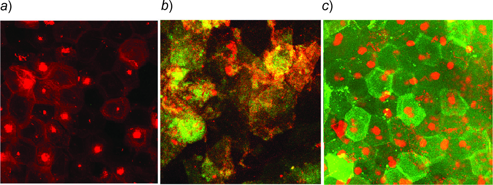
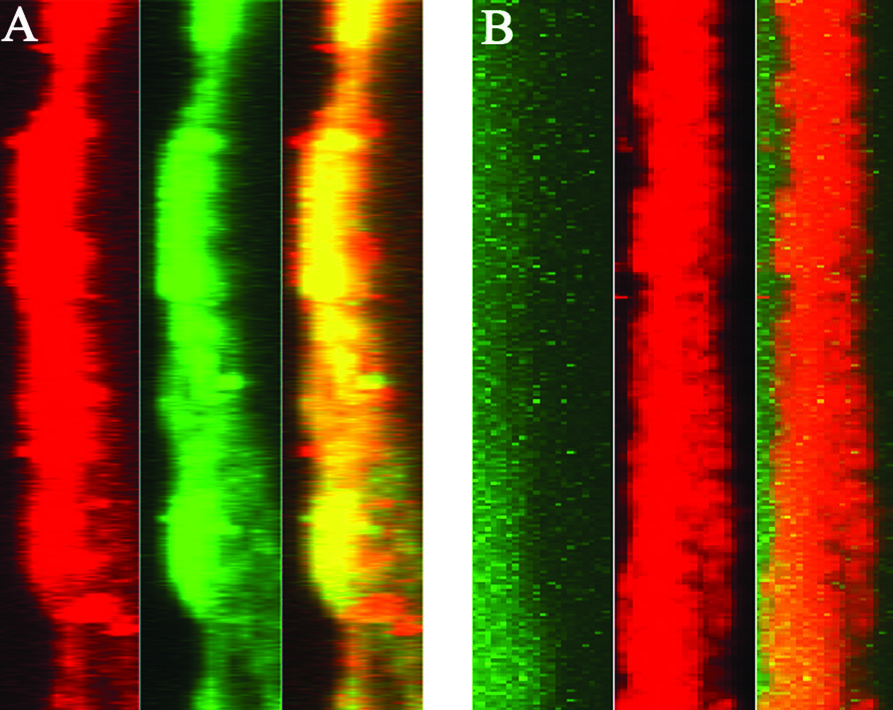
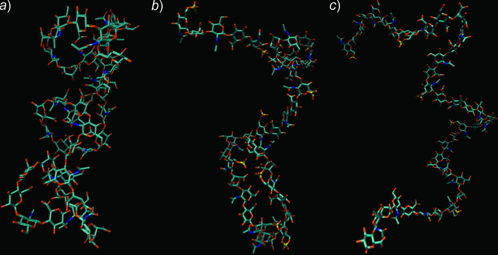
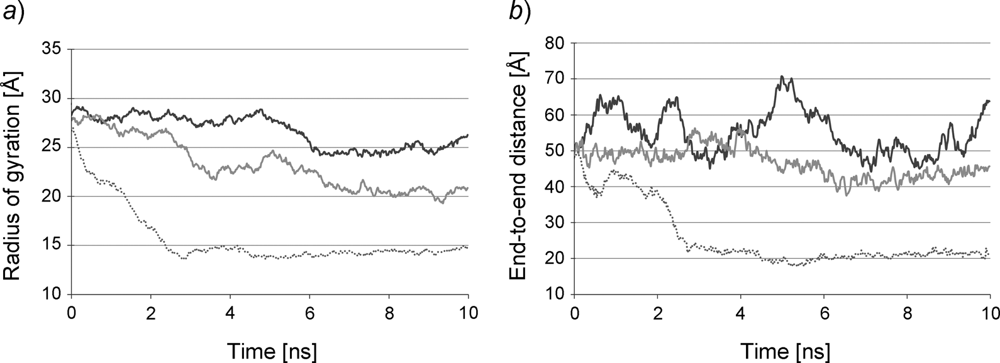

# 透明质酸硫酸化，多糖的构象特征决定其皮肤渗透能力

## 本文信息

- **标题**：多糖的构象特征在皮肤渗透中的作用——透明质酸及其硫酸化衍生物的实验与分子模拟研究
- **作者**：Francesco Cilurzo, Giulio Vistoli, Chiara G. M. Gennari, Francesca Selmin, Fabrizio Gardoni, Silvia Franz, Monica Campisi, Paola Minghetti
- **发表时间**：2014年（*Chemistry & Biodiversity*, Vol. 11, pp. 546–561）
- **单位**：意大利米兰大学制药科学系、药理与生物分子科学系；Fidia Farmaceutici S.p.A.
- **引用格式**：Cilurzo, F., Vistoli, G., Gennari, C. G. M., Selmin, F., Gardoni, F., Franz, S., Campisi, M., & Minghetti, P. (2014). The Role of the Conformational Profile of Polysaccharides on Skin Penetration. *Chemistry & Biodiversity*, *11*, 546–561. https://doi.org/10.1002/cbdv.201300130

---

## 摘要

> 透皮给药是一种**成熟且有吸引力的给药途径**。然而，药物的皮肤吸收受到角质层的限制。文献数据表明，**生物大分子有能力渗透人体皮肤**，尽管其透皮渗透似乎受制于与小分子截然不同的物理化学参数。本研究旨在考察透明质酸（HA）及其硫酸化衍生物（HAS）通过人体表皮的体外扩散特性。实验测试了低分子量和中分子量的HA以及两种硫酸化程度的衍生物。体外研究表明，**硫酸化聚合物比相应的HA渗透性更好**，尽管它们的极性大大增加；而无论硫酸化程度如何，**渗透量都随聚合物分子量的增加而显著降低**。使用荧光标记多糖的实验还表明，**透明质酸对角质细胞有很高的亲和力**，可能主要通过**跨细胞途径**穿过角质层。分子动力学研究揭示了所观察到的渗透现象可以通过监测多糖的构象特征来合理解释：**渗透性与多糖采取伸展且灵活构象的能力直接相关**。

### 核心结论

- **硫酸化增强渗透，但极性却增加**：硫酸化衍生物（HAS）的渗透量高于未修饰的HA，尽管硫酸根基团大大增加了分子的极性和亲水性——这违背了小分子透皮吸收的常规规律（亲脂性越强渗透越好）。
- **分子量是决定性因素**：低分子量样品的渗透量约为对应中分子量样品的10倍，且这一效应不受硫酸化程度的影响。
- **渗透途径更偏向跨角质细胞而非细胞间脂质网络**：CLSM成像显示HAF（FITC标记的HA）在角质细胞区域呈较均一绿色着色，而不是只沿脂质间隙分布，说明它更可能与角质细胞成分发生明显相互作用。
- **HA在溶液中采取紧凑的左手螺旋构象**：MD模拟证实，非硫酸化HA形成由氢键网络稳定的规则螺旋，这种结构较为刚硬。
- **适度硫酸化使HA变得伸展且灵活**：低硫酸化程度（约1% mol）的HA链失去螺旋结构，呈现高度伸展且动态变化的构象，其回转半径显著增大；而更高硫酸化程度（2.5% mol）则因电荷增多形成离子对网络，反而变得更为紧凑。
- **渗透量与回转半径正相关**：归一化的回转半径越高，24 h累计渗透量越大，说明伸展灵活的构象有利于多糖在皮肤中扩散。

---

## 背景

### 透皮给药与皮肤屏障

**透皮给药可以避免肝脏首过效应**、提高患者依从性，是一种理想的给药途径。但皮肤最外层的**角质层**是一个多层“砖墙”结构——扁平的角化角质细胞（砖块）嵌入在由神经酰胺、胆固醇酯和脂肪酸组成的亲脂性网络（灰浆）中。对于小分子药物而言，**亲脂性和分子尺寸**是决定透皮渗透能力的关键因素：分子量小于500 Da、油水分配系数适中者更容易穿透。

然而，生物大分子（如多糖、蛋白质）的透皮渗透研究非常有限。普遍认为，**它们的大分子体积和强氢键能力会严重限制被动扩散**。但矛盾的是，多糖（如肝素、软骨素、透明质酸）已被广泛用于皮肤护理和治疗产品，其渗透过程却鲜有定量研究。**现有文献甚至相互矛盾**：有的报道HA因高亲水性和刚性的无规卷曲构象而无法穿透角质层，另有人发现在体实验中放射性标记的HA能在30分钟内到达真皮层。

### 透明质酸：从保水剂到潜在透皮载体

透明质酸（HA）是由D-葡萄糖醛酸和N-乙酰-D-葡糖胺交替连接而成的线性多糖，在皮肤中天然存在，具有**保湿、抗氧化、促进伤口愈合**等多种功能。HA的硫酸化衍生物（HAS）则因其**抗凝血、抗炎**等活性受到关注。

本研究的关键问题是：**为什么带强负电的硫酸化HA（极性更大）反而比未修饰HA更容易穿透皮肤？** 作者假设答案不在于分子的“极性”或“大小”本身，而在于**多糖的构象特征**——即分子在溶液中的伸展程度和柔性。为了验证这一假设，他们结合了体外Franz扩散池实验、共聚焦显微镜成像和全原子分子动力学模拟。

### 关键科学问题

- **硫酸化程度如何影响HA的透皮渗透量？** 低硫酸化（1% mol）与高硫酸化（2.5% mol）是否有差异？
- **分子量的影响是否与硫酸化程度耦合？** 低分子量（约6.5 kDa）与中分子量（约170-200 kDa）的渗透量差异有多大？
- **HA是通过细胞间脂质途径还是跨细胞途径渗透？** 共聚焦显微镜能否直接观察到多糖在皮肤中的分布？
- **HA的构象如何随硫酸化和分子量变化？** 在原子水平上，硫酸根基团如何改变糖苷键的扭转角分布和整体链的折叠？
- **构象特征与渗透量之间是否存在定量关系？** 能否用回转半径、末端距等参数预测渗透能力？

### 创新点

- **首次系统比较不同分子量和硫酸化程度的HA的透皮渗透**，并定量测定了24 h累计渗透量。
- **首次使用FITC标记的中分子量HA进行CLSM成像**，直接可视化多糖在皮肤中的分布途径。
- **首次通过全原子MD模拟分析硫酸化对HA构象的影响**，此前的研究仅涉及极短寡糖（2-4个重复单元），且从未考察硫酸化效应。
- **提出“构象渗透假说”**：伸展灵活的多糖链比紧凑螺旋结构更容易在皮肤中扩散，这一机制可能适用于其他生物大分子。

---

## 研究内容

### 实验方法

#### 皮肤来源与处理

- **皮肤来源**：人体**腹部皮肤**，取自30-50岁欧亚女性美容手术捐赠者。皮肤在去除后24小时内密封于真空塑料袋中，-20°C冷冻保存。
- **表皮制备**：使用前室温解冻，仔细去除多余脂肪。皮肤切成约2.5 cm²的方块，浸入60°C水中1分钟后，用镊子轻轻分离表皮与真皮组织，光学显微镜检查确保无缺陷。

#### Franz扩散池实验

- **扩散池设置**：使用6.0 mL受体室，受体液为脱气蒸馏水含100 mg/mL NaN3作为防腐剂，温度控制在37°C水浴循环使膜表面温度维持在32±1°C。
- **实验操作**：供体室加入1 mg/mL HA或HAS溶液，在24 h后测定累计渗透量（Q24）。原文特别指出，由于分析灵敏度限制，作者**无法可靠测定通量和滞后时间**，因此全文比较主要围绕Q24展开。

#### CLSM成像方法

- **样品准备**：使用FITC标记的中分子量HA（HAF，Mw≈190 kDa）作为样品，碘化丙啶（PI）标记角质细胞间隙。
- **成像流程**：在0.5、1、2、3、4、24 h不同时间点从Franz池取下膜，水洗后用胶带（3M Transpore）去除未吸附的渗透物，进行共聚焦显微镜成像。同时设置5 mg/L游离FITC溶液作为对照实验。

#### MD模拟方法

- **模拟参数**：使用NAMD 2.7软件和CHARMM v36力场，采用Gasteiger原子电荷，在16核Tyan VX50系统上运行。截断半径设为10 Å，配对列表每20次迭代更新一次，每20 ps保存一帧轨迹共500帧（覆盖10 ns）。
- **模拟流程**：
  - 作者以NMR结构 `2BVK` 为起点，构建HA20母链，再在N-乙酰葡糖胺C6位引入硫酸基得到HA20S5和HA20S10，并额外构建HA10用于链长对照。
  - 每条链先通过聚类Monte Carlo生成2000个候选构象，但这一步只是**前处理筛构象**，不是2000条MD轨迹。作者随后选取**最低能构象**做最小化，并把它作为后续MD起点。
  - 对水相而言，共模拟了4个模型：HA10、HA20、HA20S5和HA20S10，**每个模型各进行1条10 ns MD轨迹**。升温阶段从0 K到300 K持续30 ps（10 K/ps），随后进入10 ns监测阶段；每20 ps存1帧，因此每条轨迹得到500帧。所有最小化采用共轭梯度算法直至rms梯度达到0.01 $\mathrm{kcal\cdot mol^{-1}\cdot \mathring{A}^{-1}}$。
  - 此外，作者还在$\ce{CHCl3}$中对HA20和HA20S10各补做了1条10 ns轨迹，用于比较疏水环境下的构象趋势。

### 实验设计与材料

本研究涉及6种透明质酸样品，其关键参数和24 h累计渗透量（Q24）汇总于表1。

**表1：透明质酸（HA）及其硫酸化衍生物（HAS）、FITC标记HA（HAF）的主要特征及24 h累计渗透量（Q24）**
| 名称 | 硫酸化程度 [% mol] | Mw [kDa] | 多分散指数 | Q24 [nmol/cm2] |
| --- | --- | --- | --- | --- |
| HA | 0 | 6.7 | 1.35 | 1.0 ± 0.6 |
| HA | 0 | 170.2 | 1.59 | 0.1 ± 0.0 |
| HAS | 1 | 6.8 | 1.25 | 4.9 ± 0.8 |
| HAS | 1 | 181.3 | 1.48 | 0.6 ± 0.2 |
| HAS | 2.5 | 6.4 | 1.45 | 2.4 ± 1.0 |
| HAS | 2.5 | 200.1 | 1.39 | 0.2 ± 0.1 |
| HAF | 0 | 190.3 | 1.43 | 0.1 ± 0.0 |

> 注：HAF的Q24值极低，因其分子量大且标记了FITC，但CLSM成像仍可检测其分布。

### 结果一：硫酸化促进渗透，但分子量是更强的影响因素

使用Franz扩散池，以人体表皮为膜，测定各样品24 h后的累计渗透量。由于检测灵敏度限制，作者只能可靠比较Q24，不能进一步给出稳健的通量和滞后时间。在这个前提下，实验结果有两个核心发现。

**硫酸化先增强后减弱渗透**：表1数据显示，对于低分子量样品（约6.5 kDa），1%硫酸化使Q24从未修饰HA的1.0 $\mathrm{nmol/cm^2}$增至4.9 $\mathrm{nmol/cm^2}$，提升接近5倍；当硫酸化程度继续升至2.5% mol时，Q24又降回2.4 $\mathrm{nmol/cm^2}$。**中分子量样品保持同样排序**：未修饰HA为0.1，1%硫酸化升至0.6，而2.5% mol时又降至0.2。

**分子量主导效应更强**：把低分子量和对应中分子量样品逐对比较，会发现前者的Q24大约始终是后者的10倍，即1.0对0.1、4.9对0.6、2.4对0.2。也就是说，**硫酸化会调节渗透能力，但不会抹掉分子量本身的强限制作用**。

### 结果二：CLSM显示HA主要通过跨细胞途径渗透

为了可视化HA在皮肤中的分布，作者使用FITC标记的中分子量HA（HAF，Mw≈190 kDa）进行共聚焦显微镜成像。

**图1**显示：未处理的皮肤用碘化丙啶（PI）染色后，可见角质细胞区域以及表皮死细胞核的红色信号（图1a）。HAF处理30分钟后，角质层中出现绿色荧光信号（图1b），2小时后达到平衡（图1c）。

原文的证据链其实是：**角质细胞区域整体呈均一绿色着色，而不是只在细胞间脂质缝隙中出现条带状信号**。因此作者推断，HAF与角质细胞成分有较强亲和力，并**很可能**主要经跨角质细胞路径通过角质层。

**图1：CLSM图像显示HAF在人角质层和表皮中的分布随时间变化。** a) 游离碘化丙啶在角质细胞间隙和表皮死细胞核中积累（红色）；b) 应用HAF溶液30 min后，角质层中出现绿色荧光；c) 2 h后达到平衡。原文强调，绿色信号主要对应角质细胞整体着色，提示HAF更可能与角质细胞组分发生明显相互作用。

**图2**的z-stack投影进一步比较了HAF（图2a）和游离FITC（图2b）的分布。原文图注指出，绿色荧光可对应HAF或FITC在皮肤表面沟槽中的积累，但正文进一步说明，**HAF样品中的角质细胞整体呈均一绿色，而游离FITC只有表层轻微荧光且基本不随时间变化**。这说明真正与角质层组分发生明显相互作用的是HA骨架，而不是FITC本身。

**图2：z-stack投影显示应用30 min后的分布。** A) HAF：绿色信号主要对应角质层区域，并伴随角质细胞整体着色；B) 游离FITC：仅有轻微表面荧光。红色为PI染色信号，黄色至黄绿色区域表示HAF与组织信号重叠。

此外，高效液相色谱检测显示，游离FITC在15 min的第一次采样时就已出现在受体液中，而HAF要到6 h后才首次检出，并在24 h时才能定量。色谱图中仅检测到HAF单一峰，无其他荧光信号，表明**HAF在渗透过程中未被显著切割或降解**。

### 结果三：MD模拟揭示硫酸化诱导构象从紧凑螺旋向伸展柔性转变

**图3：透明质酸的重复单元结构。** 显示非硫酸化HA的重复单元，即(1→4)-β-D-葡萄糖醛酸-(1→3)-N-乙酰-β-D-葡糖胺。

作者构建了四种寡糖模型进行**10 ns全原子MD模拟**：

| 寡糖模型 | 重复单元数 | 硫酸化程度 | 硫酸根位置 | 用途 |
| --- | --- | --- | --- | --- |
| **HA10** | 10 | 0% | - | 短链对照 |
| **HA20** | 20 | 0% | - | 代表未修饰HA |
| **HA20S5** | 20 | **1**% | 每4个N-乙酰葡糖胺的C6位1个硫酸根 | 低硫酸化模型 |
| **HA20S10** | 20 | **2.5**% | 每2个N-乙酰葡糖胺的C6位1个硫酸根 | 高硫酸化模型 |

监测三个**构象描述符**：
- **回转半径（Rg）**：描述分子大小和形状，反映链的紧凑程度
- **末端距（d）**：链两端之间的直线距离，衡量链的伸展程度
- **φ和ψ扭转角的synclinal几何比例**：φ和ψ是糖苷键的两个二面角，分别定义为Ha-Ca-O-C(i+1)和Ca-O-C(i+1)-H(i+1)，描述相邻糖环之间的旋转自由度。synclinal（-90°至+90°）表示扭转角处于允许的折叠构象范围

#### 非硫酸化HA采取紧凑的左手螺旋

模拟结果显示，HA10和HA20均呈现**规则的左手四重螺旋**（图4a）。这种螺旋由**广泛的氢键网络稳定**，包括葡萄糖醛酸的羧酸根与相邻葡糖胺的乙酰胺基之间的相互作用，以及溶质-溶剂相互作用。HA20的归一化回转半径（0.78 Å/单元）小于HA10（1.03 Å/单元），表明**长链更紧凑**——螺旋轴长约1.0 nm，环直径约1.2 nm，每圈含4个二糖单元。这一结果与**NMR和X射线实验数据高度一致**。在扭转角分布上，**ψ几乎100%保持synclinal构象**，而φ的synclinal比例约为60%（表2），说明**糖苷键的柔性主要来自φ角**。

**表2：MD模拟的主要参数平均值**
| 寡糖 | φ synclinal [%] | ψ synclinal [%] | 回转半径 [Å]（归一化） | 末端距 [Å]（归一化） |
| --- | --- | --- | --- | --- |
| HA10 | 60.0 | 100 | 10.32 ± 1.05 (1.03) | 26.91 ± 4.34 (2.69) |
| HA20 | 61.5 | 100 | 15.67 ± 8.37 (0.78) | 25.89 ± 8.57 (1.29) |
| HA20S5 (1% 硫酸化) | 53.8 | 97.4 | 25.92 ± 1.43 (1.29) | 59.62 ± 6.07 (2.98) |
| HA20S10 (2.5% 硫酸化) | 64.1 | 97.8 | 21.51 ± 3.88 (1.08) | 46.67 ± 4.15 (2.33) |

#### 低硫酸化（1%）使链伸展且高度灵活

HA20S5（1%硫酸化）的模拟结果显示，该链**完全失去了螺旋结构**，呈现**高度伸展且极其灵活的构象**（图4c）。其回转半径（25.92 Å，归一化1.29）和末端距（59.62 Å，归一化2.98）均显著大于非硫酸化HA20（15.67 Å和25.89 Å）。更重要的是，**末端距的动态曲线**（图5b）显示HA20S5在约50 Å到70 Å之间反复大幅波动，表明**链在高度伸展和部分折叠之间不断变换**——这是**高柔性**的直接证据。

从扭转角看，**HA20S5的φ角synclinal比例从非硫酸化的61.5%降至53.8**%，说明φ角更多采取反式（anti）构象，这正是链伸展的原因。

**图4：MD模拟中透明质酸构象的代表性快照。** a) 非硫酸化HA20的折叠螺旋结构（轴长约1.0 nm，环直径约1.2 nm，每圈4个二糖）；b) HA20S10（2.5%硫酸化）的中间构象，失去螺旋但仍较紧凑，两端折叠形成椭圆形；c) HA20S5（1%硫酸化）的伸展柔性结构。

**图5：动态曲线。** a) 回转半径；b) 末端距。灰色虚线：HA20（非硫酸化）；黑色线：HA20S5（1%硫酸化）；灰色线：HA20S10（2.5%硫酸化）。HA20S5的末端距在50-70 Å间大幅波动，表明高度柔性。

#### 高硫酸化（2.5%）反而变得紧凑

HA20S10（2.5%硫酸化）同样失去了螺旋结构，但其构象比HA20S5更紧凑（图4b）：回转半径21.51 Å（归一化1.08），末端距46.67 Å（归一化2.33）。**其φ角的synclinal比例回升至64.1**%，与非硫酸化HA接近。

这一反常现象的解释是：**当硫酸根基团数量适中时（1%），静电斥力占主导，迫使链伸展；但当硫酸根基团更多时（2.5%），相邻负电荷之间可能形成离子对网络（通过Na+桥接），反而稳定了折叠构象**。这与文献中**聚电解质在中等电荷密度下最伸展的观察一致**。

> 需要注意的是，文中关于“高硫酸化时可能形成Na+介导的离子对网络”这一步，主要还是**基于构象结果的机理推断**，并没有进一步做专门的离子配位统计或自由能分析来直接验证。

#### 在氯仿中模拟保持相同趋势

为了模拟皮肤疏水环境，作者还将代表性链放入CHCl3中进行对照模拟。结果显示，非硫酸化HA仍保持紧凑螺旋，而低硫酸化链仍保留伸展无序趋势；两类体系之间的差异略有缩小，作者将其归因于溶剂摩擦增大，但**整体构象排序并未改变**。

---

## 关键结论与批判性总结

### 主要发现与机制

将表1的Q24与表2的构象参数对比，可以发现**清晰的趋势**：

| 样品 | 构象特征 | Rg归一化 | 低分子量Q24 | 中分子量Q24 |
| --- | --- | --- | --- | --- |
| HA20（非硫酸化） | 紧凑螺旋 | 0.78 | 1.0 | 0.1 |
| HA20S5（1%硫酸化） | 伸展柔性 | 1.29 | **4.9**（最高） | 0.6 |
| HA20S10（2.5%硫酸化） | 中间构象 | 1.08 | 2.4 | 0.2 |

本研究**提出假说**，**多糖的构象（而非简单的分子量或极性）可能是决定其皮肤渗透能力的关键因素**。**归一化回转半径越大，24 h扩散量越高**——伸展柔性的多糖链可能更容易适应角质层、角质细胞以及更下层组织之间不断变化的微环境，从而降低扩散过程中的构象代价。

小分子透皮吸收的**经典规则**是分子量越小、亲脂性越强，渗透越好。但实验中**1%硫酸化样品的渗透量约为未修饰HA的5倍**，尽管硫酸化显著增加了极性和水溶性。MD模拟**提示**，硫酸基打乱了原有螺旋氢键网络，并通过静电作用改变糖苷键扭转分布，使链更伸展、更灵活。当硫酸化程度进一步提高至2.5%时，链反而重新折叠成椭圆形紧凑构象——原文解释为**链端折叠以最小化硫酸根之间的静电斥力**，这与聚电解质在中等电荷密度时最伸展、高电荷密度时因静电相互作用而收缩的现象一致。因此，**存在一个最佳的硫酸化程度（约1% mol）**。

CLSM成像显示HAF在角质细胞区域呈均一着色，而游离FITC没有类似分布，**提示**HA可能主要经**跨角质细胞路径**扩散，但这一推断尚未通过直接实验验证。MD模拟**帮助解释**了这些渗透数据（但也没完全打通逻辑），将焦点转向多糖柔性：**可以通过化学修饰（如硫酸化、羧甲基化等）调控构象**，使其呈现伸展、柔性的状态，从而可能增强渗透。

### 局限性

- **模拟链长远短于实验样品**：MD模拟最多20个重复单元（约8 kDa），而实验中的低分子量HA也有6.7 kDa（约30个单元），中分子量高达170-200 kDa。模拟结果能否完全外推至长链仍需谨慎。
- **模拟时间较短**：10 ns的模拟对于长链多糖的全局构象采样可能不足，更长的模拟（如微秒级）或增强采样方法可以验证平衡构象分布。
- **缺乏直接的构象-渗透定量模型**：虽然观察到了趋势，但未建立如“回转半径每增加1 Å，渗透量增加X倍”的定量关系。未来可结合更多的实验样品（不同硫酸化梯度）和更长的模拟来构建预测模型。
- **皮肤模型的简化**：体外Franz扩散池使用分离的人表皮，缺乏活性皮肤的代谢和血流清除机制，可能影响渗透动力学。

### 未来方向

- **模拟更长链（50-100个重复单元）**：使用粗粒化模型或更高效的GPU加速MD，验证长链是否仍保持伸展构象。
- **测试其他化学修饰**：如羧甲基化、磷酸化、乙酰化等，探究是否也能通过改变构象来增强渗透。
- **结合自由能计算**：计算多糖在不同构象下穿透脂质双层的自由能垒，从热力学角度验证伸展构象的优势。
- **动物实验验证**：在活体皮肤中验证FITC标记的硫酸化HA的渗透深度和分布。
- 对于从事化妆品、透皮贴剂或大分子给药的研究者，**在设计多糖载体时，不应只盯着分子量和亲水性，更要关注其溶液构象——让分子“伸展开”可能比让它“变小”更有效**。

> 小编锐评：
>
> - 需要保留的一点谨慎是：本文的MD部分更适合被看作**构象趋势解释**，而不是已经充分收敛的统计采样。
> - 尽管如此，它提出的“构象决定渗透”这一核心视角，至今仍然值得在多糖类透皮体系设计中认真对待。
> - 跨细胞途径这个跟我们contradict了，这我也很难评。
> - 全原子真好啊。。
