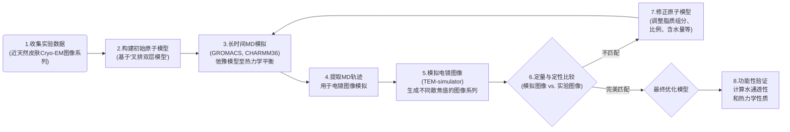

# 解码皮肤“长城”：冷冻电镜与分子模拟联手揭示皮肤屏障的原子级奥秘

## 本文信息

  - **标题**: 通过冷冻电镜和分子动力学模拟解析人类皮肤屏障的结构与功能
  - **作者**: Magnus Lundborg, Ali Narangifard, Christian L. Wennberg, Erik Lindahl, Bertil Daneholt, Lars Norlén
  - **发表时间**: 2018年4月24日
  - **单位**: 瑞典卡罗林斯卡学院，斯德哥尔摩大学，KTH皇家理工学院等 (瑞典)
  - **引用格式**: Lundborg, M., Narangifard, A., Wennberg, C. L., Lindahl, E., Daneholt, B., & Norlén, L. (2018). Human skin barrier structure and function analyzed by cryo-EM and molecular dynamics simulation. *Journal of Structural Biology*, *203*(2), 149–161. [https://doi.org/10.1016/j.jsb.2018.04.005](https://doi.org/10.1016/j.jsb.2018.04.005)

## 摘要

> 本研究利用分子动力学 (MD) 模拟，并通过与来自近天然皮肤的冷冻电子显微镜 (cryo-EM) 数据进行交叉验证，解析了人类皮肤通透性屏障的分子结构和功能。皮肤的屏障能力位于其最表层——角质层细胞间的脂质结构中。根据“叉排双层模型 (splayed bilayer model)”，该脂质结构由堆叠的双层神经酰胺 (CER) 组成，其构象呈链状叉排，胆固醇 (CHOL) 与神经酰胺的鞘氨醇部分结合，而游离脂肪酸 (FFA) 与神经酰胺的脂肪酸部分结合。然而，关于该脂质结构的精细分子组织及其各脂质组分作用的知识仍不完整。**我们从一个基于“叉排双层模型”的MD模型出发，通过逐步的结构和组分修改，最终获得了一个热力学稳定的MD模型。该模型模拟出的电镜图像与从皮肤中获得的原始cryo-EM图像达到了极其接近的匹配**。引人注目的是，MD模型的脂质组成越接近于已报道的人类角质层中的组成，其模拟电镜图像与原始cryo-EM图像的匹配度就越好。此外，匹配度最高的模型的计算水通透性和热致变色行为也与人类皮肤的实验数据相符。**这个新模型将有助于实现更先进的、基于物理原理的药物和毒物皮肤渗透性预测**。我们提出的这套基于MD分析细胞cryo-EM数据的方法，也可能被应用于其他生物分子系统。

### 核心结论

  * **方法论**：成功建立并验证了一套结合分子动力学模拟和冷冻电镜图像模拟的迭代式工作流程，可用于解析复杂生物体系的近天然原子结构。
  * **结构确定**：构建了一个迄今最精确的人类皮肤角质层脂质屏障原子模型。其关键特征为：**CER:CHOL:FFA摩尔比约1:1:1，含约5%的CER EOS，胆固醇在双层中呈75/25的不对称分布，且核心区域高度脱水（约0.3个水/脂质）**。
  * **结构-功能统一**：该优化模型不仅在结构上与cryo-EM数据完美匹配，其计算出的水通透性和热稳定性也与人类皮肤的宏观实验数据高度兼容，实现了微观结构与宏观功能的统一。
  * **机理洞见**: 研究揭示了真实的脂质链长多样性和微量超长链脂质（CER EOS）对于维持正确的11 nm长周期性结构至关重要，并指出皮肤屏障核心的熔解温度约为100°C。

## 背景

皮肤是生命体抵御外界环境的第一道防线，其核心功能——**通透性屏障**——让我们能够在干燥的陆地环境中锁住水分，免于脱水。这一至关重要的功能主要由皮肤最外层的**角质层 (stratum corneum)** 中，填充在角质细胞之间的特殊脂质基质所承担。这种脂质基质主要由三种成分以大致1:1:1的摩尔比混合而成：**神经酰胺 (Ceramides, CER)**、**胆固醇 (Cholesterol, CHOL)** 和**游离脂肪酸 (Free Fatty Acids, FFA)**。

在过去的数十年里，科学家们为了揭示这层“分子长城”的精确结构付出了巨大努力，这不仅是出于基础生物学的好奇，更因为它直接关系到**经皮给药**（如膏药、贴剂）的效率和化妆品、有毒物质渗透性的评估。尽管使用了X射线衍射、核磁共振等多种技术，并提出了多种模型，但由于该脂质结构缺乏长程有序性且环境复杂，其精细的原子级别排列方式一直未能完全确定。

一个重要的突破是2012年提出的“叉排双层模型 (splayed bilayer model)”。**该模型基于高分辨率的细胞原位冷冻电镜 (cryo-EM) 数据，提出神经酰胺的鞘氨醇长链和脂肪酸长链并非平行排列，而是像叉子一样张开，胆固醇分子插入鞘氨醇链一侧，游离脂肪酸则填充在脂肪酸链一侧，形成一种独特的、高度致密的堆叠双层结构。**但这个模型一定正确吗？在科学上，没有模型是绝对“正确”的，它们都是对现实的最佳近似。然而，本文的研究通过严谨的计算与实验比对，强有力地证明了“叉排”构象是形成人类皮肤屏障核心功能（低渗透性、高密度）的关键。这种非平行的构象创造了两个不同的疏水区域，使得胆固醇和游离脂肪酸可以特异性地、高效地填充进去，形成异常致密的堆积模式。可以说，在目前所有的理论模型中，“叉排双层模型”是唯一一个能够同时在原子结构、宏观功能和热力学性质上与真实皮肤数据完美吻合的模型（文章观点，非小编观点）。

然而，最初的模型仍然是静态的，且在脂质的具体种类、比例、含水量等方面做了简化，离真实皮肤的复杂性仍有距离。

## 关键科学问题

本文旨在解决的核心科学问题是：我们能否构建一个在原子级别上精确、在热力学上稳定、并且其物理化学性质（如结构、通透性、热稳定性）与真实人体皮肤完全一致的皮肤屏障脂质模型？

为了实现这一宏伟目标，作者试图通过一个创新的迭代优化过程来回答以下几个具体问题：

  * **模型的真实性**：最初的“叉排双层模型”在经过长时间的分子动力学弛豫后，其结构（如层状周期性）是否仍然与实验观察一致？
  * **组分的精确角色**：角质层中存在多种不同链长和头基的神经酰胺、脂肪酸，以及微量的特殊脂质（如酰基神经酰胺 CER EOS）。这些组分的精确摩尔比例、胆固醇在双层中的不对称分布以及脂质头基区域的含水量，是如何共同决定屏障的最终结构和功能的？
  * **结构与功能的关联**：一个在结构上（通过cryo-EM验证）最接近真实皮肤的模型，其预测的功能性参数（如对水分子的通透系数）是否也与已知的皮肤生理数据相符？这可以作为验证模型正确性的“双重证据”。

## 创新点

  * **方法学创新：MD与Cryo-EM的闭环验证**：本文首创了一套将分子动力学 (MD) 模拟与冷冻电镜 (cryo-EM) 图像模拟相结合的迭代优化流程。通过不断调整MD模型的原子坐标和化学组成，并将其模拟出的电镜图像与真实的皮肤cryo-EM图像进行比对，最终“逼近”真实结构。
  * **模型精度的飞跃**：从一个初步的理论模型出发，通过系统性地优化多达数十个参数（脂质比例、链长分布、含水量等），最终构建了一个迄今为止最接近真实人类皮肤角质层脂质结构的全原子、热力学稳定的计算模型。
  * **结构与功能的统一**：首次在同一个模型中成功地统一了皮肤屏障的三大核心物理特性：原子级结构（匹配cryo-EM图像）、屏障功能（计算的水通透系数与实验值兼容）以及热力学行为（相变温度与实验观察一致）。
  * **对经典模型的修正与完善**：研究证实并完善了“叉排双层模型”，例如，他们发现原始模型的周期性偏短，并通过引入更真实的脂质链长分布和酰基神经酰胺（CER EOS）等组分，成功将周期性修正至与实验值（约11 nm）匹配。

-----

## 研究内容

### 核心方法：迭代式模型优化与多重验证

本文的核心策略是一个精妙的“猜想-模拟-验证-修正”的闭环迭代过程。目标是找到一个原子模型，使其在经过MD模拟达到平衡后，其模拟的cryo-EM图像能完美复现实验图像。

**图1：实验流程示意图。** 这张图概述了通过迭代比较模拟电镜(EM)图像与实验cryo-EM图像来分析系统结构和组成的通用流程。

#### 工具与力场

  * **MD模拟**: 使用 **GROMACS 5.0** 软件进行。非键相互作用方面，静电相互作用使用 **PME** 方法计算（截断半径1.2 nm），范德华相互作用在1.2 nm处截断并使用平滑的力转换函数（从1.0 nm开始）。氢键使用 **P-LINCS** 算法进行约束。整个体系的质心移动每100步移除一次。模拟过程包括：

    1.  **能量最小化**：使用最速下降法进行5000步。
    2.  **平衡阶段**：总时长约 **270 ns**，分为五个阶段。第一阶段在NVT系综下进行，其余在NPT系综下进行。为了让系统缓慢弛豫，在前四个阶段逐步减小对脂质重原子的位置限制力（从100逐步降至0 $kJ mol^{-1}nm^{-2}$）。最终的**无约束平衡时长为250 ns**。此阶段使用 **Berendsen** 恒压器以避免状态转变时产生大的振荡。
    3.  **生产阶段**：在NPT系综下进行 **100 ns**，改用 **Parrinello-Rahman** 恒压器，温度维持在 **303.15 K**。

  * **力场**: 采用了广泛验证的 **CHARMM36** 脂质力场。其中，关键的神经酰胺（CER NP）的力场参数是作者专门优化的。他们首先使用量子化学软件 **GAMESS-US**，在 **MP2/6-31G(d,p)** 理论水平下对CER NP的头基小分子进行能量最小化和扭转角扫描，获得其势能面。然后，他们调整CHARMM36力场中的二面角参数，使其在GROMACS中计算的能量能够最好地拟合量子化学计算结果，并能复现已知的晶体结构。水模型为 **TIP3P**。

  * **EM模拟**: 使用 **TEM-simulator** 程序，该程序能根据原子坐标和显微镜参数（如加速电压、散焦值）生成高度逼真的EM图像。

  * **自由能计算**: 使用 **Copernicus** 软件，结合**非平衡正向-反向拉伸方法**。这是一种计算自由能的增强采样技术，其原理基于**Crooks涨落定理**。传统的自由能计算需要等待分子（如水）自发、缓慢地穿过膜，这在模拟中耗时极长。该方法则是用外力在短时间内将分子“拉”过膜（正向），再“拉”回来（反向）。通过统计大量拉伸过程中所做的功的分布，可以精确计算出系统在平衡状态下的**自由能差（即PMF曲线）**，从而高效地获得水分子穿膜的能垒。

#### 迭代优化的关键参数

作者系统地探索了多个关键参数对最终结构的影响。这个过程是**手动的、系统性的迭代优化**，而非程序自动完成。研究人员像做一系列对照实验一样，手动构建了几十个不同的初始模型，对每个模型进行完整的MD和EM模拟，最后通过与实验数据比对，**手动**挑选出匹配度最高的模型。优化的参数包括：

  * **脂质链长分布**: 从单一的C24链长变为模拟真实皮肤中C20-C30的复杂分布。
  * **胆固醇 (CHOL) 分布**: 调整位于神经酰胺鞘氨醇侧和脂肪酸侧的胆固醇比例。
  * **酰基神经酰胺 (CER EOS) 含量**: CER EOS是一种超长链脂质，被认为是维持长周期性结构的关键。
  * **含水量**: 精确控制脂质头基区域每个脂质分子的平均水分子数。
  * **三大组分总含量**: 分别微调CER、CHOL、FFA的总体摩尔分数。
  * **其他化学细节**: 包括神经酰胺头基种类（NS vs. NP）、鞘氨醇链长、胆固醇硫酸酯含量和脂肪酸的电荷状态等。

### 结果与分析：一步步逼近真实

在开始分析结果之前，理解电镜图像的物理意义至关重要。在电子显微镜中，图像的衬度来源于样品不同区域对电子的散射能力不同。原子序数越大的原子（即“重原子”，如氧和氮）散射电子的能力越强，因此在图像中显得**更暗**。相反，主要由原子序数小的原子（如碳和氢）组成的区域散射能力弱，显得**更亮**。因此，在皮肤脂质结构中：

  * **深色条带**：对应于电子密度高的区域，主要是**脂质的极性头基**（富含O和N原子），以及与它们结合的**水分子**。
  * **浅色条带**：对应于电子密度低的区域，主要是由碳和氢组成的**脂质疏水性尾链**。

#### 1. 初始模型的不足

作者首先验证了2012年提出的原始“叉排双层模型”。MD模拟后，该模型的层状周期性仅为 **8.5 nm**，显著低于cryo-EM和X射线衍射实验报道的约 **11 nm**。尽管其模拟电镜图像的基本模式尚可，但周期性的巨大差异表明该模型过于简化。

**图2：“叉排双层模型”的模拟结果。** (a) MD模拟后的系统快照。(b) 模型的分子排列示意图。(c) 模拟电镜图（上方）与实验cryo-EM图（下方）的比较，可见明显的周期性差异。

#### 2. 系统性的迭代优化过程

作者随后开始了一场“像素级”的优化之旅，通过调整上述一系列参数来改善模型与实验的匹配度。

**图3：不同组分对模拟EM数据的影响。** (a-f) 分别展示了改变胆固醇分布、CER EOS含量、含水量、总神经酰胺含量、总胆固醇含量和总游离脂肪酸含量时，模拟电镜图像（下方小图）与实验图像（上方大图）的对比。

  * **链长分布与CER EOS是关键**: 引入真实皮肤的宽链长分布，并将CER EOS含量增加到总脂质的**5%**（摩尔分数），成功地将周期性从8.5 nm提升至接近**11 nm**的水平。这证实了脂质的化学多样性，特别是超长链脂质的存在，是维持正确层状结构的核心。
  * **胆固醇的精确定位**: 最佳匹配出现在约 **75%** 的胆固醇位于鞘氨醇侧，25%位于脂肪酸侧时。这一定量结果首次精确揭示了胆固醇在皮肤屏障中的不对称分布。
  * **极低的含水量**: 模拟显示，当每个脂质分子平均仅结合 **0.3个水分子**时，模拟图像与实验最为吻合。这并不意味着屏障是完全“干燥”的，而是指其核心的、高度有序的脂质双层区域含水量极低。水分子主要被束缚在脂质的极性头基附近，形成“结构水”，而不是自由流动的“体相水”。这种高度脱水的环境大大增加了非极性物质穿透的难度，是皮肤强大屏障功能的关键物理基础之一。
  * **1:1:1的黄金比例**: 通过分别改变CER、CHOL和FFA的总含量，研究发现，当三者比例回归到经典的 **33%/33%/33%** 左右时，模型与实验的匹配度达到最佳。这为长期以来文献报道的1:1:1比例提供了最直接的结构生物学证据。

#### 3. 最终的优化模型：结构与功能的完美统一

经过数十个模型的迭代优化，作者最终得到了一个“冠军模型”，其组成为：CER/CHOL/FFA 摩尔比为 **33/33/33**，**75%的CHOL在鞘氨醇侧，总脂质含5%的CER EOS，每个脂质携带0.3**个水分子。

**表1：不同模型系统的周期性与排名。** 最终优化模型(33/33/33/75/5/0.3)在自动比较和视觉检查中均排名第一。

| 模型ID (CER/CHOL/FFA/CHOL鞘氨醇侧比例/EOS/水) | 周期性 (nm) | 自动比较排名 | 视觉检查排名 |
| :--- | :--- | :--- | :--- |
| 原始叉排模型 | 8.5 | 7 | 8 |
| **33/33/33/75/5/0.3** | **10.6** | **1** | **1** |
| 33/33/33/75/5/0 | 10.5 | 1 | 1 |
| 33/33/33/75/15/0.3 | 11.2 | 5 | 6 |

这个模型的模拟电镜图像在不同散焦值下都与实验图像达到了近乎无法区分的匹配程度。

**图4：最终优化模型。** (a) 模型分子组成示意图。(b) MD模拟后的系统快照。(c) 模拟电镜图（上排）与实验cryo-EM图（下排）在-1, -2, -3 µm三个散焦值下的对比，展现了极高的一致性。

更重要的是，该模型的功能性质也与实验相符：

  * **水通透性**: 模拟得到的通透系数（Permeability Coefficient, $K_p$）是一个计算值，而非直接测量值。它基于**非均匀溶解-扩散模型 (inhomogeneous solubility-diffusion model)**，需要从模拟中获得自由能曲线 (PMF) 和位置依赖的扩散系数 ($D(z)$)两个关键物理量，并通过积分计算得出。最终计算得到的水通透系数对数值为 $\log K_p = -4.5 \pm 0.2 \mathrm{cm/h}$。这个值比体外实验测得的人皮渗透系数（约-2.9）要低，这完全符合预期。因为体外实验的皮肤样品处于完全水合状态，且可能存在微小缺陷，其屏障功能会减弱。而当作者在模型中增加含水量至1.3个水/脂质时，计算的通透系数（$\log K_p = -2.9 \pm 0.2 \mathrm{cm/h}$）恰好与体外实验值吻合。这巧妙地统一了体内（低水）和体外（高水）两种状态下的皮肤屏障功能。
  * **热力学行为**: 模拟加热过程显示，该模型在约**100°C**时发生不可逆的熔融，这与实验中差示扫描量热法 (DSC) 观察到的T4相变温度一致，修正了以往认为T4相变源于蛋白质变性的观点，指出它实际上是**脂质基质本身的熔解**。

**表2：不同模型计算的水通透系数。** 最终优化模型(33/33/33/75/5/0.3)的通透性很低，而增加含水量或去除长链FFA会显著增加通透性。

| 系统 (ID) | $\log K_p$ (cm/h) | 与优化模型的显著差异 |
| :--- | :--- | :--- |
| **33/33/33/75/5/0.3** | **-4.5 ± 0.2** | **N/A** |
| 增加含水量 (1.3 水/脂质) | -2.9 ± 0.2 | Y |
| 无额外C30 FFA | -5.2 ± 0.1 | Y |
| 原始叉排模型 | -3.8 ± 0.2 | Y |

**图5：与钌染料电镜图的比较。** 优化模型中重原子（氧和氮）的分布（c）与经典的RuO4染色电镜图谱（b）中观察到的明暗条带模式高度吻合。

-----

## 关键结论与批判性总结

### 潜在影响

  * **皮肤科学**：为理解皮肤屏障的分子基础提供了前所未有的清晰图像，将对经皮给药、化妆品科学和皮肤病理学（如特应性皮炎）的研究产生深远影响。
  * **计算结构生物学**：开创了一种解析细胞原位、无序或半有序生物大分子复合物结构的新范式。这种“计算-实验”相结合的方法有望被应用于细胞膜、细胞骨架等其他难以用传统结构生物学方法解析的体系。
  * **药物与化工**：提供了一个强大的“数字皮肤”平台，使得未来能够开展高精度的、基于物理机制的化学品皮肤渗透性与毒性预测，可能减少对动物实验的依赖。

### 研究局限性

  * **力场精度**: 尽管CHARMM36是优秀的力场，但所有MD模拟的最终精度仍受限于力场参数。特别是对于非标准脂质的参数化，仍可能存在细微偏差。
  * **静态比较**: 本研究主要基于MD模拟的平衡态轨迹进行比较，对于脂质分子在更长时间尺度上的动态过程（如脂质翻转、缺陷形成与修复）的探索有限。
  * **忽略蛋白质组分**: 真实的角质层中还包含角蛋白等蛋白质成分，以及角质细胞间桥粒等结构。本模型仅关注纯脂质基质，忽略了脂质-蛋白质相互作用可能对局部结构和渗透性的影响。

### 未来方向

  * **药物渗透模拟**: 利用该优化模型，系统性地开展一系列药物和化学促渗剂的渗透模拟，揭示其穿膜路径和分子机理。
  * **模型复杂化**: 在现有模型基础上，逐步引入角蛋白片段、离子、以及考虑pH梯度等因素，构建更接近真实生理环境的多组分模型。
  * **疾病模型研究**: 通过改变脂质组成（例如，减少神经酰胺含量）来模拟特应性皮炎等皮肤病理状态，从分子层面探究其屏障功能受损的机制。

-----

## 附录：核心公式解析

### 非平衡正向-反向拉伸方法

该方法是计算分子穿膜自由能（PMF）和通透性的高效技术。其核心思想是通过**Crooks涨落定理**和**Jarzynski恒等式**的变体，从不可逆的、快速的拉伸模拟中提取平衡态的自由能信息。

#### 公式的通俗解释

我们的最终目标是计算**通透系数 ($P$)**，它的倒数是**阻力 ($R$)**。阻力是在整个膜厚度上对局部阻力的积分。

$$\frac{1}{P} = R = \int_{z_1}^{z_2} \frac{e^{\beta \Delta G(z)}}{D(z)} dz$$

这个公式告诉我们，总的穿膜阻力($R$)取决于两个因素在膜内部分布的积分：**自由能垒 ($\Delta G(z)$)** 和**局部扩散系数 ($D(z)$)**。$\Delta G(z)$ 越高的地方，分子越不愿意待着；$D(z)$ 越低的地方，分子移动越慢。这两者都会增加穿膜的难度。

**1. 如何获得自由能垒 $\Delta G(z)$?**

通过**布朗动力学涨落耗散定理 (BD-FDT)**，利用正向 ($W_F$) 和反向 ($W_R$) 拉伸模拟的功，我们可以计算出自由能。

$$e^{-\beta \Delta G(z)} = \frac{\langle e^{-\beta W_F / 2} \rangle}{\langle e^{-\beta W_R / 2} \rangle}$$

这里的 $\langle \dots \rangle$ 表示对多次拉伸模拟轨迹求平均。这个公式的巧妙之处在于，它通过指数平均的方式，从快速、高耗散的拉伸过程中，提取出了平衡态的自由能信息，极大地提高了计算效率。

**2. 如何获得局部扩散系数 $D(z)$?**

扩散系数与拉伸过程中的**耗散功** ($W_d$)有关。耗散功可以理解为在拉伸过程中因摩擦等因素损失掉的、没有转化为系统自由能的功。

$$e^{-\beta \langle W_d \rangle} = \langle e^{-\beta W_F / 2} \rangle \times \langle e^{-\beta W_R / 2} \rangle$$

一旦得到耗散功沿着z轴的导数，就可以通过以下关系计算出局部扩散系数：

$$D(z) = \frac{k_B T v}{\mathrm{d}W_d / \mathrm{d}z}$$

其中，$v$ 是拉伸速度，$k_B$ 是玻尔兹曼常数，$T$ 是温度。这个公式表明，在某个位置上，耗散功变化越剧烈（即摩擦力越大），分子的扩散就越慢。

> 小编锐评：
> - 这篇竟然是Progress in Lipid Research 88 (2022) 101184那篇综述里有的，但all CERs are in the extended conformation显然有点简化了
> - 原来他们在纵轴上也是periodic的，彻底没有水了，那可能可以先跑稳定才放到水溶液里面研究和别的东西的互作。
> - TEM的image也能模拟，让人开了眼了，这背后都有理论的，应该靠谱的吧。
> - 建一个合理的模型是超级费劲的，为了偶然的一个课题调参一年半载是不值得的，你做得也没有专业的人好；课题和体系应该有持续性或传承。
> - 可惜不能直接帮到我们的工作。
