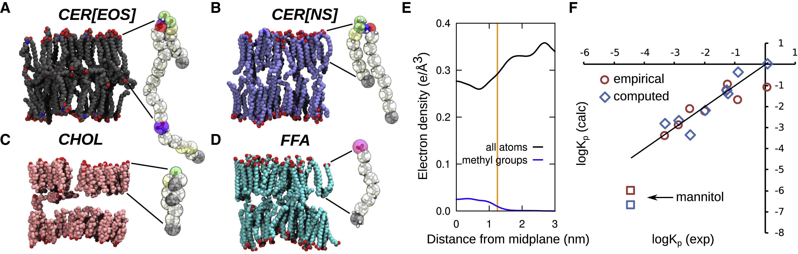
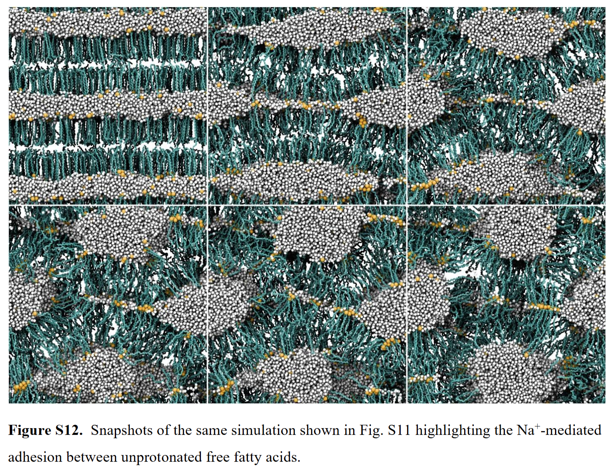
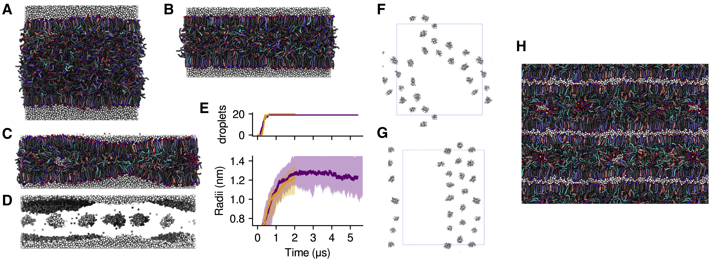
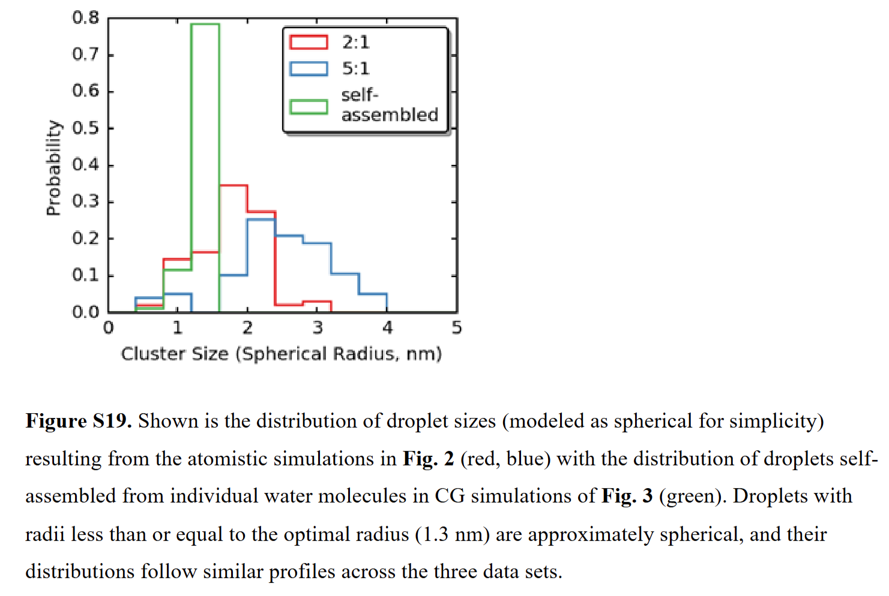
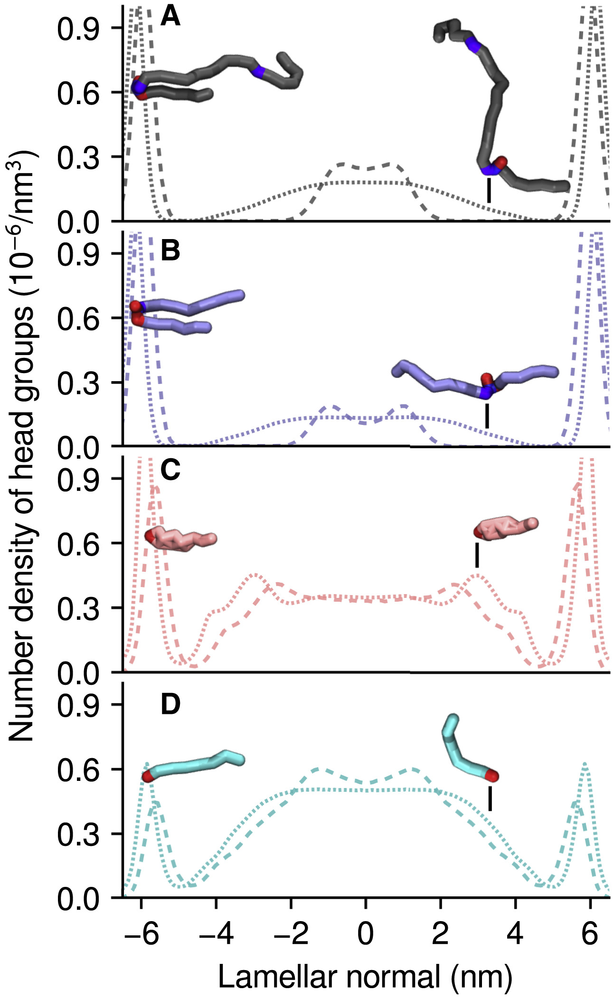
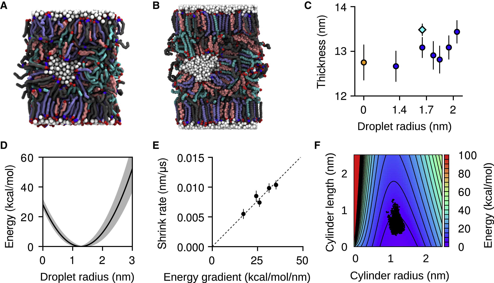
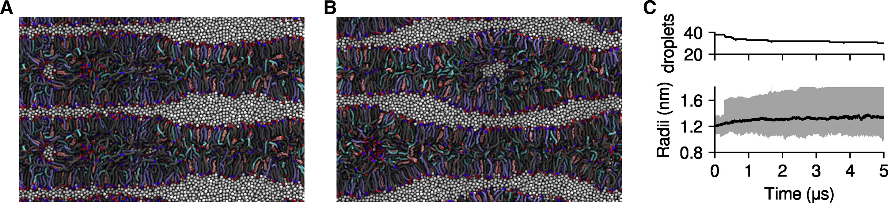
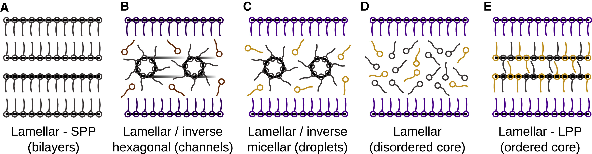

# 皮肤屏障的“水之道”：分子模拟揭示脂质相共存如何稳定间质水

## 本文信息
- **标题**: 脂质相的共存稳定了哺乳动物皮肤外层的间质水
- **作者**: Christopher M. MacDermaid, Kyle Wm. Hall, Russell H. DeVane, Michael L. Klein, and Giacomo Fiorin
- **发表时间**: 2020年1月27日
- **单位**: 坦普尔大学，宝洁公司 (美国)
- **引用格式**: MacDermaid, C. M., Hall, K. W., DeVane, R. H., Klein, M. L., & Fiorin, G. (2020). Coexistence of Lipid Phases Stabilizes Interstitial Water in the Outer Layer of Mammalian Skin. *Biophysical Journal*, *118*(7), 1588–1601. [https://doi.org/10.1016/j.bpj.2020.01.044](https://doi.org/10.1016/j.bpj.2020.01.044)

## 摘要

> 哺乳动物皮肤最外层——角质层(SC)中的脂质基质，作为决定亲水性和亲脂性渗透途径的关键，已被多种生物物理技术研究。尽管对其微观结构的共识日益形成，但**目前还没有一个分子分辨率的模型能同时解释所有化学物质的渗透性**。本研究利用分子动力学(MD)模拟，对一种模型皮肤脂质混合物进行了自组装研究。我们发现，在较高湿度下，形成的层状相通过将多余的水分配到尺寸和空间分布受控的**孤立水滴**中来维持其稳定性。这些水滴可能融合在一起形成**层内水通道**，从而为亲水性物质的渗透提供一条路径。这些结果调和了关于皮肤外层结构的相互矛盾的数据，并拓宽了基于分子的方法在提高局部用药产品安全性和推进透皮给药方面的应用范围。

### 核心结论

* 皮肤角质层脂质在自组装过程中可以形成**多种相共存的复杂结构**，包括类似短周期相(SPP)的双层、类似长周期相(LPP)的厚层状结构以及反相胶束状的**间质水滴**。
* 在较高湿度下，多余的水并不会破坏层状结构，而是被脂质头基包裹，在疏水核心中形成**稳定、尺寸受控的纳米级水滴**。
* 这些孤立的水滴可以通过融合形成**瞬时的水通道**，这为**亲水性大分子**提供了一条此前未被充分认识的渗透路径，从而解释了为何其实测渗透率远高于理论预测值。
* 模拟表明，形成水通道需要克服较高的能量势垒（约33-43 kcal/mol），这意味着在生理条件下它是一个**稀有事件**，但在外界因素（如促渗剂、超声波）的干预下可能被显著促进。

## 背景
皮肤作为我们身体的第一道防线，其核心屏障功能由最外层的**角质层** (Stratum Corneum, SC) 承担。角质层的"砖墙-灰浆"结构中，由神经酰胺(CER)、胆固醇(CHOL)和游离脂肪酸(FFA)组成的脂质"灰浆"是阻止外界物质入侵和内部水分流失的关键。**理解物质如何穿过这道屏障，对于透皮给药和化妆品安全评估至关重要**。

长期以来，一个巨大的谜团困扰着皮肤科学领域：**为什么实验测得的某些亲水性大分子的皮肤渗透率，比基于均一脂质双层模型预测的理论值高出几个数量级**？传统的模型认为，渗透主要通过脂质的疏水区域，这对亲水性物质极为不利。为了解释这一矛盾，科学家们提出了一个大胆的假设：在致密的脂质基质中，可能存在着某种亲水性孔道或水通道，为这些分子提供了"秘密通道"。

然而，这种假设缺乏直接的分子级别的证据。这些通道是否存在？如果存在，它们是如何形成和维持的？它们的尺寸、分布和稳定性如何？这些问题都悬而未决。同时，实验观察到了皮肤脂质复杂的相行为，包括短周期相 (SPP) 和长周期相 (LPP) 的共存，甚至还有反相六方相和反相胶束相等非层状结构。如何将这些复杂的结构与亲水性渗透路径联系起来，是理解皮肤屏障功能的关键瓶颈。

## 关键科学问题
本研究旨在通过多尺度分子动力学模拟，从原子和近原子（粗粒化）层面回答以下核心问题：

1.  **脂质相行为的复杂性**：在模拟中，一个包含长链神经酰胺（特别是LPP形成所必需的CER[EOS]）的皮肤脂质混合物，在自组装过程中会形成什么样的稳定或亚稳态结构？它能否同时再现SPP和LPP的特征？
2.  **水的角色与定位**：当系统暴露于较高湿度环境时，多余的水分子是如何被容纳在高度疏水的脂质基质中的？它们是均匀分散，还是会自发聚集形成特定的结构？
3.  **“水通道”的形成机制**：传说中的“亲水性渗透路径”在分子层面上的真实面貌是什么？它们是预先存在的静态孔道，还是动态形成的瞬时结构？其形成的热力学和动力学过程是怎样的？
4.  **结构与功能的统一**：能否构建一个统一的模型，既能解释**亲脂性小分子**通过有序脂质区域的渗透（溶解-扩散机制），又能解释**亲水性大分子**通过某种特殊路径的高效渗透？

## 创新点
* **首次模拟了间质水滴的自发形成**：通过长时间的粗粒化MD模拟，首次在分子层面上展示了在皮肤脂质层状结构内部，多余的水分子会自发聚集，形成由脂质头基包裹的、稳定的**反相胶束状水滴**。
* **统一了两种渗透路径**：提出了一个优雅的统一模型，即皮肤屏障是一个**多相共存体系**。致密有序的层状区域（SPP和LPP）构成了对**亲脂性分子**的主要屏障，而其中嵌入的亚稳态**间质水滴/水通道**则为**亲水性分子**提供了渗透路径。
* **定量分析了水通道的形成能垒**：通过理论模型和模拟数据，定量估算了水滴拉伸融合形成水通道所需的自由能（约33-43 kcal/mol），解释了为什么这种通道在生理条件下是稀有事件，但可能被促渗剂等外部手段触发。
* **多尺度模拟的成功应用**：巧妙地结合了**粗粒化模拟**（用于观察微秒级的自组装和相行为等大尺度现象）和**全原子模拟**（用于精确计算渗透能垒和验证局部结构），展示了多尺度方法在解决复杂生物物理问题中的强大威力。

---

## 研究内容
### 方法详述

本研究采用了一种多尺度的计算策略，以在不同的时间和空间尺度上捕捉皮肤脂质的复杂行为。

#### 力场选择的深层考量

* **粗粒化(CG)模拟**：
    * **软件与力场**：使用 **LAMMPS** 软件，力场参数基于 **SDK模型** (Shinoda-DeVane-Klein模型)。这个模型的核心思想是将3-4个重原子合并为一个"珠子(bead)"，大幅减少计算量。
    * **时间尺度优势**：CG模拟能够达到微秒甚至几十微秒的时间尺度，这对于观察脂质自组装、相分离等慢过程至关重要。相比之下，全原子模拟通常只能达到纳秒到几微秒。
    * **关键限制**：**CG水模型缺少偶极矩**，这意味着它不能准确描述氢键网络和电荷相互作用。因此，所有CG模拟仅适用于低pH条件（FFA完全质子化，不带电荷）。这是一个重要的简化假设。
    * **力场参数化**：SI中详细说明了酰胺基团和质子化羧基的参数是如何从实验液体性质（如密度、汽化热）推导出来的，确保了模型的物理准确性。

* **全原子(AA)模拟**：
    * **软件与力场**：使用 **NAMD** 软件，力场为生物膜研究的金标准 **CHARMM36** (用于脂质)和 **CGENFF** (用于小分子)，水模型为经典的 **TIP3P**。
    * **精度优势**：AA模拟提供了最高的分子细节，能够准确计算氢键、静电相互作用等精细效应，这对于计算渗透自由能至关重要。
    * **互补验证**：作者在AA和CG两个层次上都模拟了相同的双层膜体系，发现两者的膜厚度、脂质分布等关键性质高度一致（图S2-S5），这验证了CG模型的可靠性。

#### 模拟体系的生理相关性

* **脂质组成**：
    * **四组分混合物**：摩尔比为 **1:1:2:2** 的 CER[NS]/CER[EOS]/CHOL/FFA。这个比例是基于实验测得的人类角质层脂质组成的简化模型。
    * 为什么选择CER[EOS]？CER[EOS]是一种超长链神经酰胺（C30饱和链+C18不饱和亚油酸链），它对于形成 **LPP** (13 nm厚的长周期相)至关重要。实验表明，缺少CER[EOS]的混合物很难形成LPP。
    * **FFA的代表性**：山萮酸(C22:0)的链长恰好位于SC中FFA链长分布的峰值，是一个合理的"平均"代表。
    * **简化的代价**：真实SC含有上百种不同的脂质，本研究的四组分模型忽略了这种化学复杂性，这可能影响对水滴形成和稳定性的精细调控。

* **初始构象的无偏性**：
    * **CG自组装的哲学**：CG模拟从**完全随机混合**开始（脂质和水分子在空间中随机分布），让系统在力的驱动下**自发组装**。这避免了人为预设结构可能带来的偏见，确保最终结构是热力学驱动的结果。
    * **AA模拟的务实选择**：由于AA模拟的时间尺度限制，从随机构象自组装成双层膜需要过长的时间。因此，AA模拟从预先构建的、已经平衡的双层膜开始，这是一个务实的折中。

#### 关键分析技术的原理

* **自组装模拟**：
    * **时间尺度**：CG模拟持续 5-25 微秒。为什么需要这么长？因为脂质分子的扩散、翻转、相分离等过程都是缓慢的，需要足够长的时间才能达到平衡或亚稳态。
    * **观察目标**：不仅观察最终的宏观结构（如层状、六方相、反相胶束），还追踪形成过程中的动力学细节（如水滴的成核与生长，图3E）。

* **渗透性计算 (PMF)**：
    * **ABF方法**：PMF描述的是小分子在膜中不同位置的自由能。作者使用**自适应偏置力** (ABF)方法，通过实时施加一个抵消系统内力的偏置力，使小分子能够更高效地在膜中"自由"移动，大幅加速采样。
    * **窗口采样**：将膜的厚度方向（z轴，约4 nm）划分成40个重叠的窗口，每个窗口宽0.4 nm。这种重叠设计确保了在拼接各窗口数据时的平滑过渡。ABF的优势在于**无需事先知道自由能曲面的形状**，且让分子在窗口内自由扩散而非被约束在某个点附近。
    * **从PMF到渗透系数**：PMF的峰值对应渗透能垒，扩散系数描述分子在膜中的移动速度。结合两者，通过公式(1)计算出渗透系数 $k_P$，可以直接与实验测量的皮肤渗透率对比。

* **水滴/水通道的识别**：
    * **聚类分析原理**：对轨迹中的每一帧，计算所有水分子（或CG水珠）之间的距离。如果两个水分子距离小于阈值（CG为0.66 nm，AA为0.35 nm，这些阈值来自水的径向分布函数的第一个极小值），它们就被标记为"相邻"，属于同一个簇。
    * **水滴的定义**：含有10个以上CG水珠（即30个以上水分子）的簇被定义为"水滴"。小于这个阈值的簇被认为是"自由"水或瞬时涨落，不算稳定的水滴。
    * **动态追踪**：通过比较连续帧中水分子的簇归属，可以追踪水分子在水滴、水层和自由态之间的交换事件，这揭示了水滴的动态稳定性（表4、表5）。

### 结果与分析

#### 1. SPP双层模型：有序与无序的界面

首先，作者构建并模拟了一个简化的SPP模型，该模型由CER[EOS], CER[NS], 胆固醇和FFA组成。

**图1：皮肤脂质模型双层的结构与渗透性。** (A-D) 全原子模拟快照，分别展示了四种主要脂质成分：CER[EOS] (灰色)、CER[NS] (蓝色)、胆固醇 (粉色) 和山萮酸 (青色)，氢原子已隐藏；每个子图右侧显示单个分子的结构及其粗粒化表示示意图。(E) 双层膜的电子密度分布（黑线）和末端甲基的密度分布（蓝线），橙色线标记有序-无序区域的边界位置。(F) 计算得到的皮肤渗透系数 kP（蓝色菱形）与 Potts-Guy 经验公式估计值（红色圆圈）对实验值的对比；方块标记为甘露醇的数据。log(kP) 的均方根误差分别为 0.73（计算值）和 0.72（经验值）。

##### 双层膜的"三明治"结构

* **结构特征**：长时间的全原子模拟（1.5 μs）揭示了一个令人惊讶的**非均质结构**：
    * **外层**（固态有序区）：两侧是**高度有序**的"固态"外层（类似于凝胶相脂质），主要由CER和FFA的饱和碳链构成。这些长链像紧密排列的"栅栏"，链间的范德华力极强，侧向扩散缓慢（<0.2 nm²/μs）。
    * **核心**（液态无序区）：膜中心是一个**流动性很强**的"液态"无序核心（类似于液晶相），主要由CER[EOS]的不饱和亚油酸尾链（C18:2）和少量胆固醇组成。不饱和双键导致链扭结，无法紧密排列，形成高度流动的区域。
    * **关键界面**：有序-无序的界面位于距离膜中心约**1.25 nm**处（由电子密度曲线的拐点定义，图1E）。这个位置恰好对应饱和链末端甲基的分布峰。

* **为什么会形成这种结构**？这源于CER[EOS]的独特化学结构：它的C30饱和链很长，倾向于伸展并参与外层的有序排列；但它的C18不饱和亚油酸链（通过酯键连接）则"讨厌"有序环境，倾向于卷曲在膜中心。这种分子内的"矛盾"创造了宏观上的相分离。

> 小编锐评：有CER[EOS]是不是就不能用SPP了。。

##### 渗透能垒的真正位置

* **亲脂性渗透的精确预测**：
    * **计算方法**：作者计算了8种亲脂性小分子（辛醇-水分配系数 $K_{ow}$ 从0.2到5000）的PMF曲线（图S8）。每个分子都显示出**单一的自由能峰**，位于z ≈ 1.25 nm，恰好对应有序-无序界面。
    * **能垒的物理意义**：小分子要从水相进入膜，首先遇到的是外层有序区，这里链紧密排列，小分子很容易"溶解"进去（PMF下降）。但当它试图进入中心无序区时，需要拨开周围紧密排列的饱和链，这需要克服熵力能垒——这就是主要的渗透障碍。
    * **扩散系数的位置依赖性**：作者测量了5种亲脂性小分子在膜中不同位置的局部扩散系数 $D(z)$（图S8）。虽然 $D(z)$ 在膜中略有下降（水层中为1-3 nm²/ns，膜中心降至0.7-1.4 nm²/ns），但**变化幅度远小于PMF的变化**（几个 $k_BT$）。这说明能垒主要是**热力学** (熵)效应，而非**动力学** (扩散)限制。更重要的是，扩散系数与分子量的关系符合经典的**Potts-Guy经验公式**（$\log D = A - 0.0061 \times \mathrm{MW}$），验证了本文简化渗透模型的合理性。
    * **与实验的惊人一致**：通过拟合公式(2)，计算的渗透系数与人体皮肤实验值的相关系数 $r^2 = 0.89$（图1F）。这证实了**SPP模型+有序-无序界面**确实能够定量描述亲脂性分子的渗透。

* **甘露醇悖论**：
    * **巨大的偏差**：对于强亲水性分子**甘露醇**，模型预测的渗透系数为 $1.6 \times 10^{-7}$ cm/h，而实验值为 $3.7 \times 10^{-5}$ cm/h——**低估了230倍**！
    * **不是模型失败，而是路径不同**：这个偏差与其他基于均质脂质双层的计算结果一致。它强烈暗示：**亲水性分子根本不走脂质双层这条路**，而是利用某种我们尚未在模型中捕捉到的"秘密通道"。这为后续发现间质水滴/水通道埋下了伏笔。

#### 2. 加热诱导的相变：水滴与水通道的雏形

##### 实验设计的巧思

为了加速结构转变并探索亚稳态结构，作者设计了一项巧妙的"**加热-退火**"全原子模拟，模拟了实验室制备皮肤脂质样品的常用热处理过程：

* **初始结构**：构建了一个由**四层水合双层膜堆叠而成**的大体系（16×16×32 nm³或24×24×32 nm³），代表了高度有序的多层层状相（图2A）。
* **加热阶段**：将系统加热至95℃并维持0.25 μs。
    * 为什么是95℃？这个温度远高于大多数神经酰胺的熔点（约60-85℃），足以打破脂质链间的范德华力，使分子获得足够的动能进行大尺度重排。
    * 为什么用全原子？虽然CG模拟更快，但作者希望保留氢键等精细相互作用，以准确捕捉水分子在脂质重排过程中的行为。
* **退火阶段**：迅速冷却回30℃（生理温度）并**弛豫1.8 μs**，观察系统会"冻结"在什么样的亚稳态结构中。

##### 半融合：膜融合的"半成品"

**图2：经受加热的皮肤脂质双层达到半融合状态，间质水被限制在水滴或通道中。** (A) 初始多层堆叠结构。(B) 5:1水/脂比的系统在退火后形成包含连续水通道的半融合结构。(C) 2:1水/脂比的系统则形成包含孤立水滴的结构。(D) 水滴和通道的空间分布。

* **什么是半融合**？**半融合** (hemifusion) 是膜融合过程的中间态：相邻双层膜的**外层发生融合**，形成了连续的脂质单层；但**内层仍然保持独立** (图2B-C)。这是膜融合研究中的经典结构，常见于病毒入侵等过程。

* **半融合的形成机制**：
    * 加热使脂质链"熔化"，膜变得柔软且易弯曲。
    * 相邻双层膜在热涨落驱动下在多个位置发生**局部接触**。
    * 接触点处的外层脂质"流"到一起，形成半融合区域。
    * SI图S10-S12的时间演化显示，去质子化的FFA (COO⁻) 通过 Na⁺ 离子桥接，显著促进了膜间粘附。这揭示了一个重要机制：**pH和离子强度可以调控皮肤屏障的相行为**。

##### 水的命运：含水量决定结构

* **高含水量** (5:1水/脂比)：水形成了连续的通道 (图2B)。
    * **物理图像**：半融合区域形成了类似"反相六方相"的结构，其中脂质头基朝内排列，形成管状通道，水在管中流动。
    * 这是稳定的吗？由于水含量过高，这种结构在生理条件下可能不稳定，但它证明了**皮肤脂质有形成水通道的内在倾向**。

* **生理含水量** (2:1水/脂比)：水被包裹在脂质核心中，形成了孤立的水滴 (图2C-D)。
    * **关键发现**：原本位于双层之间的**界面水层**在半融合过程中被"挤压"和重新分配。一部分水被"困"在脂质核心中，被脂质头基包裹，形成反相胶束状水滴。
    * **水滴的形态**：图2D显示，这些水滴呈球形，直径约1-2 nm，散布在脂质基质中。它们的大小和分布与后续自组装模拟的结果高度一致（图3）。

* **启示**：任何能够引起膜局部结构剧烈重排的事件（热、机械应力、化学物质）都有可能将界面水"包裹"到疏水核心中，从而**创造出亲水性渗透路径的雏形**。这为理解超声波、微针等物理促渗方法提供了分子机制。

#### 3. 自组装模拟：LPP厚度与间质水滴的自发形成

##### 模拟策略：从混沌到有序

为了探索更接近真实LPP的结构，作者设计了长时间的CG自组装模拟。关键的创新在于**初始构象的选择**：

* **三明治起始结构**：顶部和底部各有一个预组装的脂质单层（头基朝外），中间夹着 15 nm 厚的完全随机混合的脂质和水（图3A，视频S1）。
* **设计意图**：
    * 预组装的单层作为模板，模拟真实SC中角质细胞表面结合的脂质层，引导中心区域的脂质向其靠拢。
    * 中心的随机区域让系统有充分的自由度去探索不同的相结构（层状、六方、胶束等）。
    * 水缓冲层（外侧）允许体系在各向异性压力耦合下自由调整形状，避免周期性边界条件的人为限制。

* **两个对照实验**：
    * 脱水模型（模拟III）：对中心±6 nm范围内的水分子施加排斥势，阻止水进入脂质核心，模拟低湿度条件。
    * 水合模型（模拟I、II）：允许水自由扩散，模拟正常生理湿度。

> 小编锐评：这个就算是强行给里面塞水呗，但不知道真实形成的能垒如何

##### 水的存在改变了一切

**图3：自组装的~13 nm层状结构，包含或不含间质水滴。** (A) 初始随机构象。(B) "脱水"模型最终形成的均一厚度的层状结构。(C) "水合"模型形成的厚度不均的层状结构。(D) (C)中水滴的放大图。(E) 水滴数量和半径随时间的演化。(F, G) 两次独立模拟中水滴的最终平面分布。(H) 由多个单元复制得到的多层结构。

* 脱水模型的结果（图3B）：
    * 脂质在0.5-2 μs内逐渐从中心迁移到表面，厚度从15 nm收缩到 **13 nm，恰好与实验测得的LPP厚度一致**。
    * 最终形成的是**均一、对称**的层状结构，脂质头基集中在±6 nm处（图4，虚线）。
    * 这是理想的LPP吗？厚度对了，但内部结构过于简单——缺少实验观察到的±2 nm处的内层头基峰。

* 水合模型的惊人发现（图3C-D）：
    * 最终结构呈现**厚度不均**：厚区约11 nm，薄区约6 nm（类似SPP）。
    * **关键观察**：在厚区内部，水分子**自发聚集**形成了 20个左右的球形水滴（图3D），直径约2.6 nm（半径1.3 nm）。
    * **水滴的本质**：这些不是随机涨落，而是反相胶束——**脂质头基朝内，包裹着水核**，疏水尾链朝外，与周围的有序脂质链接触（图5A）。

##### 水滴形成的动力学：成核、生长与平衡

* **成核与生长过程**（图3E）：
    * 0-0.5微秒（成核期）：水滴数量快速增加，从0增至约20个。机制是**经典的成核与生长**：随机分布的水分子通过扩散相遇，形成小簇（"核"），小簇继续捕获附近的水分子而长大。
    * 0.5-5微秒（平衡期）：水滴数量基本稳定，半径逐渐收敛到 **1.3 nm**。这表明系统已经达到了一个**亚稳态平衡**。
    * **普适性验证**：SI中三组不同条件的模拟（2:1水/脂AA、5:1水/脂AA、10:1水/脂CG）的水滴尺寸分布峰值都在1.3 nm（图S19），证明这个尺寸不是偶然，而是由**热力学稳定性**决定的普适特征。

* **水滴的空间分布**（图3F-G）：
    * **准六方格子**：两次独立模拟中，水滴在层状平面上的分布都呈现局部的六方堆积，但缺乏长程有序。
    * **滴间距离**：相邻水滴间隔约3-5 nm，恰好是一个SPP双层膜的厚度。这意味着水滴之间被薄的脂质壁分隔，这些壁与SPP的结构类似。

##### 脂质分布的秘密

**图4：13 nm层状结构中各种脂质的分布**。横坐标"Lamellar normal"是垂直于层状平面的坐标，**0点代表层状结构的中心**。曲线显示四种脂质（A: CER[EOS], B: CER[NS], C: 胆固醇, D: 山萮酸）的**头基数量密度**在"脱水"（虚线）和"水合"（点线）模型中的分布。

* **外层峰** (±6 nm)：两个模型都有，对应外层脂质的头基。
* **内层峰** (-2到+2 nm)：**只有水合模型有**！这些是包裹水滴的脂质头基。
    * **物理意义**：水滴的存在**迫使脂质头基向内弯曲**，形成了一个全新的脂质-水界面。这正是反相胶束的特征。
    * **与LPP的联系**：实验的中子衍射数据也显示±2 nm处有头基分布峰（虽然强度较弱）。本研究首次在分子层面揭示：**这些内层峰可能来自包裹间质水滴的脂质头基**！

* **脂质的选择性富集**：
    * **FFA富集在中心** (图4D)：它的单链结构和小头基使其更适合形成反相结构。
    * 胆固醇略富集在距中心约4 nm处 (图4C)：位于外层有序区和内层无序水滴区的交界处，可能起"缓冲"作用。
    * 神经酰胺主导外层 (图4A-B)：它们的大头基和双链结构更适合形成平坦的双层。

#### 4. 水滴的稳定性与形成通道的能量学

##### 理论模型：界面张力 vs 弯曲弹性

这些在CG模拟中发现的水滴是否真的稳定？为什么半径总是收敛到1.3 nm？作者构建了一个精巧的**连续介质力学模型**，将复杂的分子相互作用简化为两个宏观参数：

**自由能公式**（Helfrich模型）：

$$
F(S) = \int_S \left[ \gamma + \frac{K_c}{2}(c - c_0)^2 \right] \mathrm{d}A_S
$$

* **界面张力** $\gamma$：水-脂界面的表面能，类似于水滴在空气中的表面张力。作者使用 1-辛醇/水界面张力 γ ≈ 8.5 mN/m 作为估计（因为脂质尾链的疏水性与长链醇类似）。每增加1 nm²的水-脂界面，系统就要"付出"约8.5×10⁻²¹ J（约5 kcal/mol）的能量代价。**这个项驱使水滴尽可能小以减少表面积**。

* **弯曲模量** $K_c$：脂质层抵抗弯曲的能力。通过计算SPP双层膜的面积压缩模量 ($K_A$ = 273±35 mN/m)，再用聚合物刷模型估算出 $K_c$ = 9.5±1.2 kcal/mol。**这个项惩罚过度弯曲**，驱使水滴朝着某个"舒适"的曲率半径（即自发曲率半径 $r_0$）生长。

* **自发曲率** $c_0$：脂质"喜欢"的曲率。作者根据之前从皮肤渗透实验数据反推的水通道半径分布（峰值2.7 nm），取 $r_0$ = 2.7 nm。

**图5：水滴在层状核心中是亚稳态的。** (A, B) CG和AA模拟快照。(C) 不同模型计算的膜厚度。(D) 水滴能量随半径变化的理论曲线。(E) 大水滴收缩速率与能量梯度的关系。(F) 水滴变形为圆柱形（通道）的能量图。

##### 1.3 nm：热力学稳定性的"甜蜜点"

* **能量曲线** (图5D)：
    * 对于球形水滴，$F(r)$ 在 $r^*$ = **1.3 nm** 处有一个局部极小值（亚稳态）。
    * **物理解释**：在小于1.3 nm时，界面张力占主导，水滴倾向于"长大"以降低单位水分子的表面能；在大于1.3 nm时，弯曲能惩罚变强（曲率偏离 $c_0$ 太多），水滴倾向于"缩小"。两者的平衡点就是1.3 nm。
    * **与模拟的完美契合**：这个理论预测值与CG自组装、AA加热退火、以及多个独立CG运行的水滴半径观测值**完全一致** (图5C)。

* **动力学验证**：大水滴会缩小 (图5E)
    * 作者人为构建了含有更大水滴的体系（半径1.4-2.0 nm），然后模拟它们的演化。
    * **观察**：所有大于1.3 nm的水滴都**自发收缩**，收缩速率 ($\mathrm{d}r/\mathrm{d}t$) 与理论能量梯度 ($\mathrm{d}F/\mathrm{d}r$) 成**线性关系** (图5E)。
    * **时间尺度**：收缩的时间常数为**75-100 μs**——这比水分子在水滴和水层间的交换时间（约1 ns）慢了**75000倍**！
    * **律速步骤**（Rate-limiting step）：不是水分子的扩散，而是**包裹水滴的脂质头基的重排**。脂质分子要"松开手"，让水滴缩小，需要克服分子间的氢键和范德华力，这是一个缓慢的过程。这再次证明水滴是**被脂质骨架稳定的结构**，而非简单的水团聚集。

##### 通道形成：可能，但稀有

* **圆柱形通道的能量图** (图5F)：
    * 作者计算了水滴拉伸成圆柱形"胶囊"（半径 $r$，长度 $L$）的自由能 $F(r, L)$。
    * **关键发现**：要让一个半径1.3 nm的水滴拉伸成长度6 nm的通道（足以连接相邻水滴），需要克服 **33-43 kcal/mol** 的能量势垒（蓝色区域）。
    * **如果允许体积变化**（即从外部水层"吸"更多水进来），能垒降至 **33 kcal/mol**；如果体积固定（恒定水滴大小），能垒为 **43 kcal/mol**。

* **这个能垒有多高**？
    * 在室温下（30°C），热涨落的典型能量是 $k_BT$ ≈ 0.6 kcal/mol。要靠纯热涨落越过33 kcal/mol的能垒，概率为 $\exp(-33/0.6)$ ≈ $10^{-24}$——**几乎不可能**。
    * 这解释了为什么在平衡态下，模拟中观察到的都是孤立水滴，而非连续通道。

* **但并非不可逾越**：
    * **促渗剂的作用**：乙醇、油酸等促渗剂能够降低界面张力或改变弯曲模量，从而降低能垒。例如，若 γ 降低30%，能垒可能降至20 kcal/mol，使通道形成概率提高约 $10^7$ 倍。
    * **机械力的助力**：超声波（频率20 kHz，周期50 μs）的振动周期与水滴-水滴水交换时间（40 μs，表5）相当。振动可以通过周期性压缩脂质层，**反复将水滴推近**，增加融合概率。根据原文估算，超声波提供的能量密度（>3 J/cm²）远超单个水滴通道化所需能量（约 $10^{-4}$ J/cm²），足以促成大量通道形成。

##### 层间相互作用：水滴融合的另一途径

**图6：脂质层状结构的相对运动促进水滴融合。** 当模拟一个包含两层、布满水滴的层状结构时，层间的相对滑动会压缩水滴的分布空间，导致一些小水滴融合形成更大的水滴。SI中的3D反相胶束相演化显示，在不到10 μs内，初始的8个孤立水滴中有6个融合成片层状域。

* **实验设计**：复制图3的单层模拟快照两次，堆叠成两层，观察多层系统中的水滴动力学（模拟VI）。
* **观察**：
    * 层间相对滑动**压缩了水滴的二维分布空间**，使原本分散的水滴被"挤到一起"。
    * 1 μs内，水层厚度趋于均匀化（适应不规则的脂质表面波动）。
    * 5 μs后，水滴数量从初始的38个减少到30个，中位半径仍稳定在1.3 nm (图6C)。
    * **融合机制**：当两个水滴被挤到距离 <1 nm 时，它们之间的薄脂质壁被"挤破"，水滴合并。合并后的大水滴随后通过释放水分子（到外层或其他水滴）缓慢收缩回1.3 nm。

* **生理意义**：真实SC中，角质细胞表面的起伏、外界机械应力（如皮肤拉伸）都可能导致层间相对运动，从而**动态地促进水滴融合和通道形成**。这提供了一个不依赖促渗剂的、内源性的亲水渗透路径调节机制。

#### 5. 多相共存模型：统一的屏障功能图景

**图7：皮肤脂质基质中不同相结构的示意图。** (A) 层状-SPP（双层）：致密有序的双层膜结构，主要由饱和链脂质构成。(B) 层状/反相六方相（通道）：在高水合条件下形成的连续水通道，脂质头基朝内排列。(C) 层状/反相胶束相（水滴）：在生理水合条件下形成的孤立水滴，被脂质头基包裹在疏水核心中。(D) 层状（无序核心）：含有流动性强的液晶相核心的双层结构。(E) 层状-LPP（有序核心）：厚层状结构，具有更有序的核心区域。

本研究的核心贡献在于揭示了**皮肤脂质基质并非单一均质的疏水屏障，而是多种相结构动态共存的复杂体系**：

* **主体结构**：致密的层状相（SPP和LPP）提供了对亲脂性分子的主要屏障功能。
* **亲水缺陷**：在层状基质中镶嵌的间质水滴和瞬时水通道为亲水性分子提供了替代渗透路径。
* **动态平衡**：这些结构并非静态，而是在热力学驱动下不断调整，响应环境湿度、温度和外部干预（如促渗剂）的变化。

这一统一模型首次在分子层面解释了为何**亲水性大分子的实测渗透率远高于基于均质脂质双层模型的预测值**，为理解皮肤屏障功能和开发透皮给药策略提供了坚实的理论基础。

---

## Q&A
* **Q1**: 这项研究提出的“间质水滴”模型，与之前关于皮肤屏障的“砖墙-灰浆”模型是什么关系？
* **A1**: 这个模型不是要推翻“砖墙-灰浆”模型，而是对其核心——“灰浆”（脂质基质）——进行了前所未有的精细化描绘。
    * **传统模型**：将脂质“灰浆”视为一个均一的、连续的疏水层。
    * **本文模型**：揭示了“灰浆”本身是**非均一的、多相共存**的。它主体上是一个致密的疏水屏障（层状脂质），但内部镶嵌着离散的、亚稳态的亲水性“微缺陷”（即间质水滴）。这个模型更动态，也更真实地反映了皮肤作为一种生物材料，需要在提供屏障功能的同时，保持一定的可塑性和对环境（如湿度）的响应能力。

* **Q2**: 为什么粗粒化(CG)模拟能够观察到自组装和水滴形成，而全原子(AA)模拟不能？
* **A2**: 关键在于**时间尺度**和**计算成本**。
    * **CG模拟**：通过简化原子表示（多个原子合成一个“珠子”），大大减少了计算量，使得模拟可以达到**微秒(µs)甚至更长**的时间尺度。脂质的自组装、相分离和水滴的成核与生长，这些都是缓慢的、需要大范围分子重排的过程，只有在微秒级的时间尺度上才能充分发生。
    * **AA模拟**：提供了最高的精度，但计算成本极其高昂，通常只能模拟**纳秒(ns)到几微秒**的尺度。在这个时间尺度上，系统往往来不及发生大规模的自组装，只能观察到基于初始构象的局部弛豫和性质。因此，本文巧妙地使用CG模拟来探索宏观的相行为，然后用AA模拟来精确计算特定构象下的物理性质（如渗透能垒）。

* **Q3**: 文中提到加热模拟导致了“半融合(hemifusion)”，这个过程对于理解水通道的形成有什么启示？
* **A3**: “半融合”是指两个相邻的脂质双层膜的外层发生融合，而内层仍然保持独立。在这个过程中，原本分隔两个双层的水层被“挤压”和重新分配。模拟显示，这些被挤压的水在脂质核心中形成了通道或水滴。这提供了一个重要的启示：**任何能够引起膜局部结构剧烈重排的事件（无论是热、机械应力还是化学物质），都有可能将界面水“包裹”到疏水核心中，从而创造出亲水性路径的雏形**。这为理解超声波、微针等物理促渗方法为何能增强亲水性药物渗透提供了可能的分子机制。

---

## 关键结论与批判性总结
### 潜在影响
* **统一了皮肤渗透理论**：首次提出了一个能够同时解释**亲脂性**和**亲水性**物质渗透路径的统一分子模型，解决了长期以来理论预测与实验观察之间的矛盾。
* **为药物递送提供新靶点**：揭示了间质水滴/水通道是亲水性大分子药物渗透的潜在"高速公路"。这意味着，未来开发新型透皮促渗剂的策略可以从"破坏整个屏障"转向**特异性地稳定或诱导这些水通道的形成**，从而实现更高效、更安全的药物递送。
* **推动了计算皮肤科学的发展**：展示了多尺度模拟在研究复杂生物屏障中的巨大潜力，为皮肤科学领域从宏观现象描述转向微观机制探究提供了强大的计算工具。

### 研究局限性
* **简化的脂质模型**：尽管比以往的模型复杂，但本研究使用的仍然是一个简化的四组分混合物。真实角质层中上百种不同链长和头基的脂质所带来的化学复杂性，可能会对水滴的形成和稳定性产生更精细的调控。
* **粗粒化力场的精度**：CG模拟的结果依赖于力场参数的准确性。虽然本研究使用的SDK模型已被广泛验证，但它在描述某些特定的相互作用（如氢键）时仍然存在近似，可能会影响对水滴界面结构的精确描述。
* **未考虑蛋白质和角质细胞**：模型忽略了角质细胞包膜上共价结合的脂质以及角蛋白等蛋白质成分，这些都可能作为“锚定点”或模板，影响脂质的局部组织和水通道的形成。

### 未来方向

#### 模拟扩展方向
* **促渗剂的作用机制**：利用该模型，可以直接在模拟中加入乙醇、油酸等经典的化学促渗剂，观察它们是如何影响水滴的形成、融合以及通道的稳定性的。预测：促渗剂可能通过降低界面张力 $\gamma$ 或改变弯曲模量 $K_c$，将水通道形成的能垒从33-43 kcal/mol降至20 kcal/mol左右，使通道形成概率提高约 $10^7$ 倍。
* **疾病状态的模拟**：通过改变脂质组成（例如，减少长链神经酰胺的比例）来模拟特应性皮炎等皮肤病状态，研究其屏障功能受损是否与间质水滴的异常增多或融合有关。

#### 可实验验证的预测
* **间质水滴的直接观测**：
  - 使用改进的**冷冻电镜（cryo-TEM/cryo-EM）**技术，在高湿度处理的皮肤脂质样品中寻找 ~1.3 nm 的水滴结构
  - 已有部分cryo-EM图像显示了类似的纳米级水滴特征，但分辨率有待提高
  - **预测**：在生理湿度下，应观察到直径2.6 nm（半径1.3 nm）的球形水滴，密度约为5-10个/100 nm²

* **湿度依赖的相变研究**：
  - 在不同相对湿度（RH = 30%, 60%, 90%）下测量皮肤脂质样品的**小角X射线散射（SAXS）**
  - **预测相变序列**：
    - 低湿度（30% RH）：均一LPP相，只有13 nm的主衍射峰
    - 中等湿度（60% RH）：LPP + 弱衍射峰（来自水滴引起的周期性扰动）
    - 高湿度（90% RH）：连续相变，出现反相六方相特征峰（水通道）

* **物理促渗方法的机制验证**：
  - **超声波频率匹配**：模拟预测20 kHz超声波（周期50 μs）与水滴-水层交换时间（40 μs）接近，可能通过"共振"促进水滴融合
  - **实验设计**：比较不同频率（10 kHz, 20 kHz, 40 kHz）超声波对亲水性药物渗透率的影响，验证是否存在最优频率
  - **温和促渗策略**：开发特异性稳定或诱导水通道的新型促渗剂，只为亲水性药物开"门"，而不破坏整体屏障功能

---

> **注**：详细的公式推导、方法学细节和补充图表分析请参见[附录文档](分子模拟揭示脂质相共存如何稳定间质水-附录.md)。
>
