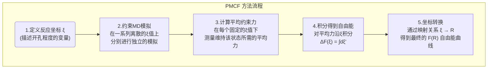

# 皮肤屏障的两种面孔：分子模拟揭示亲水与疏水跨膜孔道的形成机理

## 本文信息

  - **标题**: 皮肤屏障功能的模拟：神经酰胺双层中疏水性和亲水性跨膜孔的自由能
  - **作者**: Rebecca Notman, Jamshed Anwar, W. J. Briels, Massimo G. Noro, Wouter K. den Otter
  - **发表时间**: 2008年11月
  - **单位**: 伦敦国王学院 (英国), 布拉德福德大学 (英国), 特文特大学 (荷兰), 联合利华研发中心 (英国)
  - **引用格式**: Notman, R., Anwar, J., Briels, W. J., Noro, M. G., & den Otter, W. K. (2008). Simulations of Skin Barrier Function: Free Energies of Hydrophobic and Hydrophilic Transmembrane Pores in Ceramide Bilayers. *Biophysical Journal*, *95*(10), 4763–4771. [https://doi.org/10.1529/biophysj.108.138545](https://www.google.com/search?q=https://doi.org/10.1529/biophysj.108.138545)

## 摘要

> 跨膜孔的形成是许多生物过程的核心，例如离子运输、细胞融合和病毒感染。此外，在角质层的神经酰胺双层中形成孔道，可能是**二甲基亚砜 (DMSO) 等渗透增强剂削弱皮肤屏障功能的重要机制**。我们使用**平均约束力势 (PMCF)** 方法，计算了神经酰胺双层在其天然凝胶相和DMSO诱导的流化状态下形成孔道的自由能。我们的模拟显示，流体相双层形成了典型的**充满水的亲水性孔道**，与在磷脂双层中观察到的相似。相比之下，刚性的凝胶相双层则形成了**疏水性孔道**。在我们研究的相对较小的孔径下，这些疏水性孔道是空的而不是充满水的，这表明它们并不会损害神经酰胺膜的屏障功能。一种唯象理论分析表明，这些“蒸汽孔”在临界半径以下是稳定的，因为产生水-蒸汽和脂质尾链-蒸汽界面的能量代价，低于直接将强疏水性尾链暴露于水中的代价。PMCF方法计算出的蒸汽孔自由能曲线支持了这一分析。这些模拟指出，**高浓度的DMSO通过显著降低开孔所需的自由能，从而极大地损害了皮肤的屏障功能**。

### 核心结论

  - **皮肤屏障存在两种截然不同的孔道**：在天然的、高度有序的**凝胶相**状态下，神经酰胺双层倾向于形成**疏水性的“蒸汽孔”**（即内部真空、不导通水分）；而在被DMSO等化学物质**流化**后，则会形成**亲水性的、充满水的孔道**。

  - **天然皮肤屏障的“自我修复”机制**：即使在刚性的凝胶相中形成微小缺陷（疏水孔），由于其内部极度疏水，水分子无法进入，因此**不会破坏其防水屏障功能**。这解释了为何皮肤在日常拉伸和弯曲下仍能保持强大的屏障能力。

  - **DMSO的促渗机理**：高浓度的DMSO能够破坏神经酰胺头基间的氢键网络，使膜从凝胶相转变为流体相。更重要的是，它**极大地降低了形成“导通性”亲水孔的自由能垒**，使得水溶性物质更容易穿透皮肤。

  - **理论模型的验证与拓展**：本文首次计算了神经酰胺双层中的成孔自由能，并提出和验证了描述疏水孔和蒸汽孔能量的唯象模型，拓展了经典的成孔理论。

## 背景

我们的皮肤是抵御外界环境的第一道、也是最重要的一道防线。这道防线的核心在于皮肤最外层的角质层 (stratum corneum)，其中的神经酰胺 (ceramide) 脂质双层像“灰浆”一样填充在角质细胞“砖块”之间，形成了一道致密、高度疏水的屏障，防止体内水分流失和外界有害物质入侵。

然而，在医药和化妆品领域，我们常常希望能够“临时”打开这道屏障，以便将药物或活性成分有效地递送到皮肤内部，这就是所谓的“经皮给药”。为了实现这一点，科学家们常用一些化学物质，如二甲基亚砜 (DMSO)，作为“渗透增强剂”。我们知道DMSO很有效，但它在分子层面究竟是如何“撬开”这道坚固的屏障的呢？一种被广泛猜测的机制是：**DMSO可能通过在脂质双层上诱导出微小的、瞬时的孔道，从而为物质的穿透提供捷径**。

尽管在普通的、处于流动态的磷脂双层膜（构成大多数细胞膜）中，孔道的形成已有较多研究，但对于皮肤角质层中这种由神经酰胺构成的、在生理条件下处于高度有序、坚硬的“凝胶相”的特殊膜体系，我们对其成孔机制知之甚少。这些刚性的膜在形成孔道时，行为是否会与柔性的流体膜一样？DMSO又是如何参与并改变这一过程的？回答这些问题，对于理性设计更安全、更高效的经皮给药系统至关重要。

## 关键科学问题

本研究旨在通过分子动力学模拟，从原子和能量的层面回答以下核心科学问题：

1.  **神经酰胺双层中存在何种类型的孔道**？在天然的、坚硬的凝胶相状态下，和被DMSO“软化”的流体相状态下，形成的跨膜孔道在结构和性质上有何不同？

2.  **形成这些孔道需要克服多大的能量壁垒**？即成孔的自由能是多少？这个能量壁垒的大小直接决定了孔道在生理条件下自发形成的概率。

3.  **DMSO是如何影响成孔过程的**？它仅仅是让膜变得更“软”，还是直接参与并降低了成孔的能量成本？定量地揭示这一过程，是理解其渗透增强机理的关键。

## 创新点

  - **首次计算神经酰胺膜的成孔自由能**：利用先进的**平均约束力势 (PMCF)** 计算方法，本文首次定量地给出了在两种不同物相（凝胶相和流体相）下，神经酰胺双层中跨膜孔道形成的完整自由能曲线。

  - **发现并命名“蒸汽孔”**：在模拟天然的凝胶相神经酰胺膜时，研究者发现了一种全新的孔道类型。这种孔道由疏水性的脂质尾链包围，并且在其内部是空的（充满水蒸气而非液态水），因此将其命名为“**蒸汽孔 (Vapor pore)**”。这一发现颠覆了传统对疏水孔必定充满水的认知。

  - **提出并验证新理论模型**：基于经典的成孔理论，研究者们进一步提出了能够描述疏水孔和蒸汽孔自由能的唯象物理模型，并通过模拟数据成功验证了该模型的合理性，为理解不同类型孔道的稳定性提供了理论基础。

  - **揭示DMSO的分子机理**：研究不仅证实了DMSO能诱导膜从凝胶相向流体相转变，更定量地指出，**DMSO能将形成亲水性孔道的能垒降低一个数量级**，从而极大地促进了导通性孔道的形成，为解释其强大的促渗效果提供了直接的分子层面的证据。

-----

## 研究内容

### 核心方法论：从模拟细节到理论模型

为了精确计算在膜上“开一个洞”需要多少能量，研究者们设计了一套严谨的模拟流程，并结合了先进的自由能计算方法和深刻的理论分析。

#### 模拟体系的构建

  - **核心组分**：模拟体系的核心是**神经酰胺2 (Ceramide 2)** 双层膜，它是人体皮肤角质层中最丰富的神经酰胺类型。体系共包含512个神经酰胺分子。

  - **两种环境**：为了对比，研究者构建了两种不同的模拟环境：

    1.  **纯水环境**：模拟天然皮肤屏障，此时神经酰胺分子紧密排列，形成有序且刚性的**凝胶相 (gel phase)**。
    2.  **高浓度DMSO水溶液**：将膜置于0.6摩尔分数的DMSO水溶液中，模拟使用渗透增强剂后的情况。在此条件下，膜的有序性被破坏，转变为无序且柔软的**流体相 (fluid phase)**。

  - **模拟参数**：所有模拟均在323 K (50°C)下进行。神经酰胺采用基于Berger力场的联合原子力场，DMSO采用Bordat等人参数化的模型，水则采用经典的SPC模型。所有模拟均通过修改版的 **GROMACS** 软件包完成。

#### 核心计算方法：平均约束力势 (PMCF)

PMCF是一种精确计算沿某个特定路径（反应坐标）的自由能变化的方法，其过程可以分解为以下几个步骤：

  - **1. 定义反应坐标 ξ**：为了描述“开孔”这一过程，研究者定义了一个基于膜中心一个微小圆柱区域内脂质密度的变量 `ξ`。当膜完整时，该区域密度正常，`ξ` 接近于0；当脂质被逐渐从该区域排开，孔道开始形成时，`ξ` 逐渐增大。

  - **2. 施加约束并模拟**：研究者进行了一系列独立的MD模拟。在每一系列模拟中，`ξ` 的值被算法**强制固定**在一个特定的数值上。例如，分别在 `ξ`=0.1, 0.2, 0.3... 等多个点上进行模拟。

  - **3. 计算平均约束力 \<F(ξ)\>**：为了将 `ξ` 维持在一个固定值，模拟程序必须施加一个虚拟的“约束力”来对抗系统自发回到平衡态的趋势。通过对每个约束模拟进行足够长时间的采样，就可以得到在该 `ξ` 值下，维持该状态所需的**时间平均约束力**。

  - **4. 积分得到自由能 F(ξ)**：根据热力学积分的基本原理，将得到的平均约束力 `<F(ξ)>` 沿着反应坐标 `ξ` 从0积分到目标值，就可以得到系统从完整膜状态到 `ξ` 状态的自由能变化曲线 $F(\xi)$。

  - **5. 映射为 F(R)**：`ξ` 是一个抽象的密度坐标，为了得到更直观的、以孔道半径R为变量的自由能曲线 $F(R)$，研究者使用了一种粒子插入的算法来建立 `ξ` 和 R 之间的映射关系，最终将 $F(\xi)$ 转换为 $F(R)$。

#### 理论模型：从经典到创新

为了从物理层面理解模拟得到的自由能曲线，研究者引入并发展了几个唯象理论模型。

**图1：神经酰胺2和DMSO的分子结构。**

1.  **经典亲水孔模型**:

      - **Litster模型**：最早的成孔模型，认为成孔自由能是**线张力能**（创造边缘的代价）和**表面张力能**（释放膜张力的收益）之间的竞争：
        $$
        \Delta F = 2\pi R\lambda - \pi R^2\gamma_s
        $$
      - **Tolpekina模型**：这是对Litster模型的改进，特别适用于本文中**总面积固定**的模拟系综。它额外考虑了因开孔导致剩余膜面积被压缩而产生的**弹性形变能**：
        $$
        F_{philic}(R) = \frac{K_A}{2A_0}(A-A_0)^2 + 2\pi R\lambda
        $$
        
        公式的通俗解释
          - **$2\pi R\lambda$**：这是**线张力能**，代表了创造一个周长为 $2\pi R$ 的孔道边缘所需要的能量。$\lambda$ 是线张力系数，可以理解为膜边缘的“一维表面张力”。
          - **$\frac{K_A}{2A_0}(A-A_0)^2$**：这是**弹性形变能**。在固定的模拟盒子中，开一个半径为R的孔，剩余膜的面积 $A = A_{||} - \pi R^2$ 就会被压缩（或拉伸）偏离其最稳定的面积 $A_0$。$K_A$ 是膜的面积压缩模量，这个项描述了这种形变带来的能量代价。

2.  **本文提出的疏水/蒸汽孔模型**:
    这是本文的理论创新。研究者认为，对于疏水孔，不能再用“线张力”来描述，而应该用更基本的“界面张力”。

      - **充满水的疏水孔模型 ($F_{phobic}$)**：
        $$
        F_{phobic}(R) = \frac{K_A}{2A_0}(A-A_0)^2 + 2\pi Rh\gamma_{tw}
        $$
        这里，能量代价主要来自孔道内壁形成的面积为 $2\pi Rh$（h是膜厚）的**脂质尾链-水界面**，其单位面积能量为 $\gamma_{tw}$。
      - **空的蒸汽孔模型 ($F_{vapor}$)**：
        $$
        F_{vapor}(R) = \frac{K_A}{2A_0}(A-A_0)^2 + 2\pi Rh\gamma_{tv} + 2\pi R^2\gamma_{wv}
        $$
        这种情况下，能量代价来自两部分：孔道内壁形成的**脂质尾链-蒸汽界面**（能量为 $2\pi Rh\gamma_{tv}$）和孔道两端形成的两个圆形的**水-蒸汽界面**（能量为 $2\pi R^2\gamma_{wv}$）。

### 结果与分析：两种截然不同的孔道

#### 1. 流体相 (含DMSO)：经典的亲水孔

**图2：在含DMSO的流化神经酰胺双层中形成亲水孔的过程。** 随着约束增强（半径R增大），脂质头基向内翻转，形成一个由亲水头基包围的、充满溶剂（水和DMSO）的孔道。

在DMSO存在下，神经酰胺膜变得柔软、呈流体状。此时，成孔机制与教科书中的磷脂膜非常相似：

  - **头基翻转**：当膜被拉开时，神经酰胺的亲水头基会主动向内翻转，形成孔道的内壁，以“保护”内部疏水的尾链不与水接触。
  - **溶剂填充**：孔道一旦形成，水和DMSO分子会立即涌入，形成一个导通的跨膜通道。
  - **极低的能垒**：计算出的成孔自由能垒非常低，**仅为几个 $k_B T$**。这意味着在DMSO存在下，这种亲水孔可以相当容易地自发形成和闭合，从而大大增强了膜的通透性。

**图3：含DMSO的神经酰胺双层中亲水孔的自由能曲线。** 模拟数据点与经典的Tolpekina理论模型拟合得非常好。

**表1：DMSO浓度对神经酰胺膜力学性质的影响**

| DMSO摩尔分数 | 平衡单位脂质面积 ($a_0$, nm²) | 弹性模量 ($K_A$, mJ/m²) | 线张力 (λ, pJ/m) |
|---|---|---|---|
| 0.0 | 0.374 ± 0.001 | 7900 ± 700 | **440 ± 8** |
| 0.1 | 0.385 ± 0.001 | 3700 ± 300 | 250 ± 20 |
| 0.6 | 0.68 ± 0.02 | 190 ± 20 | **7 ± 20** |

从表中可见，DMSO使膜的弹性模量急剧下降，而亲水孔的线张力（7 pJ/m）也比疏水孔的线张力（440 pJ/m）低了**近两个数量级**。

#### 2. 凝胶相 (纯水)：新奇的疏水“蒸汽孔”

**图4：在纯水中的凝胶相神经酰胺双层中形成疏水孔的过程。** 即使孔道半径达到1.32 nm，其内部仍然是空的，水分子无法进入。

在纯水中，神经酰胺膜处于刚性的凝胶相，其成孔行为截然不同：

  - **无头基翻转**：由于头基之间强大的氢键网络锁定了脂质，当膜被拉开时，脂质分子无法有效重排。结果是，孔道的内壁直接由**疏水性的脂质尾链**构成。
  - **水被排斥在外**：最令人惊讶的发现是，即使孔道已经变得足够大，可以容纳许多水分子，但由于其内壁极度疏水，**液态水并不会进入孔道**。孔道内部形成了一个真空或充满水蒸气的区域，研究者将其命名为“蒸汽孔”。
  - **极高的能垒**：形成这样一个孔道的自由能垒非常高，仅打开一个半径为1Å的微小孔道就需要**约60 kJ/mol (超过20 $k_B T$)** 的能量。这意味着在自然状态下，这种孔道极难自发形成，即使形成，由于内部是真空，它也**无法传导水溶性物质**。

**图5：三种不同孔道结构的示意图。** 清晰地展示了亲水孔、充满水的疏水孔和空的蒸汽孔之间的区别。

**图6：凝胶相中蒸汽孔的自由能曲线。** 模拟数据点（圆圈）与新提出的蒸汽孔理论模型（实线）吻合得相当好。图中还分解了弹性、水-蒸汽界面和尾链-蒸汽界面对总自由能的贡献。

唯象理论分析也支持了蒸汽孔的稳定性。对于一个小孔来说，形成一个大的“油-水”界面（充满水的疏-水孔）的能量代价，要高于形成一个“油-气”界面和两个“水-气”界面（蒸汽孔）的能量代价之和。只有当孔道半径超过某个临界值（估计约为膜厚的0.4倍）时，水才有可能填充进去。

**图7：不同DMSO浓度下，膜条带边缘的快照。** (a) 纯水中，边缘是平直的疏水界面；(c) 0.6 mol分数DMSO中，边缘重排为亲水界面。

-----

## Q\&A

  - **Q1**: 为什么在刚性凝胶相中形成的疏水孔是“空的”（蒸汽孔），而不是像我们想象的那样充满水？

  - **A1**: 这背后是界面能的博弈。一个半径为R、高度为h的孔道，如果充满水，会形成一个面积为 $2\pi Rh$ 的脂质尾链-水界面，其能量代价正比于 $\gamma_{tw}$（尾链-水界面张力）。如果它是空的，则会形成一个面积为 $2\pi Rh$ 的脂质尾链-蒸汽界面（能量代价正比于 $\gamma_{tv}$）和两个面积为 $\pi R^2$ 的水-蒸汽界面（能量代价正比于 $\gamma_{wv}$）。由于 $\gamma_{tw}$ 非常大（油水不相溶），而 $\gamma_{tv}$ 和 $\gamma_{wv}$ 相对较小，在R很小的时候，形成后两种界面的总能量代价要低于形成前一种界面。因此，系统宁愿在孔道内部维持一个真空，也不愿让水接触到大量的疏水尾链。

  - **Q2**: 这项研究如何从分子层面解释DMSO作为渗透增强剂的强大效果？

  - **A2**: 研究从两个层面揭示了DMSO的机理：

    1.  **物理性质改变（“软化”）**：高浓度DMSO能有效插入到神经酰胺头基之间，破坏其紧密的氢键网络，使得整个膜从坚硬、致密的凝胶相转变为柔软、疏松的流体相。这本身就降低了分子扩散的阻力。
    2.  **成孔机制改变（“开路”）**：这是本文最核心的发现。在天然凝胶相中，即使形成孔道也是不导通的“蒸汽孔”，能垒极高。而DMSO的“软化”作用使得脂质头基可以自由翻转，从而能够形成**亲水性的、充满水的孔道**。更关键的是，形成这种导通性孔道的自由能垒**极低**（仅几个 $k_B T$）。这意味着，在DMSO的作用下，皮肤屏障上会频繁地、自发地出现可供水溶性分子通过的“捷径”，从而使其通透性得到数量级的提升。

  - **Q3**: 论文中反复提到的“线张力 (line tension)”究竟是什么物理量？

  - **A3**: “线张力”可以理解为**膜边缘的“一维表面张力”**。当你在一个二维的膜上开一个洞时，就创造出了一条一维的边缘。维持这条边缘的存在需要付出能量代价，这个能量代价与边缘的长度成正比，其比例系数就是线张力 `λ`，单位是能量/长度（如pJ/m）。对于亲水孔，边缘由亲水的头基构成，与水相互作用良好，所以线张力很低。而对于疏水孔，边缘是暴露的疏水尾链，与水接触是能量上非常不利的，因此其线张力会高出几个数量级。

  - **Q4**: 为什么模拟要在恒定膜面积下进行，而不是恒定压强？这对结果解读有什么影响？

  - **A4**: 这是一个重要的技术细节。作者解释说，在PMCF模拟中，施加在脂质密度上的约束力会贡献到体系的侧向压强中，同时，如果允许膜面积变化（恒压），压强控制算法（barostat）对盒子尺寸的缩放又会反过来改变反应坐标 `ξ` 的值。这两者耦合在一起会使模拟和分析变得非常复杂。为了避开这些技术难题，研究者选择了在**恒定膜面积**下进行模拟。这意味着，解读结果时必须使用考虑了膜弹性形变能的理论模型，也就是本文中重点使用的Tolpekina模型及其衍生模型，而不是更简单的Litster模型。

-----

## 关键结论与批判性总结

### 潜在影响

  - **揭示皮肤屏障的内在韧性**：“蒸汽孔”的发现从分子层面解释了为何高度有序的角质层脂质在受到机械应力产生微小缺陷时，仍能保持其优异的防水功能，为皮肤的生物力学和生理功能提供了新的见解。
  - **指导经皮给药系统设计**：通过定量揭示DMSO降低亲水孔形成能垒的机理，该研究为筛选和设计新型、高效、低毒的化学渗透增强剂提供了明确的物理化学指导原则，即重点关注那些能够有效流化神经酰胺膜并降低其亲水孔线张力的分子。
  - **拓展膜物理理论**：将经典的成孔理论拓展到刚性的凝胶相和疏水孔道体系，为理解纳米尺度下受限空间内的疏水效应和去湿现象（dewetting）提供了重要的理论模型和模拟证据。

### 研究局限性

  - **模型简化**：研究使用的是单一组分（神经酰胺2）的模型膜，而真实的角质层脂质包含多种神经酰胺、胆固醇和游离脂肪酸。这种简化可能会影响定量的结果，如能垒的具体数值。
  - **力场限制**：模拟使用的是联合原子力场，这在一定程度上简化了分子的表示。使用全原子力场可能会提供更精确的细节，但计算成本也会更高。
  - **时间尺度限制**：尽管PMCF是高效的自由能计算方法，但单次模拟的时长仍然有限（纳秒级）。对于孔道形成与闭合的完整动力学过程，可能需要更长时间的模拟或专门的路径采样方法来研究。

### 未来方向

  - **构建更复杂的模型**：将胆固醇和游离脂肪酸等关键组分加入到模拟体系中，研究多组分膜的成孔行为，使其更接近真实的皮肤环境。
  - **研究其他促渗剂**：利用本文建立的计算框架，系统地研究其他类型的渗透增强剂（如酒精、脂肪酸、表面活性剂等）的分子机理，进行横向比较和筛选。
  - **模拟分子穿透过程**：在已经形成的孔道模型中，直接模拟药物分子或水分子的穿透动力学，以计算真实的渗透系数，并将模拟结果与实验直接对比。