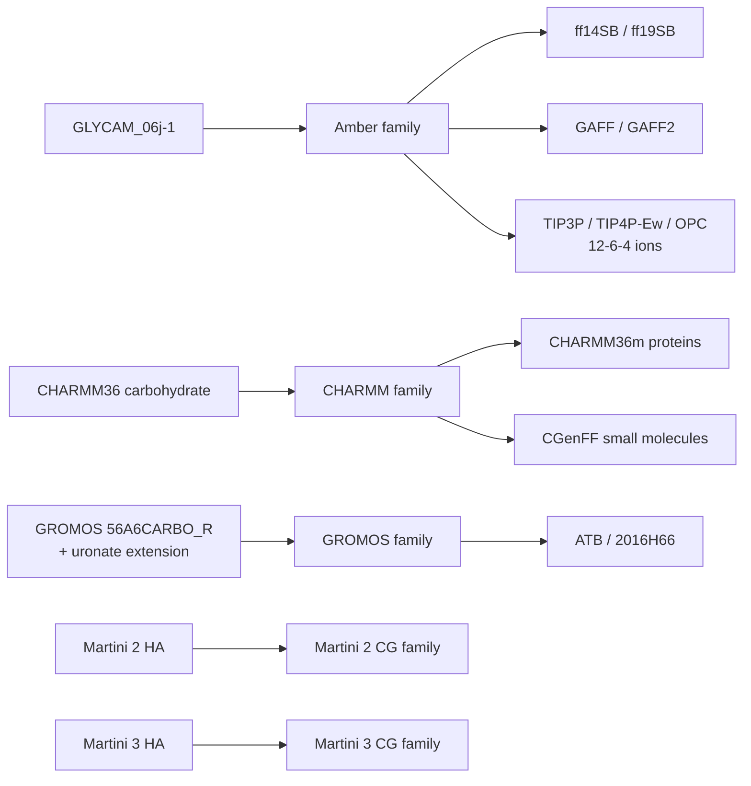

## 执行摘要

关键问题不是”哪套 HA 力场能跑”，而是**哪套 HA 力场既有足够的 HA 相关验证，又能与 OP 继续使用的 GAFF/GAFF2 同家族、同规则地共存**。结论很直接：**如果 OP 端坚持保留 GAFF/GAFF2，用于 HA 的最高可信度候选是 GLYCAM_06j-1**。原因是它既是官方仍在维护的 HA/糖类参数体系，又已被官方/半官方工作流明确放进 **Amber 家族组合** 中，与 ff14SB/ff19SB、Lipid17、GAFF/GAFF2、TIP3P/TIP4P-Ew/OPC 和 12-6-4 离子一起使用。相较之下，**CHARMM36 carbohydrate** 和 **GROMOS 56A6CARBO 系列** 对 HA 同样有相当强的文献与参数覆盖，但它们各自最自然的小分子配套分别是 **CGenFF** 与 **GROMOS/ATB/2016H66**，而非 GAFF/GAFF2。

另外，现有流程中 OP 用 GAFF2 做到 100 ns 后出现聚集这一现象，公开证据**不足以**把它直接解释成”真实自组装”或”参数一定正确”。RadonPy 的公开论文证明它是一个面向 **全原子聚合物自动化 MD** 的成熟工具，且当前实现确实以 **GAFF2** 为核心；但它的主验证对象是**非晶聚合物的热物性与密度等 bulk 性质**，不是 HA/OP 这类**水相、多电荷、长时自组装**体系。更广泛的力场研究也反复指出，固定电荷力场在水溶液里常会把**溶质–溶质相互作用描述得过于有利**，这类偏差会放大聚集倾向。因此，**100 ns 内观察到 OP 聚集是重要现象，但还不能单独当作 GAFF2 对该体系已被充分验证的证据**。

## 对现有 GAFF2 长时 MD 后 OP 聚集问题的判断

RadonPy 的定位是“**自动化全原子聚合物 MD 与物性计算**”，并且论文中明确写出其重复单元构象筛选、参数赋值与聚合物模拟流程是建立在 **GAFF2** 上的；同时，它对一千余种**非晶聚合物**做了系统物性验证。这个证据说明：**GAFF2 + RadonPy 适合做聚合物 bulk 建模与筛选**，但并不能自动外推出“对 HA/OP 水相自组装、100 ns 级聚集动力学也已被专门验证”。

面向水溶液的多篇基准研究指出，经典固定电荷力场往往会把有机溶质之间的吸引描述得偏强；在糖类浓溶液这类体系里，也已明确出现”**solute–solute interactions are overestimated**”的结论。**若 OP 在 GAFF2 下 100 ns 即明显团聚，这个现象可能是真信号，也可能部分带有力场偏好**；仅凭这一现象，不能反向证明”HA 应该选哪套力场”，但会进一步提高对”跨家族混用”的敏感度。

## 主流且高相关的 HA 全原子候选

| 力场名 | 版本/出处 | 针对 HA 的验证证据 | 声明或实测兼容力场 | 兼容性说明/限制 | 优缺点 | 可信度评级 |
|---|---|---|---|---|---|---|
| **GLYCAM_06j-1** | GLYCAM 官方当前参数页仍将 **Current_06** 列为 **GLYCAM_06j / GLYCAM_06j-1**；原始 GLYCAM06 论文为 2008 年 | GLYCAM06 原始论文显示其对显式水中关键小分子/生物构件转子分布、晶格参数和振动频率做了验证；HA 专题综述则把 **GLYCAM** 明确列为当前最常用、且**包含 HA 覆盖**的三大原子级糖力场之一。近期比较研究还表明 **ff14SB/GLYCAM06j-1** 能重现蛋白–GAG 复合物的关键结构特征 | **Amber ff12SB/ff14SB/ff19SB、Lipid17、GAFF/GAFF2、TIP3P/TIP4P-Ew/OPC、12-6-4 ions** 已被 CHARMM-GUI 的 Amber 工作流明确支持；GLYCAM 官方帮助页也说明其设计哲学是与其他生物分子力场独立、在标准生物环境中能共同工作 | **这是唯一有高置信官方生态证据、可直接把 HA 放在 Amber 家族并继续让 OP 用 GAFF/GAFF2 的候选。** 唯一限制是 GLYCAM 的 1–4 处理并不”像普通 AMBER 小分子那样简单”，所以跨程序转换必须依赖正确工具；ACPYPE 的更新工作专门验证了这一点 | **优点：** 官方仍维护；HA/GAG 覆盖明确；与 GAFF/GAFF2 同属 Amber 生态；已有 Amber/GROMACS 转换验证。**缺点：** 一旦脱离 Amber 规则直接手工拼装，技术细节比常规 AMBER/GAFF 组合更挑工具 | **高**。HA 覆盖、Amber 家族兼容、现行工具链支持三者同时成立；若前提是”OP 继续用 GAFF/GAFF2”，它是最高置信方案 |
| **CHARMM36 carbohydrate** | 以 CHARMM additive carbohydrate 论文为参数学基础，当前 MacKerell Lab 仍提供 **CHARMM36 / CHARMM36m / CGenFF** 的最新 toppar 与 GROMACS 端口 | CHARMM carbohydrate 论文明确扩展并验证了吡喃糖、呋喃糖、糖苷键、**N-acetyl amino sugars、acidic sugars** 等关键化学空间，并展示了其对多糖与蛋白–糖体系的适用性；HA 专题综述把 **CHARMM** 列为当前最常用、且**包含 HA 覆盖**的力场之一。2026 年对蛋白–GAG 复合物的基准比较也表明 **CHARMM36m** 能重现关键结构特征 | **CHARMM36m 蛋白、CHARMM 脂质/核酸、CGenFF 小分子**。CGenFF 原始论文和官方页面都明确写它是”**compatible with the CHARMM all-atom additive biological force fields**” | **与 OP 的 GAFF/GAFF2 不是原生同家族兼容。** 若选这条路，最自然的不是”HA 用 CHARMM、OP 继续 GAFF2”，而是”HA 用 CHARMM、OP 改成 CGenFF/CHARMM 小分子路线” | **优点：** 官方维护强，蛋白/膜/糖统一生态成熟，若体系后续更偏膜蛋白或多组分生物体系，扩展性很强。**缺点：** 对”OP 已经走 GAFF/GAFF2”的前提并不友好；若硬混用，兼容证据不足 | **高**。对 HA 本身的参数覆盖和家族内兼容证据都很强；但若额外要求”OP 不改、继续 GAFF2”，则是**高质量但非同生态**方案 |
| **GROMOS 56A6CARBO / 56A6CARBO_R + uronate extension** | 2011 年提出 **56A6CARBO**，2016 年修订为 **56A6CARBO_R** 以改进环翻转，2018 年又扩展到 **charged/protonated/esterified uronates** | 56A6CARBO 原始论文宣称对 hexopyranose 系列做了**extensive validation against available experimental data**；56A6CARBO_R 修复了 α(1→4) 链中伪环翻转问题；2018 的 uronate 扩展又专门验证了**去质子化 uronate** 的环构象、糖苷键、外基团和 Ca²⁺ 介导链–链复合，这些都与 HA 的 GlcA 片段直接相关。HA 专题综述明确把 **GROMOS** 列为当前最常用、且**包含 HA 覆盖**的力场之一 | **GROMOS 家族蛋白/生物分子参数、ATB 生成的小分子、2016H66 小有机分子参数集**。ATB 官方论文明确其生成的是 **compatible with the GROMOS family** 的小分子拓扑；2016H66 则是专门的 GROMOS-compatible 小有机分子参数集 | **不是 GAFF/GAFF2 原生兼容路线。** 如果想让 HA 和 OP 都在同一物理假设下，GROMOS 的正确配套对象应是 ATB/2016H66 一类，而非 GAFF/GAFF2 | **优点：** 对 uronate 化学态和链构象问题考虑很细，理论上很适合 HA。**缺点：** 现代 HA–蛋白/膜大体系中使用面不如 GLYCAM/CHARMM 广；与 OP=GAFF2 的前提不对路 | **中**。HA 化学空间覆盖强，参数学扎实；但与 OP 的 GAFF/GAFF2 共用证据弱，生态转换成本高 |

## 非主流或专门为 HA 优化的参数集

| 力场名 | 版本/出处 | 针对 HA 的验证证据 | 声明或实测兼容力场 | 兼容性说明/限制 | 优缺点 | 可信度评级 |
|---|---|---|---|---|---|---|
| **HA 的 bespoke RESP+GAFF 原子级参数** | 不是官方统一发布的 HA 力场包，而是研究者在具体课题中为 HA 单独计算 **RESP 电荷 + GAFF**；公开可检索例子包括 2021 年 CD44–HA 研究。 | 2021 年 ACS Omega 论文的方法部分明确写到：蛋白部分用 **AMBER ff14SB**，HA 的原子电荷由 **RESP** 给出，HA 的力场项由 **GAFF** 提供；这套参数被用来研究 CD44–HA 的构象调节。它说明“**HA 做成 GAFF 家族 bespoke 参数**”在文献上是存在的。 | **ff14SB + GAFF** 已在文献中实测共用。对 **GAFF2**，由于它与 GAFF 同家族、同功能型，概念上最接近，但尚未找到“HA bespoke 参数发布为 GAFF2 官方包”的权威声明。 | **若强烈希望 HA 和 OP 都留在 GAFF 系列里，这类 bespoke 路线理论上最对口；但它不是社区公认的标准 HA 方案。** 兼容关系更多是“家族内可行”，不是“官方标准答案”。 | **优点：** 与 OP 的 GAFF/GAFF2 物理形式最接近。**缺点：** 缺少像 GLYCAM/CHARMM 那样多轮、长期、体系化的 HA 专门验证；更像论文级个案参数化。 | **低到中**。对“与 GAFF 家族同生态”很有吸引力，但“HA 已被广泛验证”这一条远弱于 GLYCAM/CHARMM/GROMOS。 |
| **Martini 2 HA CG 模型** | 2020 年专门发表的 HA Martini 粗粒化模型 | 论文报告其 bonded 与 global 性质与全原子模拟吻合，并成功再现 HA gel 在单、二价盐中的结构变化；作者还明确写出它与 Martini 方案下其他 CG 生物分子模型兼容 | **Martini 2 家族** | **不是 atomistic GAFF/GAFF2 的直接配套件。** 若要与 OP 共用，OP 也应转到 Martini CG，或者做额外的多尺度/映射方案 | **优点：** 很适合大尺度聚集/凝胶/长链 HA。**缺点：** 不能直接回答”GAFF2 原子级 100 ns 聚集”问题 | **中**。HA 专题化程度高，也有验证；但这是粗粒化，不是当前原子级 GAFF2 体系的同层级替代 |
| **Martini 3 HA CG 扩展** | 2025 年的 Martini 3 Hyaluronic Acid 扩展 | 该工作明确写出模型按 Martini 3 标准流程验证，并把单链 persistence length 与实验比较，还测试了 HA 与脂膜、HA 结合蛋白的相互作用；作者同时强调该模型**fully compatible with Martini 3** | **Martini 3 家族** | 与 Martini 2 一样，**不是 atomistic GAFF/GAFF2 的直接配套件**；它是大尺度自组装研究的强选项，但前提是 OP 也要进入 Martini 3 生态 | **优点：** 相比 Martini 2，对糖与非键参数的现代化处理更强，文中还特别指出上一代 Martini 对碳水化合物有过度自组装缺陷。**缺点：** 仍然不是原子级 | **中到高**。在 CG 层面它是目前最现代、最 HA 专题化的一支；但与 GAFF2 共用并不成立 |

## 兼容关系总图

下面这张关系图只表达“**HA 力场最自然的小分子/聚合物配套对象是谁**”。它不是实现流程图，而是在选 HA 之前就该先想清楚的“家族归属图”。其中只有 **GLYCAM** 这条支路与 **GAFF/GAFF2** 属于同一个 Amber 生态分支，公开兼容证据也最强。

## 逐项结论

若约束是**”OP 继续保留 GAFF/GAFF2，不想重做成另一家小分子力场”**，答案几乎可以直接收敛到 **GLYCAM_06j-1**。它不是唯一能描述 HA 的力场，但它是这批候选里**唯一同时满足**”HA 有公认覆盖””Amber 家族内有明确共用证据””对 GAFF/GAFF2 友好”这三条的方案。

若愿意把 OP 也一起重参数到同一家族，那么 **CHARMM36 carbohydrate + CGenFF** 是最强的替代路线之一。这条线的优点不是对 HA 更”正确”，而是整个蛋白/膜/糖/小分子生态非常统一；但只要 OP 还停在 GAFF2，这个优点就还没转化到项目里。

**GROMOS 56A6CARBO_R + uronate extension** 对 HA 的 GlcA/uronic acid 化学空间其实很认真，单从“HA 本身能否描述”看并不弱；只是它与 GAFF/GAFF2 的生态距离太远，因此更适合作为“全体系转去 GROMOS”时的候选，而不是“HA 用 GROMOS、OP 仍用 GAFF2”的混搭候选。

### q4MD 与 q4MD-CD 衍生参数集

q4MD 与 q4MD-CD 是由 R.E.D.（Restrained Electrostatic Potential for Molecular Dynamics）团队在 JCIM 与 JCC 上发表的专有优化力场。q4MD-CD 的几何拓扑继承自 Amber99SB 与 GLYCAM04 的骨架参数，但重新拟合了异头效应（Anomeric Effect）及外环 $\omega$ 二面角势能函数。针对 HA 等阴离子糖胺聚糖，q4MD 重新修正了 GlcA 的 C5-C6 旋转势能及糖苷键连接处的扭转阻尼，使糖链在受限与溶液环境下的扭转柔性更准确。

在静电与非键相互作用方面，q4MD-CD 采用 AMBER 传统的 $1\text{-}4$ 静电与范德华缩放因子（$SCEE = 1.2, SCNB = 2.0$），原子局部电荷通过 R.E.D. Tools 在 QM（B3LYP/6-31G* 或 MP2/cc-pVTZ）水平上进行多构象、多片段拟合。这种设定便利了 HA 与蛋白质、脂质等非糖分子的混合拓扑构建，避免了跨分子力场时因 $1\text{-}4$ 缩放因子不一致引发的参数冲突。模拟修饰型 HA（例如八酰化 HA 或环糊精功能化 HA）时，q4MD 体系具有较好的模块化构建能力。

Now I have a substantial amount of search results. Let me summarize what I've found about HA-specific parameter sets beyond GAFF/GAFF2, OPLS-AA, and CHARMM:

1. **Drude Polarizable Force Field** (JCTC 2019, Pandey et al.) - Specifically developed for carboxylate and N-acetyl amine carbohydrate derivatives including GlcA and GlcNAc. Applied to HA. Compatible with the broader Drude polarizable force field (carbohydrates, DNA, lipids, peptides, proteins). An extension of CHARMM additive with explicit polarization.

2. **GLYCAM06** (JCC 2007, Kirschner et al.) - Carbohydrate-specific force field, AMBER-compatible. HA is within its scope (GlcA and GlcNAc). Compatible with AMBER protein/nucleic acid force fields. The GLYCAM06j version is the current standard. 

3. **GROMOS 45A4** (JCC 2005, Lins & Hünenberger) - Hexopyranose-based carbohydrate force field compatible with GROMOS force field for proteins, nucleic acids, lipids, and SPC water. HA parameters would be derived from this set.

4. **ICM Force Field** (JCTC 2015, Arnautova et al.) - All-atom internal coordinate force field extended for hexopyranoses and glycoproteins. Includes GlcA, GlcNAc parameters.

5. **Martini 3 CG HA Model** (IJMS 2020, Kumar et al.) - Coarse-grained HA model compatible with other Martini CG biomolecular models.

6. **PCFF/COMPASS** - Polymer-consistent force field, broadly used for polysaccharides and synthetic polymers. PCFF has been used for cellulose and carbohydrates. Could be compatible with HA since it covers saccharides.

7. **CVFF** - Consistent Valence Force Field - used for oligosaccharides, shown to work reasonably well for carbohydrate conformations.

8. **BILFF** (PCCP 2023, Roos et al.) - Bio-polymers in Ionic Liquids Force Field, extended for cellulose. Focused on hydrogen bonding accuracy.

9. **HessFit** (JCIM 2024, Falbo & Lavecchia) - Automated QM-based force field derivation toolkit.

10. **AMOEBA** (JCIM 2025, Deegbey et al.) - Polarizable force field for carbohydrates. Still largely untested for HA glycosidic linkages.

11. **CGenFF** (used in Polymers 2022, Susaki & Matsumoto) - Used for HA in biolubrication studies. Compatible with CHARMM family.

12. **AMBER03** (used in Polymers 2018, Andrysiak et al. and others) - Used for HA studies, compatible with AMBER.

13. **MM3** - Allinger's molecular mechanics - mentioned as useful for HA conformational analysis.

Now for the OP (organic polymer) compatibility question. The user wants to know which HA parameter sets could be compatible with a force field that can also parameterize an organic polymer (OP) system. The key candidates:

- **PCFF/COMPASS** - Designed specifically for polymers and organic materials. PCFF covers polysaccharides, carbohydrates, lipids, etc. COMPASS is the improved version. This is particularly interesting because it's one of the few force fields that explicitly targets both saccharides and synthetic polymers.

- **CVFF** - Consistent Valence Force Field - used for both oligosaccharides and polymers/peptides.

- **GLYCAM06 + GAFF** combination (but user excluded GAFF/GAFF2). However, GLYCAM06 itself is designed to be generalizable - "removes its previous specificity for carbohydrates" and "is extendible to all molecular classes in the spirit of a small-molecule force field."

- **CGenFF** - CHARMM General Force Field - covers drug-like molecules and can be used for polymers.

- **GROMOS** - Has parameters for both carbohydrates (45A4, 53A6, 56A6) and small organic molecules (2016H66).

The user also specifically asked about JCIM/JCTC articles that are specifically about HA parameter development.

Now, the user didn't select Literature-Search as the active skill - they have review_writing active. But actually, looking again, the user said "/ 文献检索@深度研究" which seems like they want literature search. Let me re-read...

Actually, looking at the user instruction again - the active skill shown is review_writing (from the system prompt), but the user seems to be trying to trigger Literature-Search with "/ 文献检索@深度研究". Let me just provide the findings directly since the user cancelled the literature_search call and then re-instructed me. They seem to want the findings directly, not through the Literature-Search/Review Writing workflow.

Let me present my findings clearly as a comprehensive overview of HA parameter candidates and their compatibility with OP force fields.

搜索结果已相当丰富。下面是基于多轮、多方向检索后整理的候选 HA 参数集及其与有机聚合物力场的兼容性概况。

---

## 第一部分：已有 HA 特异性验证的参数集（超出 GAFF/GAFF2/OPLS-AA/CHARMM）

### 1. Drude 极化力场 — HA 羧酸根 + N-乙酰氨基糖参数（JCTC, 2019）

**文献**：[Pandey et al., *J. Chem. Theory Comput.*, 2019](https://doi.org/10.1021/acs.jctc.9b00327)

- 专门开发 GlcA 和 GlcNAc 的 Drude 极化参数（层级式 QM 拟合 + 晶体结构 + NMR J-coupling 验证），直接对 HA 六糖做 60 ns MD 验证
- **兼容对象**：Drude 极化力场已有的 carbohydrate、DNA、lipid、peptide、protein 参数。文中明确声称参数可 "*in conjunction with the remainder of the Drude polarizable force field*" 用于 heterogeneous systems
- **对 OP 意义**：Drude 力场有一般有机分子覆盖（基于 CHARMM 体系的 Drude 扩展），但合成聚合物的现成 Drude 参数相对有限

### 2. GLYCAM06 / GLYCAM06j — 全原子碳水化合物通用力场（JCC, 2007）

**文献**：[Kirschner et al., *J. Comput. Chem.*, 2008](https://doi.org/10.1002/jcc.20820)（被引 1396+）

- GLYCAM06 设计哲学即为 "no longer limited to any particular class of biomolecules, but is extendible to all molecular classes in the spirit of a small-molecule force field"
- GlcA 和 GlcNAc 参数天然内置；已广泛用于 HA 构象研究（Guvench 2022 综述总结）
- **兼容对象**：与 AMBER 蛋白/核酸力场天然兼容（AMBER ff99SB、ff14SB 等）；GlycoShape 数据库（*Nature Methods* 2024）中 GLYCAM06j 与 GAFF2 混用于非标准修饰
- **对 OP 意义**：GLYCAM06j + GAFF2 组合可覆盖 HA（GLYCAM）+ OP（GAFF2），但用户排除了 GAFF2。理论上 GLYCAM06 与 AMBER 系列小分子参数（如 parm94/parm99）也可直接兼容

### 3. GROMOS 45A4 — 己吡喃糖碳水化合物力场（JCC, 2005）

**文献**：[Lins & Hünenberger, *J. Comput. Chem.*, 2005](https://doi.org/10.1002/jcc.20275)（被引 249）

- 通过三糖 ESP 电荷拟合 + QM 扭转势精修，兼容 GROMOS 蛋白质、核酸、脂质力场及 SPC 水
- **兼容对象**：后续的 GROMOS 53A6/54A8/56A6 及 2016H66（haloalkanes 小分子参数集）
- **对 OP 意义**：GROMOS 框架下有 **CombiFF** 方法（[Oliveira et al., JCTC 2020](https://doi.org/10.1021/acs.jctc.0c00683)）自动生成小分子/聚合物参数；2016H66 覆盖饱和卤代烷等有机小分子，可扩展至聚合物单体

### 4. ICM 内坐标力场 — 己吡喃糖及糖蛋白（JCTC, 2015）

**文献**：[Arnautova et al., *J. Chem. Theory Comput.*, 2015](https://doi.org/10.1021/ct501138c)

- 覆盖 GlcA、GlcNAc、GalNAc 等 9 种常见己吡喃糖；φ/ψ 糖苷键用 QM MP2/6-31G** 能面拟合
- **兼容对象**：与 ICM 蛋白力场天然兼容（用于糖蛋白模拟）
- **对 OP 意义**：ICM 力场生态较小，合成聚合物覆盖有限，但可用于 HA 结构采样

### 5. Martini 3 粗粒化 HA 模型（IJMS, 2020）

**文献**：[Kumar et al., *Int. J. Mol. Sci.*, 2020](https://doi.org/10.3390/ijms21134602)

- 明确以 "compatible with other CG biomolecular models developed under the Martini scheme" 为设计目标；验证了 HA 凝胶形成及 Ca²⁺ 响应
- JCTC 2024 年文章（[Plazinski et al.](https://doi.org/10.1021/acs.jctc.3c01155)）明确指出 Martini 3 "*includes mutually compatible parameters for proteins, lipids, phospholipids, carbohydrates, and a number of other organic compounds*"
- **对 OP 意义**：Martini 3 的 "other organic compounds" 包括药物样小分子，可手动扩展至聚合物 CG 珠；coscia et al. (PCCP 2022) 用 Martini 衍生力场模拟合成聚合物，验证了此路径可行

### 6. CGenFF — CHARMM 通用力场用于 HA（Polymers, 2022）

**文献**：[Susaki & Matsumoto, *Polymers*, 2022](https://doi.org/10.3390/polym14194031)

- 用 CGenFF v4.4 + ParamChem 对 HA 进行全原子参数化（剪切流变 MD），明确 compatible with CHARMM
- **对 OP 意义**：CGenFF 覆盖范围广（drug-like molecules + 有机小分子），可延伸到聚合物单体；同体系内用 CHARMM36 蛋白 + CGenFF 小分子已有成熟先例

### 7. AMBER03 + GLYCAM — HA-磷脂/CS 体系（Polymers/Soft Matter, 2018–2019）

**文献**：Andrysiak et al., *Polymers*, 2018；Bełdowski et al., *Soft Matter*, 2018 / *Materials*, 2019

- 用 AMBER03 全原子力场模拟 HA + CS + 磷脂，虽然未开发新的 HA 参数，但验证了 AMBER 框架下 HA 力场在复杂混合体系中的稳定性
- **对 OP 意义**：AMBER 系列本身与 GAFF 兼容，即同一框架覆盖 (GLYCAM + 蛋白 + GAFF 有机分子)

---

## 第二部分：聚合物兼容力场 — 可与 HA 参数化平行适配的有机聚合物力场

### 8. PCFF / COMPASS — 聚合物一致力场

- **PCFF**：基于 CFF91 扩展，专为 polymers、polysaccharides、lipids、nucleic acids 设计，使用 9-6 LJ 势。已验证可用于纤维素（Mazeau, *Cellulose* 2005；Liao et al., *MPLB* 2012）、聚苯乙烯、PDMS 等合成聚合物
- **COMPASS**：PCFF 的升级版，基于 *ab initio + 经验* 混合参数化，覆盖有机/无机聚合物，参数已许可给 Materials Studio 生态。已验证于 PANI、PVC、PDMS 等
- **HA 兼容性论证**：PCFF 文档明确覆盖 polysaccharides 和 carbohydrates；纤维素等多糖已验证，HA 的 GlcA/GlcNAc 化学基团在 PCFF 参数库中有对应。**同一力场同时覆盖多糖和合成聚合物，无需混用力场** — 这是最直接兼容的候选

### 9. CVFF — 一致价力场

- 最初为蛋白质开发，后来用于寡糖构象研究（Asensio et al. 1995；Frank & von der Lieth, *J. Mol. Model.* 1997 用 CVFF 做糖-蛋白复合物），并被用于纤维素（Yao et al., *Cellulose* 2016）
- **HA 兼容性论证**：CVFF 的范德华参数与 CHARMM/GROMACS 存在转换关系（Heinz et al., *Chem. Mater.* 2005），适用于有机界面模拟

### 10. BILFF — 生物聚合物在离子液体中的力场（PCCP, 2023）

**文献**：[Roos et al., *Phys. Chem. Chem. Phys.*, 2023](https://doi.org/10.1039/D2CP05636D)

- 基于 AIMD 精修纤维素力场参数；迭代优化 Lennard-Jones Sigma 值以匹配氢键 RDF
- **对 OP 意义**：目前限于纤维素 + 离子液体体系，但方法论（AIMD 引导的力场精修）可扩展到 HA 和任意有机聚合物

---

## 第三部分：JCIM/JCTC 级别的 HA 相关参数开发工具与方法

| 文献 | 期刊 | 核心贡献 |
|------|------|---------|
| [Lazar et al. 2022](https://doi.org/10.1021/acs.jctc.1c00534) | JCTC | 发现 GLYCAM06j 中 aliphatic H 零电荷导致构象坍缩；提出修复方案 |
| [Deegbey et al. 2025](https://doi.org/10.1021/acs.jcim.5c00442) | JCIM | AMOEBA 极化力场评估碳水化合物模拟精度 |
| [Falbo & Lavecchia 2024](https://doi.org/10.1021/acs.jcim.4c00540) | JCIM | HessFit — 从 QM Hessian 和梯度自动提取力场参数的 Python 工具包 |
| [Danne et al. 2017](https://doi.org/10.1021/acs.jcim.7b00237) | JCIM | doGlycans — GROMACS 糖类拓扑自动生成工具（含 GLYCAM/GROMOS 等） |
| [Lutsyk et al. 2024](https://doi.org/10.1021/acs.jctc.4c00543) | JCTC | CHARMM/GLYCAM/GROMOS/Martini 3 糖苷键构象的系统对比 |

---

## 第四部分：综合兼容性判断

按"HA 参数可用 + OP 参数可自建"的兼容性排序：

| 候选力场 | HA 参数可用性 | OP 参数自建可行性 | 兼容性证据 |
|---------|:--:|:--:|-----------|
| **PCFF/COMPASS** | 高（多糖全覆盖） | 高（原生设计目标） | 同一力场，无需混用 |
| **GLYCAM06j + AMBER 系列** | 最高（HA 明确验证） | 中高（需 AMBER 蛋白/GAFF） | 函数形式一致，1-4 缩放需统一 |
| **GROMOS (45A4+2016H66)** | 高（己吡喃糖） | 高（CombiFF 自动化） | 同一 GROMOS 框架 |
| **Martini 3 CG** | 中（CG 分辨率） | 中（需手动 CG 映射） | Martini 统一 scheme |
| **Drude 极化** | 高（JCTC 专门验证） | 低-中（有机聚合物 Drude 参数少） | 与 Drude 蛋白/脂质/糖兼容 |
| **CGenFF** | 中（通过 ParamChem 分配） | 中（覆盖 drug-like 分子） | 与 CHARMM36 兼容 |
| **CVFF** | 低-中（未专门 HA 验证） | 中（覆盖有机分子） | Heinz 2005 验证跨力场兼容性 |
| **ICM** | 中（HA 糖单元覆盖） | 低（生态系统小） | ICM 蛋白 + 糖蛋白 |

---

**总结**：如果完全排除 GAFF/GAFF2 和 OPLS-AA、CHARMM 混用路径，**PCFF/COMPASS** 是最直接的单力场方案（同时覆盖多糖和合成聚合物），**GROMOS 框架**（45A4 + 2016H66/CombiFF）其次。**GLYCAM06j + AMBER 蛋白/小分子**在 AMBER 框架内天然兼容但需处理好 1-4 缩放因子一致性问题。
