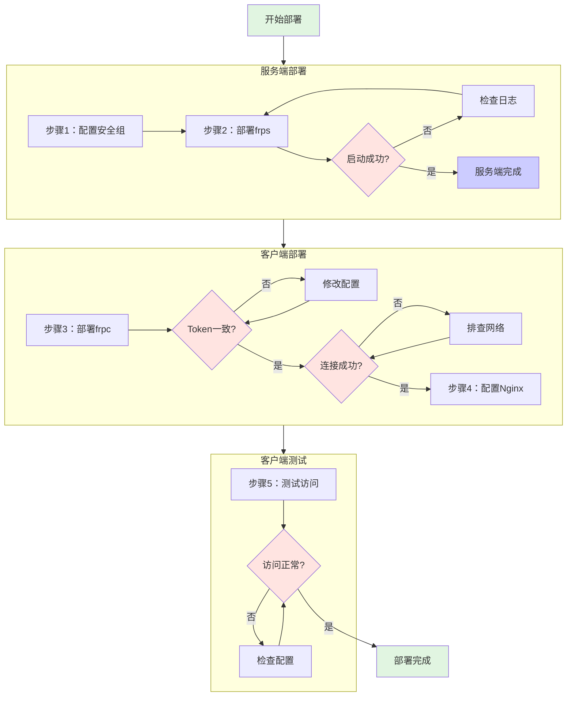

# 【实战教程】使用 frp 实现内网穿透：从零搭建安全的远程访问方案

## 背景与需求

### 使用场景

在科研开发或远程协作中，我们经常需要：
- 在**实验室内网服务器**上运行 Web 应用（如 Streamlit、Jupyter 等）
- 让**外部协作者**能够访问这些服务进行测试和使用
- 通过 **SSH 远程访问**内网服务器进行开发调试

### 面临的问题

- **内网服务器无公网 IP**，外网无法直接访问
- **公网 IP 动态变化**，连接不同网络后 IP 会改变
- 需要**安全的访问控制**，不能完全暴露在公网

### 解决方案：frp 内网穿透

使用 **frp（Fast Reverse Proxy）** 通过一台有公网 IP 的云服务器（如 AWS EC2）作为中转。

#### 架构图


**核心架构**：
- **frps（服务端）**：运行在云服务器，有固定公网 IP
- **frpc（客户端）**：运行在内网服务器，主动连接 frps
- **Token 认证**：保证只有授权的客户端能连接
- **Nginx 反向代理**：添加 HTTP 密码保护层
- **端口映射**：
  - `云服务器:8502` → `内网:8502` (Web 应用)
  - `云服务器:8606` → `内网:22/606` (SSH)

> **本文档包含**：
> - 完整的部署流程（含一键脚本）
> - 实际遇到的问题和解决方法
> - 安全配置策略（Token + HTTP Auth）
> - WebSocket 支持（适用于 Streamlit 等）

## 快速索引

- [安全配置策略](#安全配置策略必读)
- [云服务器端配置](#1-云服务器端配置frps)
- [内网客户端配置](#2-内网客户端配置frpc)
- [HTTP 密码保护](#3-http-密码保护推荐)
- [完整部署流程](#4-完整部署流程)
- [常见问题排查](#5-常见问题排查)

## 安全配置策略（必读）

### 问题：内网服务器 IP 会变化怎么办？

**推荐方案**：使用 `0.0.0.0/0` 开放 frp 控制端口 + 强 Token 认证

#### 为什么这样安全？

1. **Token 认证机制**：即使攻击者能连接控制端口，没有正确的 Token 也会被拒绝
2. **分层防护**：
   - frp 控制端口（7000）：0.0.0.0/0 + 64位随机Token
   - 实际服务端口（8502等）：可限制为特定IP或通过Nginx认证
3. **Token 强度**：64 位十六进制字符串（256位熵），暴力破解几乎不可能

#### 云服务器安全组配置（推荐）

| 类型 | 协议 | 端口 | 源地址 | 说明 |
|------|------|------|--------|------|
| Custom TCP | TCP | 7000 | **0.0.0.0/0** | frp控制端口（Token认证） |
| HTTP | TCP | 80 | 0.0.0.0/0 或 指定IP | Nginx HTTP认证 |
| Custom TCP | TCP | 8606 | 指定IP/32 | SSH转发（可选） |
| SSH | TCP | 22 | 你的IP/32 | 云服务器管理 |

**重要**：配置 Nginx 后，可以**关闭** 8502/8500/8504 等应用端口的直接访问，强制所有流量通过 Nginx 的密码保护。

#### 生成强 Token

```bash
# 在任意 Linux/macOS 机器上执行
openssl rand -hex 32

# 示例输出（每次运行都不同，请使用你自己生成的）：
# a1b2c3d4e5f6789012345678901234567890abcdef1234567890abcdef123456
```

**重要**：生成后妥善保存，需要在云服务器和内网服务器**两边同时使用**！

## 1. 云服务器端配置（frps）

### 1.1 下载 frp

```bash
# SSH 登录到云服务器
ssh your_user@YOUR_SERVER_IP

# 下载 frp（以 0.65.0 为例，请访问 https://github.com/fatedier/frp/releases 获取最新版本）
wget https://github.com/fatedier/frp/releases/download/v0.65.0/frp_0.65.0_linux_amd64.tar.gz

# 解压
tar -xzf frp_0.65.0_linux_amd64.tar.gz
cd frp_0.65.0_linux_amd64
```

### 1.2 一键部署脚本

```bash
#!/bin/bash
# 文件名: deploy_frps.sh
# 在云服务器上执行

set -e

# 生成强随机 Token（如果已有 Token，可以直接替换下面这行）
TOKEN=$(openssl rand -hex 32)
echo "========================================="
echo "生成的 Token（请妥善保存，客户端需要使用）："
echo "${TOKEN}"
echo "========================================="

FRP_VERSION="0.65.0"
FRP_DIR="$HOME/frp_${FRP_VERSION}_linux_amd64"

# 下载并安装 frp
cd ~
wget https://github.com/fatedier/frp/releases/download/v${FRP_VERSION}/frp_${FRP_VERSION}_linux_amd64.tar.gz
tar -xzf frp_${FRP_VERSION}_linux_amd64.tar.gz
cd ${FRP_DIR}

# 创建服务端配置
cat > frps.toml <<EOF
# frps 服务端配置
bindAddr = "0.0.0.0"
bindPort = 7000

# Token 认证（必须与客户端一致）
auth.method = "token"
auth.token = "${TOKEN}"

# 安全增强配置
transport.maxPoolCount = 5
transport.heartbeatTimeout = 90

# 日志配置
log.to = "./frps.log"
log.level = "info"
log.maxDays = 7

# Dashboard（可选，建议生产环境关闭）
# webServer.addr = "0.0.0.0"
# webServer.port = 7500
# webServer.user = "admin"
# webServer.password = "change_this_password"
EOF

# 创建 systemd 服务（自动启动）
sudo bash -c "cat > /etc/systemd/system/frps.service <<'SVC'
[Unit]
Description=frp server
After=network-online.target
Wants=network-online.target

[Service]
Type=simple
User=$(whoami)
Restart=on-failure
RestartSec=5s
ExecStart=${FRP_DIR}/frps -c ${FRP_DIR}/frps.toml

[Install]
WantedBy=multi-user.target
SVC"

# 启动服务
sudo systemctl daemon-reload
sudo systemctl enable frps
sudo systemctl start frps

echo ""
echo "✓ frps 服务已启动"
echo "检查状态: sudo systemctl status frps"
echo ""
echo "========================================="
echo "⚠️  请将上面生成的 Token 复制保存！"
echo "客户端配置时需要使用相同的 Token"
echo "========================================="
```

### 1.3 验证服务状态

```bash
# 检查服务状态
sudo systemctl status frps

# 实时查看日志
sudo journalctl -u frps -f

# 确认端口监听
sudo ss -tlnp | grep 7000

# 应该看到类似输出：
# LISTEN  0  128  0.0.0.0:7000  0.0.0.0:*  users:(("frps",pid=xxxx,fd=x))
```

## 2. 内网客户端配置（frpc）

### 2.1 下载 frp

```bash
# SSH 登录到内网服务器
ssh your_user@INTERNAL_SERVER_IP

# 下载 frp（版本应与服务端一致）
wget https://github.com/fatedier/frp/releases/download/v0.65.0/frp_0.65.0_linux_amd64.tar.gz

# 解压
tar -xzf frp_0.65.0_linux_amd64.tar.gz
cd frp_0.65.0_linux_amd64
```

### 2.2 一键部署脚本

```bash
#!/bin/bash
# 文件名: deploy_frpc.sh
# 在内网服务器上执行

set -e

# ⚠️ 重要：请替换为云服务器生成的 Token！
read -p "请输入云服务器生成的 Token: " TOKEN
if [ -z "$TOKEN" ]; then
    echo "错误: Token 不能为空！"
    exit 1
fi

# ⚠️ 重要：请替换为你的云服务器公网 IP
read -p "请输入云服务器的公网 IP: " SERVER_ADDR
if [ -z "$SERVER_ADDR" ]; then
    echo "错误: 服务器地址不能为空！"
    exit 1
fi

FRP_VERSION="0.65.0"
FRP_DIR="$HOME/frp_${FRP_VERSION}_linux_amd64"

# 下载并安装 frp
cd ~
wget https://github.com/fatedier/frp/releases/download/v${FRP_VERSION}/frp_${FRP_VERSION}_linux_amd64.tar.gz
tar -xzf frp_${FRP_VERSION}_linux_amd64.tar.gz
cd ${FRP_DIR}

# 创建客户端配置
cat > frpc.toml <<EOF
# frpc 客户端配置
serverAddr = "${SERVER_ADDR}"
serverPort = 7000

# Token 认证（必须与服务端一致）
auth.method = "token"
auth.token = "${TOKEN}"

# 日志配置
log.to = "./frpc.log"
log.level = "info"
log.maxDays = 7

# 连接池配置
transport.poolCount = 1

# SSH 端口转发（本地22 -> 远程8606）
[[proxies]]
name = "ssh"
type = "tcp"
localIP = "127.0.0.1"
localPort = 22
remotePort = 8606

# Web 服务端口转发（根据需要调整）
[[proxies]]
name = "web_8502"
type = "tcp"
localIP = "127.0.0.1"
localPort = 8502
remotePort = 8502

# 如果有多个服务，继续添加
# [[proxies]]
# name = "web_8500"
# type = "tcp"
# localIP = "127.0.0.1"
# localPort = 8500
# remotePort = 8500
EOF

# 创建 systemd 服务
sudo bash -c "cat > /etc/systemd/system/frpc.service <<SVC
[Unit]
Description=frp client
After=network-online.target
Wants=network-online.target

[Service]
Type=simple
User=${USER}
Restart=on-failure
RestartSec=5s
ExecStart=${FRP_DIR}/frpc -c ${FRP_DIR}/frpc.toml

[Install]
WantedBy=multi-user.target
SVC"

# 启动服务
sudo systemctl daemon-reload
sudo systemctl enable frpc
sudo systemctl start frpc

echo "✓ frpc 服务已启动"
echo "检查状态: sudo systemctl status frpc"
```

### 2.3 验证连接状态

```bash
# 检查 frpc 服务
systemctl status frpc

# 查看日志（重要：确认是否连接成功）
journalctl -u frpc -n 50

# ✅ 成功的日志应该显示：
# [I] [client/service.go:xxx] login to server success, get run id [xxxxxxxx]
# [I] [proxy/proxy_manager.go:xxx] proxy added: [ssh web_8502]
# [I] [client/control.go:xxx] [ssh] start proxy success

# ❌ 如果看到以下错误，说明有问题：
# "i/o timeout" - 网络连接问题，检查安全组配置
# "authentication failed" 或 "token doesn't match" - Token 不一致
```

## 3. HTTP 密码保护（推荐）

### 问题：为什么需要额外的密码保护？

即使配置了 frp，只要知道 `http://YOUR_SERVER_IP:8502` 这个地址，任何人都能访问你的服务。

**解决方案**：在云服务器上用 **Nginx** 添加 HTTP Basic Auth。

### 为什么使用 Nginx 而不是 frp 自带的 HTTP 认证？

对于 **Streamlit**、**Jupyter** 等需要 **WebSocket** 的应用：
- ❌ frp 的 `type = "http"` + `httpUser/httpPassword` **不完全支持 WebSocket**
- ✅ 保持 frp 使用 `type = "tcp"`，用 Nginx 添加认证，完美支持 WebSocket

### 方案选择

**方案A（推荐）**：单服务，无需修改应用配置
- 访问地址：`http://YOUR_SERVER_IP/`
- 应用端无需任何特殊配置

**方案B**：多服务，需要配置应用的 baseUrlPath
- 访问地址：`http://YOUR_SERVER_IP/app1/`、`/app2/` 等
- 需要修改 Streamlit 等应用的启动参数

### 方案A：单服务版（一键脚本）

```bash
#!/bin/bash
# 文件名: setup_nginx_auth.sh
# 在云服务器上执行

set -e

# 安装 Nginx 和密码工具
sudo apt update
sudo apt install -y nginx apache2-utils

# 创建用户和密码（请修改用户名和密码）
USERNAME="your_username"
echo "请输入密码："
sudo htpasswd -c /etc/nginx/.htpasswd ${USERNAME}

# 配置 Nginx 反向代理 + Basic Auth
sudo tee /etc/nginx/sites-available/frp-auth <<'EOF'
server {
    listen 80 default_server;
    server_name _;

    # 根路径代理到应用（如 Streamlit）
    location / {
        auth_basic "Restricted Access - Please Login";
        auth_basic_user_file /etc/nginx/.htpasswd;

        # 反向代理到 frp 映射的端口
        proxy_pass http://127.0.0.1:8502;
        proxy_http_version 1.1;

        # WebSocket 支持（Streamlit/Jupyter 必需）
        proxy_set_header Upgrade $http_upgrade;
        proxy_set_header Connection "upgrade";

        # 其他必要的 headers
        proxy_set_header Host $host;
        proxy_set_header X-Real-IP $remote_addr;
        proxy_set_header X-Forwarded-For $proxy_add_x_forwarded_for;
        proxy_set_header X-Forwarded-Proto $scheme;

        # 超时设置（适应长连接）
        proxy_read_timeout 86400;
    }
}
EOF

# 启用配置
sudo ln -sf /etc/nginx/sites-available/frp-auth /etc/nginx/sites-enabled/
sudo rm -f /etc/nginx/sites-enabled/default  # 删除默认配置
sudo nginx -t  # 测试配置
sudo systemctl reload nginx
sudo systemctl enable nginx

echo "✓ Nginx HTTP Auth 已配置"
echo "访问地址: http://YOUR_SERVER_IP/"
echo "用户名: ${USERNAME}"
```

**应用端配置（内网服务器）**：
```bash
# Streamlit 示例：无需任何额外选项！
streamlit run app.py --server.port=8502

# Jupyter 示例
jupyter notebook --ip=127.0.0.1 --port=8502 --no-browser
```

**访问方式**：
```
http://YOUR_SERVER_IP/  # 浏览器会提示输入用户名密码
```

### 方案B：多服务版（参考）

如果需要同时运行多个应用（8502、8500、8504），可以配置子路径：

```nginx
# 在 Nginx 配置中添加多个 location
location /app1/ {
    auth_basic "Restricted Access";
    auth_basic_user_file /etc/nginx/.htpasswd;
    proxy_pass http://127.0.0.1:8502/;
    # ... 其他配置同上
}

location /app2/ {
    auth_basic "Restricted Access";
    auth_basic_user_file /etc/nginx/.htpasswd;
    proxy_pass http://127.0.0.1:8500/;
    # ... 其他配置同上
}
```

对应的应用需要配置 baseUrlPath：
```bash
streamlit run app.py --server.baseUrlPath=/app1 --server.port=8502
```

### 安全增强：关闭直接端口访问

配置 Nginx 后，在云服务器安全组中：
- **移除** 8502/8500/8504 的入站规则
- **只开放** 80 端口（HTTP）或 443 端口（HTTPS）
- 这样外部只能通过 Nginx（需要密码）访问，无法绕过认证

## 4. 完整部署流程



### 详细步骤

**步骤 1**：配置云服务器安全组
- 在云服务商控制台，添加入站规则：
  - TCP 7000 端口：0.0.0.0/0（frp 控制）
  - TCP 80 端口：0.0.0.0/0（HTTP 访问）

**步骤 2**：部署云服务器端
```bash
# 执行 1.2 节的部署脚本
bash deploy_frps.sh

# 验证服务
sudo systemctl status frps
```

**步骤 3**：部署内网客户端
```bash
# 执行 2.2 节的部署脚本
bash deploy_frpc.sh

# 验证连接
journalctl -u frpc -n 20
```

**步骤 4**：配置 Nginx（可选但推荐）
```bash
# 执行 3 节的 Nginx 配置脚本
bash setup_nginx_auth.sh
```

**步骤 5**：测试访问
```bash
# 测试 frp 连接
nc -zv YOUR_SERVER_IP 7000

# 浏览器访问（有密码保护）
http://YOUR_SERVER_IP/

# 或直接访问端口（无密码保护，不推荐）
http://YOUR_SERVER_IP:8502

# SSH 连接测试
ssh -p 8606 your_user@YOUR_SERVER_IP
```

## 5. 常见问题排查

### Q1: "token doesn't match" 认证失败

**现象**：
```
[E] [client/service.go:310] token in login doesn't match token from configuration
```

**原因**：云服务器和内网服务器的 Token 不一致，或修改后未重启服务

**解决步骤**：
```bash
# 1. 检查两边 Token 是否一致
# 云服务器：
grep "auth.token" /path/to/frp/frps.toml

# 内网服务器：
grep "auth.token" /path/to/frp/frpc.toml

# 2. 如果不一致，修改配置文件，确保 Token 完全相同

# 3. 重启两边服务（重要！）
# 云服务器：
sudo systemctl restart frps

# 内网服务器：
sudo systemctl restart frpc

# 4. 验证连接成功
journalctl -u frpc -n 20 | grep "login to server success"
```

### Q2: "i/o timeout" 无法连接

**原因**：网络连通性问题，通常是安全组配置不正确

**解决方法**：
```bash
# 1. 测试网络连通性
nc -zv YOUR_SERVER_IP 7000

# 2. 检查云服务器安全组
# 确保 7000 端口的入站规则源地址为 0.0.0.0/0

# 3. 检查云服务器防火墙（如果有）
sudo ufw status
sudo ufw allow 7000/tcp

# 4. 重启 frpc
sudo systemctl restart frpc
```

### Q3: Streamlit/Jupyter 连接卡住或 WebSocket 错误

**原因**：Nginx 配置缺少 WebSocket 支持

**解决方法**：
确保 Nginx 配置包含以下关键行：
```nginx
proxy_http_version 1.1;
proxy_set_header Upgrade $http_upgrade;
proxy_set_header Connection "upgrade";
proxy_read_timeout 86400;
```

### Q4: 配置 Nginx 后无法访问

**检查清单**：
```bash
# 1. 确认 Nginx 服务运行
sudo systemctl status nginx

# 2. 测试 Nginx 配置
sudo nginx -t

# 3. 确认端口监听
sudo ss -tlnp | grep :80

# 4. 检查 frp 端口是否正常
curl http://127.0.0.1:8502

# 5. 查看 Nginx 日志
sudo tail -f /var/log/nginx/error.log
```

### Q5: 服务重启后 frp 未自动启动

**解决方法**：
```bash
# 确保 systemd 服务已启用
sudo systemctl enable frps  # 云服务器
sudo systemctl enable frpc  # 内网服务器

# 检查服务状态
sudo systemctl status frps
sudo systemctl status frpc
```

## 快速命令参考

```bash
# === 服务管理 ===
# 云服务器
sudo systemctl status/start/stop/restart frps
sudo systemctl enable frps  # 开机自启

# 内网服务器
sudo systemctl status/start/stop/restart frpc
sudo systemctl enable frpc

# === 日志查看 ===
# 实时日志
sudo journalctl -u frps -f  # 云服务器
sudo journalctl -u frpc -f  # 内网服务器

# 最近50行日志
sudo journalctl -u frps -n 50
sudo journalctl -u frpc -n 50

# === 测试命令 ===
# 测试 frp 控制端口
nc -zv YOUR_SERVER_IP 7000

# 测试 HTTP 访问
curl -I http://YOUR_SERVER_IP/

# 测试本地服务
curl http://127.0.0.1:8502

# SSH 连接测试
ssh -p 8606 your_user@YOUR_SERVER_IP

# === Nginx 管理 ===
sudo systemctl status/reload/restart nginx
sudo nginx -t  # 测试配置
sudo tail -f /var/log/nginx/access.log
sudo tail -f /var/log/nginx/error.log
```

## 总结与最佳实践

### 安全建议

1. **Token 管理**：使用强随机 Token，妥善保存，定期更换
2. **多层防护**：Token 认证 + HTTP Basic Auth + 安全组限制
3. **最小权限**：只开放必要的端口，关闭不需要的服务
4. **日志监控**：定期检查 frp 和 Nginx 日志，发现异常访问
5. **HTTPS 升级**：生产环境建议配置 SSL 证书（Let's Encrypt 免费）

### 性能优化

1. **连接池配置**：根据并发需求调整 `transport.poolCount`
2. **心跳超时**：稳定网络可适当增加 `heartbeatTimeout`
3. **日志轮转**：配置 `log.maxDays` 避免日志文件过大

### 故障恢复

1. **自动重启**：systemd 配置已包含 `Restart=on-failure`
2. **监控告警**：可配合监控工具（如 Prometheus）监控服务状态
3. **备份配置**：定期备份 frps.toml 和 frpc.toml

## 参考资源

- **frp 官方文档**：https://gofrp.org/zh-cn/docs/
- **frp GitHub 仓库**：https://github.com/fatedier/frp
- **Nginx 官方文档**：https://nginx.org/en/docs/
- **HTTP Basic Auth**：https://developer.mozilla.org/zh-CN/docs/Web/HTTP/Authentication

**本文更新时间**：2025-10-22 | **作者**：Xufan Gao
