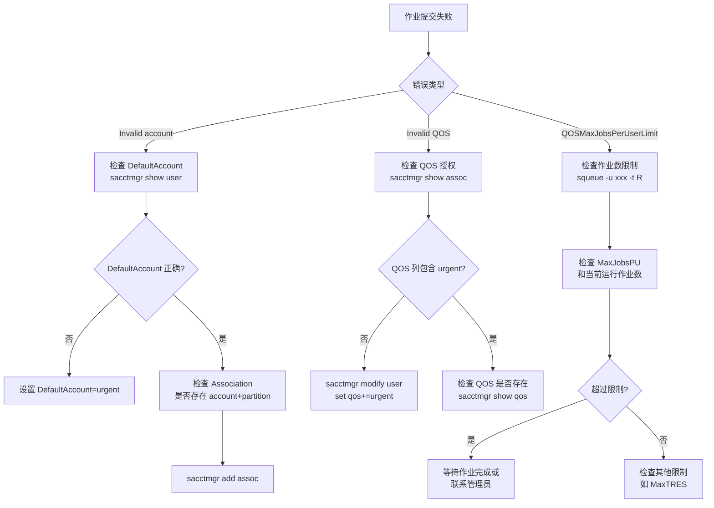

# Slurm 作业“插队”指南：QOS 优先级配置从入门到实战

本文基于实验室集群的真实运维经验整理，介绍如何通过 QOS（Quality of Service）机制管理作业优先级。

## 核心概念

### QOS、Partition、Account 的关系

Slurm 调度涉及四个核心概念：
- **Partition（分区）**：节点的逻辑分组，可限定允许的 Account 和 QOS
- **Account（账户）**：项目或课题组标识，用于计费和权限控制
- **QOS（服务质量）**：影响优先级和资源限制的关键机制
- **Association（关联）**：`User-Account-Partition-QOS` 的组合，必须存在才能提交作业

**关键公式**：
```
作业总优先级 = PriorityWeightAge × Age因子
            + PriorityWeightFairshare × Fairshare因子
            + PriorityWeightQOS × (QOS Priority / 系统最高QOS Priority)
            + PriorityWeightPartition × Partition优先级
            + PriorityWeightTRES × TRES因子
```

**Priority=0 说明**：Slurm 默认的 `normal` QOS 就是 Priority=0，这是基准值。作业可以正常运行，但不会从 QOS 获得额外优先级加成（QOS 因子为 0）。正值提升优先级，负值降低优先级。

### 环境检查

确认集群启用了 multifactor 调度：
```bash
scontrol show config | grep -i Priority
```

**实际输出示例**（your_cluster）：
```
PriorityType            = priority/multifactor
PriorityWeightAge       = 200
PriorityWeightFairShare = 100
PriorityWeightPartition = 500
PriorityWeightQOS       = 500
PriorityWeightTRES      = gres/gpu=2000
```

关键参数：`PriorityWeightQOS=500` 和 `PriorityWeightTRES=gres/gpu=2000` 表示 GPU 资源权重最高。

查看当前作业优先级各因子贡献：
```bash
sprio -u username | head
```

**实际输出示例**：
```
JOBID PARTITION   USER  PRIORITY  SITE  AGE  FAIRSHARE  PARTITION  QOS  TRES
123456 quick    username      514     0    3          2          1  500  gres/gpu=9
123456 quick    username      514     0    3          2          1  500  gres/gpu=9
```

解读：QOS 贡献了 500 分（使用 urgent QOS，Priority=200，归一化后 × 500），TRES 贡献 9 分（申请了 GPU）。

## 创建 urgent QOS

### 检查现有 QOS

```bash
sacctmgr show qos format=Name,Priority,MaxTRES,MaxWall,MaxJobsPU | column -t
```

**实际输出示例**：
```
Name     Priority  MaxTRES         MaxWall    MaxJobsPU
normal   0                         -          64
multi    0                         7-00:00:00 14
single   0         cpu=1,gres/gpu+ 7-00:00:00 100
quick    0                         12:00:00   120
urgent   200                       -          -
```

可以看到 `urgent` QOS 的 Priority=200，明显高于其他 QOS 的 0。

### 创建并设置参数

```bash
sacctmgr add qos urgent \
  priority=200 \
  MaxJobsPU=200 \
  MaxSubmitPU=200 \
  MaxWall=02:00:00 \
  MaxTRESPU=gres/gpu=4
```

**参数说明**：
- `priority=200`：QOS 优先级值，会被归一化后参与计算
- `MaxJobsPU`：Per User，每用户最多运行作业数
- `MaxSubmitPU`：Per User，每用户最多提交作业数
- `MaxWall`：最长运行时间
- `MaxTRESPU`：Per User，每用户最多 GPU 数

**修改 QOS**（可选）：
```bash
# 调整优先级
sacctmgr modify qos urgent set priority=300

# 设置组级别限制（所有用户共享）
sacctmgr modify qos urgent set GrpTRES=gres/gpu=32 GrpJobs=12
```

### 配置 Partition 白名单

检查分区配置：
```bash
scontrol show partition quick | egrep 'Allow|Default'
```

**实际输出示例**：
```
AllowGroups=ALL AllowAccounts=project_a AllowQos=ALL
```

说明 `quick` 分区允许所有 QOS（`AllowQos=ALL`），但只允许 `project_a` 账户。

如果分区的 `AllowQos` 不是 `ALL` 且缺少 `urgent`，需要添加：
```bash
scontrol update PartitionName=urgent AllowQos=urgent,normal AllowAccounts=urgent,project_a
```

## 授权用户使用 urgent

### 添加权限并设置默认

```bash
# 授权用户
sacctmgr modify user where name=username set qos+=urgent

# 设置默认 QOS和账户，最好做一下
sacctmgr modify user where name=username set DefaultQOS=urgent
sacctmgr modify user name=username set DefaultAccount=urgent
```

### 验证授权

```bash
sacctmgr show assoc where user=username format=User,DefaultQOS,QOS
```

**实际输出示例**：
```
User      Def QOS    QOS
username   urgent     normal,urgent
username   urgent     normal,urgent
```

说明用户已被授权使用 `urgent` QOS，且默认 QOS 为 `urgent`。

提交测试作业并检查优先级：
```bash
sbatch --partition=quick --qos=urgent --wrap="sleep 60"
sprio -u username | head
```

应该看到 `QOS` 列出现 500 分（= PriorityWeightQOS × 归一化因子）。

## 解决 Invalid account 错误

### 问题诊断

错误信息：`Invalid account or account/partition combination specified`

**原因**：Slurm 要求 `(Account, Partition)` 组合必须在 Association 表中存在。

### 排查步骤

**1. 检查默认账户**
```bash
sacctmgr show user username format=User,DefaultAccount
```

如果默认账户不是 `urgent`，需要设置：
```bash
sacctmgr modify user name=username set DefaultAccount=urgent
```

**2. 检查 Association 是否存在**
```bash
sacctmgr show assoc where user=username format=Cluster,Account,User,Partition,QOS
```

如果缺少 `account=urgent, partition=urgent` 的记录：
```bash
sacctmgr add assoc user=username account=urgent partition=urgent
```

**3. 检查分区允许的账户**
```bash
scontrol show partition urgent | grep AllowAccounts
```

确保你的账户在允许列表中。

## 作业提交与验证

### 首次提交（显式指定所有参数）

```bash
sbatch --partition=urgent --account=urgent --qos=urgent --time=10:00 --wrap="hostname"
```

### 简化提交（使用默认值）

如果已设置 `DefaultAccount=urgent` 和 `DefaultQOS=urgent`：
```bash
sbatch --partition=urgent --time=10:00 --wrap="hostname"
```

### 迁移已提交的 Pending 作业

如果作业已提交到 `quick` 分区，想迁移到 `urgent` 分区提升优先级：

```bash
# 错误做法（只改 Partition）
scontrol update JobId=123456 Partition=urgent
# 报错：Invalid account or account/partition combination specified

# 正确做法（同时更新 Account 和 Partition）
scontrol update JobId=123456 Account=urgent Partition=urgent
```

**原因**：`urgent` 分区只允许 `urgent` 账户（`AllowAccounts=urgent`），而原作业的账户是 `project_a`，必须一起更新才能匹配。

**批量迁移多个作业**：
```bash
for jobid in $(squeue -u $USER -t PD -h -o "%i"); do
  scontrol update JobId=$jobid Account=urgent Partition=urgent
done
```

**验证迁移结果**：
```bash
scontrol show job 123456 | grep -E 'Account|Partition|Priority'
```

迁移成功后，优先级会显著提升（如从 520 → 1104）。

### 检查 QOS 限制

```bash
sacctmgr show qos urgent format=Name,MaxTRES,MaxJobsPU,MaxWall
```

常见 Pending 原因：
- `QOSMaxJobsPerUserLimit`：超过 `MaxJobsPU`
- `QOSMaxGRESPerUser`：超过 `MaxTRESPU` 的 GPU 限制
- `QOSMaxWallDurationPerJobLimit`：申请时间超过 `MaxWall`

## 故障排查流程



## 常见问题

### Q1：`sprio` 显示 QOS 列为 0？

**可能原因**：
1. QOS 的 `Priority=0`（基准值，无额外加成）
2. `PriorityWeightQOS=0`（系统未启用 QOS 权重）
3. 作业未使用目标 QOS

**解决**：
```bash
# 检查并提升 QOS Priority
sacctmgr show qos urgent format=Name,Priority
sacctmgr modify qos urgent set priority=200

# 检查系统权重
scontrol show config | grep PriorityWeightQOS

# 确认作业使用的 QOS
scontrol show job 123456 | grep QOS
```

### Q2：设置了 DefaultQOS 但不生效？

**原因**：分区的 `DefaultQOS` 会覆盖用户设置，或脚本中显式指定了其他 QOS。

**解决**：
```bash
scontrol show partition your_partition | grep DefaultQOS
grep "qos" your_script.sh
```

### Q3：如何临时降低作业优先级？

使用 low QOS 或修改 Nice 值：
```bash
sbatch --qos=low --wrap="sleep 60"
# 或
scontrol update JobId=123456 Nice=10000
```

### Q4：查看 QOS 使用情况？

```bash
sacctmgr show qos format=Name,GrpJobs,GrpTRES,MaxJobsPU,MaxTRESPU -p
squeue -o "%.10i %.9P %.8j %.8u %.2t %.10M %.6D" | head
```

**实际输出示例**：
```
Name|GrpJobs|GrpTRES|MaxJobsPU|MaxTRESPU|
normal|||64|gres/gpu=64|
multi|500||14|gres/gpu=100|
single|500||100|gres/gpu=150|
quick|999||120|gres/gpu=200|
urgent|||||
JOBID PARTITION     NAME     USER ST       TIME  NODES
123456     multi ha-110_2  username  R      43:46      1
123456     multi ha-110_2  username  R      57:46      1
```

## 回滚与清理

### 移除用户授权

如果之前为使用 urgent 配置了专门的账户和 QOS，回滚时需要全部恢复：

```bash
# 1. 移除默认 QOS
sacctmgr modify user where name=username set DefaultQOS=normal

# 2. 恢复默认账户（如果之前改过）
sacctmgr modify user where name=username set DefaultAccount=project_a

# 3. 取消 QOS 授权
sacctmgr modify user where name=username set qos-=urgent

# 4. 验证清理结果
sacctmgr show assoc where user=username format=User,DefaultAccount,DefaultQOS,QOS
```

期望输出：
```
User      DefaultAccount  Def QOS  QOS
username   project_a            normal   normal
```

### 删除 QOS（谨慎）

检查是否有用户在使用：
```bash
sacctmgr show assoc format=User,QOS | grep urgent
```

确认无人使用后删除：
```bash
sacctmgr delete qos where name=urgent
```

建议保留 urgent QOS 供未来复用，只需取消用户授权即可。

## 总结

Slurm QOS 配置的关键步骤：
1. 确认 `PriorityType=priority/multifactor` 已启用
2. 创建 QOS 并设置 `Priority` 和资源限制
3. 配置 Partition 允许该 QOS
4. 授权用户并设置默认 QOS
5. 确保 `(Account, Partition)` 组合存在于 Association
6. 使用 `sprio` 验证优先级变化

掌握这些要点后，你可以灵活应对各种作业调度需求。
