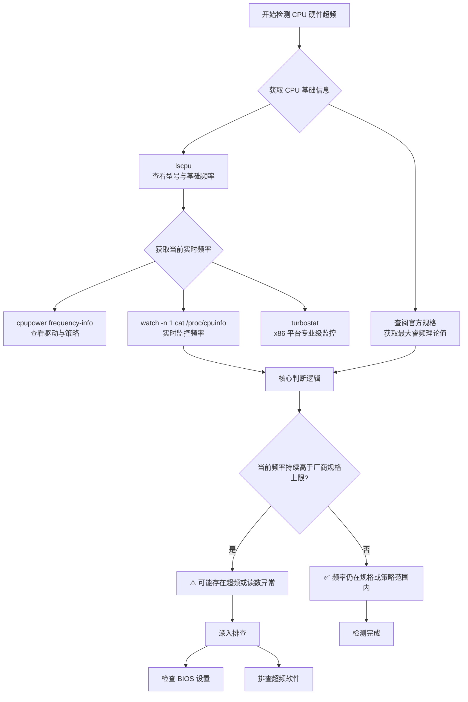

# Linux 集群 CPU 频率检测：区分高负载与硬件超频

## 引言

在管理 Linux 计算集群时，我们经常会在 `pestat` 输出中看到一些节点的 CPU 负载异常高。例如下面的 pestat 输出显示了多个节点的状态：

```bash
Hostname       Partition     Node Num_CPU  CPUload  Memsize  Freemem  Joblist
                            State Use/Tot  (15min)     (MB)     (MB)  JobID User ...
node1             multi+   alloc   48  48   49.07*   191895   158367  436066 mxy ...
node2             multi+   alloc   48  48   49.00*   191898   157115  436116 mxy ...
node10            single     mix    8 128  111.63*   515641   408900  434722 gxf1212 ...
node11            multi+     mix  122 128   97.99*   515641   461935  436055 xucx ...
node12             multi     mix  114 128  112.52*   515641   452336  435966 shizq ...
node22             multi     mix  126 128  114.80*   515621   452780  432502 wangtk ...
```

注意到 node10 的 15 分钟平均负载达到 111.63，但实际上只分配了 8 个 CPU 核心（128 个核心中的 8 个），而 node22 的负载为 114.80，分配了 126 个核心。这种现象常常引发关于“超频”的疑问。本文将**系统性地分析 CPU 负载与频率监控的完整方法论**，帮助管理员准确诊断集群状态。

## 两种不同的“超频”概念

在深入技术细节之前，我们需要明确区分两个经常被混淆的概念：

### 软件层面的高负载

这是指系统的 **Load Average**（平均负载）异常高，超出了正式分配的计算核心数。例如某个节点有 128 个 CPU 核心，但 SLURM 只分配了 8 个核心给作业，而系统负载却达到了 111.63。这**并不等于“有 111 个核心正在满载计算”**，而是表示在统计窗口内，**处于可运行状态或不可中断睡眠状态**（常见于 I/O 等待）的任务平均数很高。

造成软件层面高负载的常见原因包括**失控进程进入死循环**、**用户运行高并行度程序**（如使用 `make -j 128` 进行编译）、**大量线程同时争抢 CPU**、**I/O 阻塞导致大量任务处于 D 状态**，以及 Docker 或 Singularity 容器、日志轮转、备份任务等额外工作负载。严格来说，**僵尸进程本身不会继续消耗 CPU**，也通常不是高 load average 的直接原因；如果看到大量僵尸，更应排查其父进程管理是否异常。

### 硬件层面的超频

这是传统意义上的概念，指通过调整 BIOS/UEFI 或使用软件，**人为将 CPU 运行频率提升到出厂默认频率以上**。本文后续部分将重点讨论如何检测这种情况。

## CPU 硬件频率检测流程

检测 CPU 是否存在硬件超频的**核心思路是对比 CPU 的当前运行频率、内核当前策略上限，以及厂商公开规格中的基础频率和最大 boost 频率**。如果观测到的频率**长期超过厂商规格上限**，才值得怀疑 BIOS/UEFI 或平台策略存在非常规设置；如果只是高负载，而频率仍在规格内，则通常**不属于硬件超频问题**。

### 完整检测流程图



## 关键检测命令详解

### 步骤一：获取 CPU 型号与官方规格

首先需要知道 CPU 的“出厂设定”：

```bash
lscpu | grep -E "Model name:|CPU MHz:|CPU max MHz:|CPU min MHz:"
```

**输出示例**：
```
Model name:            Intel(R) Xeon(R) Gold 6338 CPU @ 2.00GHz
CPU MHz:               2500.000
CPU max MHz:           3500.0000
CPU min MHz:           800.0000
```

**关键字段说明**：`Model name` 中的 `@ 2.00GHz` 一般对应厂商标称基础频率；`CPU max MHz` 和 `CPU min MHz` 是 `lscpu` **从内核接口读取到的本机可见频率范围**，常可作为本机策略或驱动视角下的参考上限与下限；`CPU MHz` 则是当前某个 CPU 的瞬时或近似瞬时频率读数。它们对排障很有用，但**不应直接替代厂商规格表**。

> ⚠️ **重要提示**：`lscpu` 显示的 `CPU max MHz` 来自内核当前暴露的信息，它可能受驱动、BIOS/UEFI、电源策略和平台实现影响，因此不一定等于厂商宣传页上的最大 boost 频率。最可靠的方法仍然是根据 CPU 型号去厂商官网查询正式规格。

### 步骤二：监控当前实时频率

查看 CPU 在负载下的实际运行频率有多种方法。**使用 cpupower 工具可以查看详细的频率信息**，包括 `driver`（当前 cpufreq 驱动）、`hardware limits`（内核当前看到的频率范围）、`available frequency steps`（可用的频率档位，若驱动支持）、`boost state support`（平台是否支持 boost，以及当前是否启用）以及 `current CPU frequency`。需要注意，`current CPU frequency` 的精度和含义依赖具体驱动与硬件接口，**不能把它当作绝对精确的硬件测量值**。

```bash
sudo cpupower frequency-info
```

**动态监控所有核心**（最直观的方法）是使用 watch 命令实时刷新显示频率：

```bash
watch -n 1 "grep \"^[c]pu MHz\" /proc/cpuinfo"
```

这种方法直观、方便，而且 `watch` 的手册页也把它作为动态频率观察示例。但 `/proc/cpuinfo` 中的 `cpu MHz` **本质上是内核导出的软件读数**，适合快速巡检，**不适合拿来做极严格的频率取证**。

**使用 turbostat**（专业级监控工具）可以获取更详细的性能数据：

```bash
sudo turbostat --quiet --show Core,CPU,Busy%,Bzy_MHz,CPU%c7 --interval 2
```

其中 `Bzy_MHz` 列显示每个逻辑 CPU 在忙碌时的平均运行频率。`turbostat` **是 x86 平台的专业工具**，在 Intel 平台上最常见；在 AMD 平台上通常也可使用，但具体字段可用性会受内核、处理器型号和权限影响。

## 实战案例分析

### 案例 1：node10 节点分析

**环境信息**：
```
Model name:            AMD EPYC 7713 64-Core Processor
CPU MHz:               1500.000
CPU max MHz:           2000.0000
CPU min MHz:           1500.0000
```

**cpupower 输出**：
```
analyzing CPU 0:
  driver: acpi-cpufreq
  hardware limits: 1.50 GHz - 2.00 GHz
  available frequency steps:  2.00 GHz, 1.70 GHz, 1.50 GHz
  current policy: frequency should be within 1.50 GHz and 2.00 GHz.
                  The governor "conservative" may decide which speed to use
                  within this range.
  current CPU frequency: 1.50 GHz (asserted by call to hardware)
Error while evaluating Boost Capabilities on CPU 0 -- are you root?
```

**实时监控结果**：`watch -n 1 "grep \"^[c]pu MHz\" /proc/cpuinfo"` 显示各核心均为 1.50 GHz。

#### 诊断结论

根据 AMD 官方规格，EPYC 7713 的基础频率为 2.0 GHz，最大 boost 频率可达 3.675 GHz。

这里**最稳妥的判断顺序是三步**：

1. `lscpu` 显示 `CPU MHz = 1500`、`CPU max MHz = 2000`，说明**当前内核看到的瞬时频率为 1.50 GHz**，本机可见上限为 2.00 GHz。
2. `cpupower frequency-info` 显示 `hardware limits: 1.50 GHz - 2.00 GHz`，且当前策略为 `conservative`，`current CPU frequency` 也为 1.50 GHz。
3. `/proc/cpuinfo` 动态监控时，**各核心频率持续稳定在 1.50 GHz**，没有出现任何高于 2.00 GHz 的读数。

因此，“**现有证据只能支持 node10 没有发生硬件超频**”。更准确地说，这台机器**当前运行在 1.50 GHz 的低频状态**，而不是跑到了超出规格的高频状态。

至于为什么这颗 7713 没有表现出更高的 boost 频率，则是另一个问题。当前输出只能说明 Linux 通过 `acpi-cpufreq` 暴露给用户空间的范围是 1.50 至 2.00 GHz，**不能仅凭这一点就断言“boost 一定被彻底禁用”**。更合理的说法是：这个节点目前处于较保守的频率策略下，或者平台没有把更高 boost 档位暴露给当前的 cpufreq 接口。

### 案例 2：node22 节点分析

**环境信息**：
```
Model name:            AMD EPYC 7763 64-Core Processor
CPU MHz:               2450.000
CPU max MHz:           2450.0000
```

**cpupower 输出**：
```
hardware limits: 1.50 GHz - 2.45 GHz
current CPU frequency: 2.45 GHz
Error while evaluating Boost Capabilities
```

**turbostat 输出**：
```
Busy%   Bzy_MHz
100.00  3099
100.00  3123
100.00  3145
...
```

在满负载核心上，`Bzy_MHz` 多次出现在约 3.05 至 3.15 GHz 的区间。

#### 诊断结论

根据 AMD 官方规格，EPYC 7763 的基础频率为 2.45 GHz，最大 boost 频率约 3.5 GHz。

这里**同样按证据链来判断**：

1. `lscpu` 显示 `CPU MHz = 2450`、`CPU max MHz = 2450`、`CPU min MHz = 1500`。
2. `cpupower frequency-info` 显示 `hardware limits: 1.50 GHz - 2.45 GHz`，当前调速器仍为 `conservative`，`current CPU frequency` 为 2.45 GHz。
3. `/proc/cpuinfo` 动态监控时，各核心持续稳定在 2.45 GHz，没有看到高于 2.45 GHz 的读数。
4. 但 `turbostat` 在高负载下给出的 `Bzy_MHz` **多次达到约 3.1 GHz**，明显高于 2.45 GHz，但仍低于 AMD 官方标称的最大 boost 频率 3.5 GHz。

因此，**现有证据支持的结论是：node22 没有发生硬件超频，而且实际上已经进入了正常的 boost 区间**。换句话说，`lscpu`、`cpupower` 和 `/proc/cpuinfo` 这几处在这台老内核机器上更像是在报告 cpufreq 接口可见的基础档或策略档，而 `turbostat` **则揭示了核心忙碌时的实际平均运行频率**。

需要强调的是，AMD 官网给出的 3.5 GHz **是厂商标称的最大 boost 频率**，而不是此时 Linux `acpi-cpufreq` 接口已经向用户空间暴露出来的可用上限。`node22` 的 `turbostat` 结果说明：**当前 Linux 可见的 cpufreq 上限未体现出厂商标称的 boost 档位，但 boost 本身并不一定没开**。

### 两个节点的对比

| 对比项 | node10 | node22 |
| --- | --- | --- |
| CPU 型号 | AMD EPYC 7713 | AMD EPYC 7763 |
| 官方基础频率 | 2.0 GHz | 2.45 GHz |
| 当前运行频率 | 1.5 GHz | 2.45 GHz |
| `cpupower` 可见范围 | 1.50-2.00 GHz | 1.50-2.45 GHz |
| `turbostat` 观测 | 暂无补充数据 | 忙碌核心约 3.05-3.15 GHz |
| 频率状态 | 低于基础频率的低频运行 | 实际可进入高于基础频率的正常 boost 区间 |
| Boost 暴露情况 | cpufreq 未显示高于基础频率的 boost 上限 | cpufreq 未显示 boost 上限，但 turbostat 已观察到 boost |
| 硬件超频 | ❌ 否 | ❌ 否 |

## 总结与建议

### 检测要点总结

检测 CPU 超频的核心在于区分两类不同概念：**软件高负载与硬件超频是两回事**，前者通常意味着可运行任务或 I/O 等待任务太多，后者才是实际运行频率超过硬件规格。**更稳妥的判定流程是**：先看 `lscpu`，再看 `cpupower frequency-info` 的驱动、策略和可见频率范围，最后用 `/proc/cpuinfo` 或 `turbostat` 做动态复核。尤其是在老内核加 `acpi-cpufreq` 的组合下，`lscpu` 和 `cpupower` **可能看不到完整 boost 档位**，这时应优先相信 `turbostat` 给出的忙碌频率，再去和厂商规格比较。**只要观测频率没有超过厂商规格上限，就不能把它判定为超频**。

**关键命令组合**：
   ```bash
   # 快速检查
   lscpu | grep -E "Model name:|CPU max MHz:"

   # 详细监控
   sudo cpupower frequency-info
   watch -n 1 "grep \"^[c]pu MHz\" /proc/cpuinfo"
   ```

### 管理建议

根据不同的应用场景和管理需求，我们提供以下管理建议：

| 场景类型 | 建议措施 | 说明 |
| --- | --- | --- |
| 性能敏感的应用 | 检查 BIOS 设置、平台电源策略与 cpufreq 驱动类型；确认是否启用了 boost 相关能力；再评估是否需要将 CPU 调速器从 `conservative` 改为 `performance` | 最大化 CPU 性能输出 |
| 稳定性和能效优先 | 当前配置是合理的，牺牲部分峰值性能换取稳定性；定期监控系统负载，确保没有失控进程 | 适合长期稳定运行 |
| 集群统一管理 | 建议对同类节点使用一致的 BIOS 和电源策略；建立基准测试，验证不同配置下的实际性能差异 | 便于运维和管理 |

### 如果还要继续追问“为什么没有 boost”

上面的命令已经足够支持“**不是超频**”这个结论。如果后续还想解释“为什么没看到 3.5 GHz 或 3.675 GHz”，则**建议补充以下命令**，进一步区分是 BIOS 设置、驱动类型，还是 cpufreq 策略导致的：

```bash
cat /sys/devices/system/cpu/cpufreq/policy0/scaling_driver
cat /sys/devices/system/cpu/cpufreq/policy0/scaling_governor
cat /sys/devices/system/cpu/cpufreq/policy0/scaling_min_freq
cat /sys/devices/system/cpu/cpufreq/policy0/scaling_max_freq
cat /sys/devices/system/cpu/cpufreq/boost
```

如果系统支持，还可以继续看：

```bash
dmesg | grep -i amd_pstate
dmesg | grep -i cpufreq
sudo turbostat --quiet --show Core,CPU,Busy%,Bzy_MHz --interval 2
```

对于 node22，`uname -r` 显示的是 `3.10.0-957.el7.x86_64`，`dmesg` 中可见的是 `acpi_cpufreq`，而没有 `amd_pstate`。这说明它**运行在较老的内核和传统 cpufreq 驱动栈上**，这也正好解释了为什么 `cpupower` 没有把 boost 能力展示完整，而 `turbostat` 仍然能观察到约 3.1 GHz 的实际忙碌频率。

因此，这些命令不是为了重新证明“有没有超频”，而是为了回答另一个更细的问题：**为什么当前平台没有把更高 boost 档位完整暴露出来，或者为什么不同工具看到的频率上限不一致**。

## 参考资源

- [Linux Kernel CPU Frequency Scaling](https://www.kernel.org/doc/html/latest/admin-guide/pm/cpufreq.html)：https://www.kernel.org/doc/html/latest/admin-guide/pm/cpufreq.html
- [Linux Kernel amd-pstate 文档](https://docs.kernel.org/admin-guide/pm/amd-pstate.html)：https://docs.kernel.org/admin-guide/pm/amd-pstate.html
- [lscpu 手册页](https://man7.org/linux/man-pages/man1/lscpu.1.html)：https://man7.org/linux/man-pages/man1/lscpu.1.html
- [uptime 手册页](https://man7.org/linux/man-pages/man1/uptime.1.html)：https://man7.org/linux/man-pages/man1/uptime.1.html
- [proc_loadavg 手册页](https://man7.org/linux/man-pages/man5/proc_loadavg.5.html)：https://man7.org/linux/man-pages/man5/proc_loadavg.5.html
- [procps 手册页（僵尸进程与进程状态）](https://man7.org/linux/man-pages/man1/procps.1.html)：https://man7.org/linux/man-pages/man1/procps.1.html
- [AMD EPYC 处理器官方规格](https://www.amd.com/en/products/cpu/amd-epyc-7003-series)：https://www.amd.com/en/products/cpu/amd-epyc-7003-series
- [cpupower 手册页](https://man7.org/linux/man-pages/man1/cpupower-frequency-info.1.html)：https://man7.org/linux/man-pages/man1/cpupower-frequency-info.1.html
- [watch 手册页](https://man7.org/linux/man-pages/man1/watch.1.html)：https://man7.org/linux/man-pages/man1/watch.1.html
- [turbostat 手册页](https://man.archlinux.org/man/turbostat.8.en)：https://man.archlinux.org/man/turbostat.8.en
