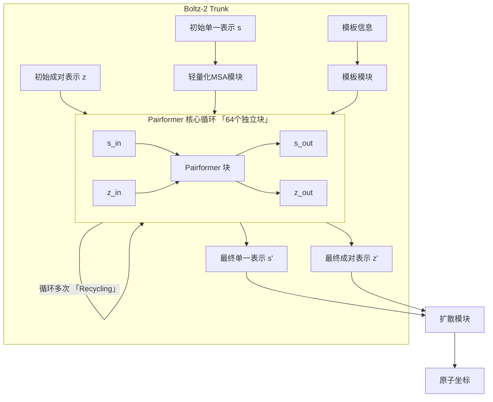
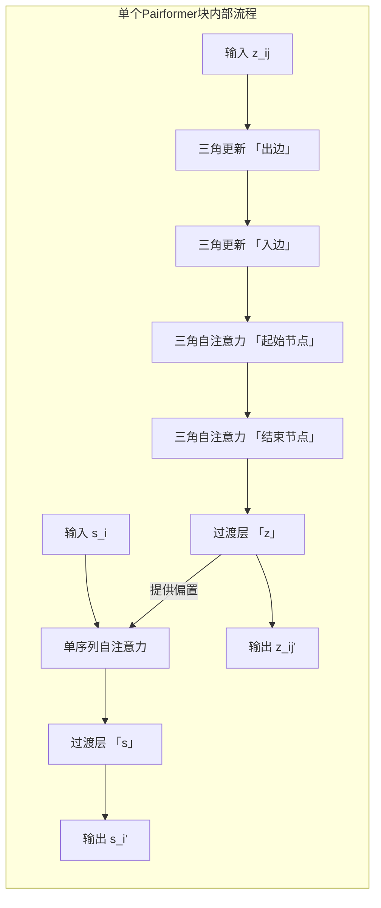
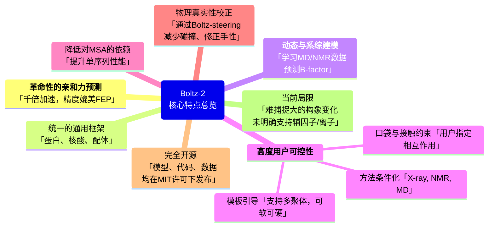
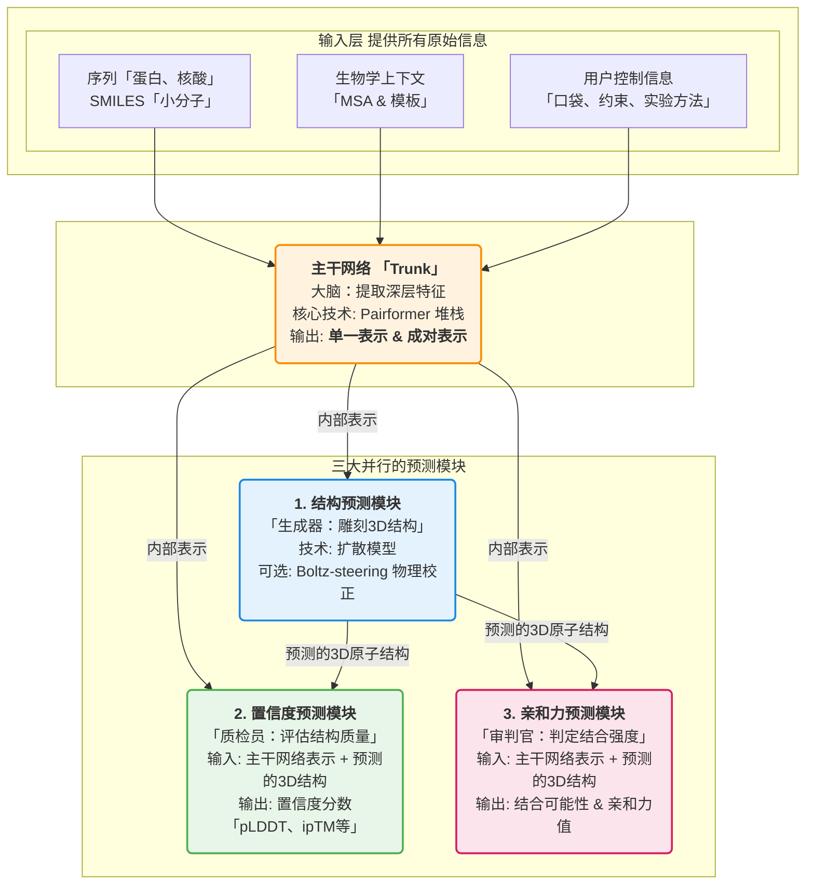
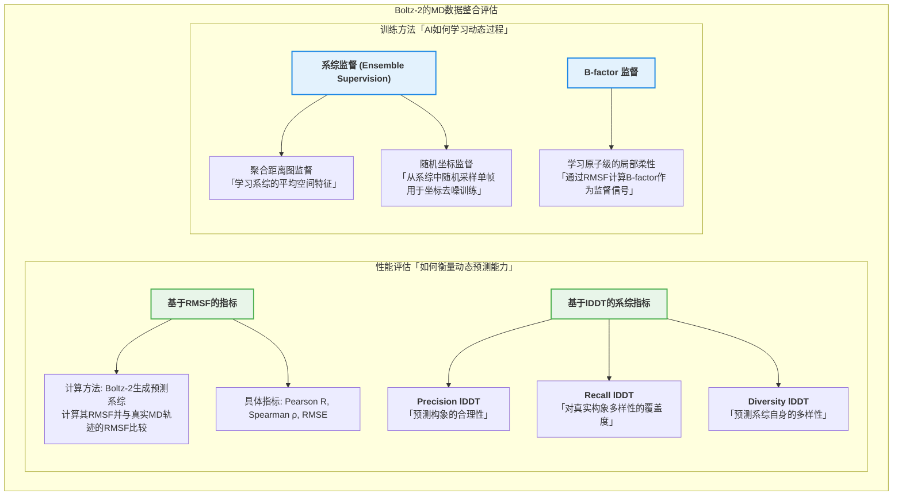
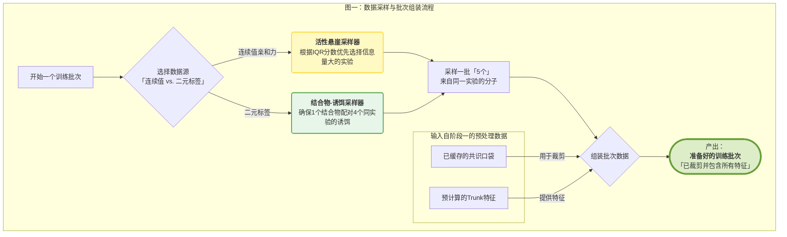
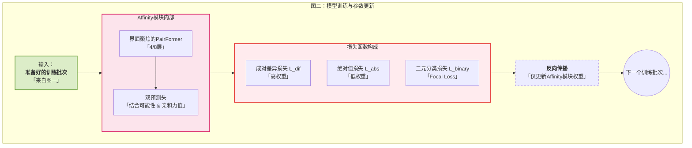
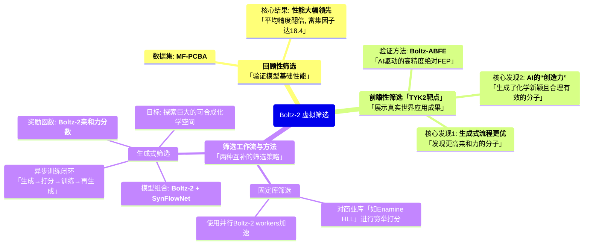
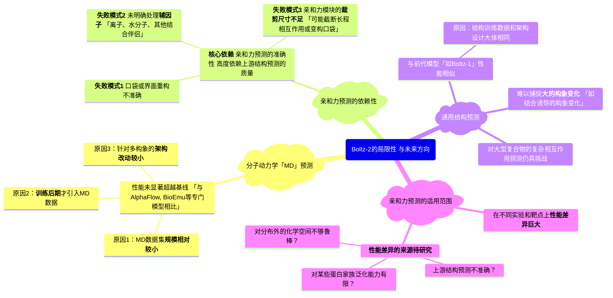

### 2.1 Boltz-2 主干网络 (Trunk): Pairformer 架构

Boltz-2的主干网络（Trunk）是其结构预测能力的核心，其设计在很大程度上借鉴并扩展了前代模型的思想，其核心是**Pairformer**模块。与早期架构相比，Pairformer的一个关键演进是**显著降低了对多序列比对（MSA）信息的直接和持续依赖**，转而将计算重心完全放在对**成对表示（pair representation）**和**单一表示（single representation）**的深度迭代精炼上。这种设计使其能更高效地处理包含多种分子类型（蛋白质、核酸、小分子等）的复杂生物系统。

#### Pairformer 整体架构与数据流

Pairformer是Boltz-2主干网络中进行迭代优化的核心引擎。它接收初始的单一表示（描述每个残基/原子的特征）和成对表示（描述每对残基/原子间的关系），并通过一系列结构相同但参数独立的处理块（Blocks）进行循环精炼。

- **输入**：
  - **单一表示 (Single Representation)** $s$：一个二维张量，尺寸为 $(n \times c_s)$，其中 $n$ 是系统中所有残基和原子（tokens）的总数，$c_s$ 是编码每个token自身属性的特征通道数。
  - **成对表示 (Pair Representation)** $z$：一个三维张量，尺寸为 $(n \times n \times c_z)$，其中 $c_z$ 是特征通道数。它编码了系统中每对token $(i, j)$ 之间的空间和化学关系。
  
- **处理流程**：

  - 初始的 $s$ 和 $z$ 矩阵，连同模板信息，被送入一个包含多个独立参数的Pairformer块的堆栈中进行处理。
  - Boltz-2将此核心堆栈扩展到了64层，以增强模型的表达能力和性能。
  - 在主循环中，信息主要在成对表示 $z$ 中通过**三角更新（Triangle Updates）**和**三角自注意力（Triangle Self-Attention）**进行横向传递和整合，以捕捉复杂的几何约束。
  - 单一表示 $s$ 的信息通过一个带有成对偏置的注意力机制（`Single attention with pair bias`）被更新，并反过来影响成对表示的计算。
  - 整个主干网络的结果会通过“循环”（Recycling）机制多次反馈，将上一轮的输出作为下一轮的输入，进一步精炼表示。

- **输出**：

  - 经过64次迭代精炼后，主干网络输出最终的单一表示和成对表示。这些高度精炼的表示随后被送入**扩散模块（Diffusion Module）**，用于直接生成最终的三维原子坐标。

以下是Pairformer整体架构的示意图：

#### Pairformer 模块核心组件解析

每个Pairformer块内部由一系列精心设计的子模块构成，旨在高效地在成对表示中传播和整合信息。

#### 三角更新 (Triangle Update)

**三角更新是Pairformer中一种不基于注意力的信息传播机制，其核心思想是利用几何上的三角关系来更新两个节点（i,j）之间的关系表示**。它通过一个中间节点 $k$ 来传递信息：如果节点 $i$ 和 $k$ 之间的关系已知，并且节点 $k$ 和 $j$ 之间的关系也已知，那么这些信息就可以被整合用来推断和更新节点 $i$ 和 $j$ 之间的关系。这种机制在直觉上与三角不等式的几何约束思想相通，但在实现上是特征层面的信息整合。

该过程分为两个步骤：

1. **基于出边的三角更新 (`Triangle update using outgoing edges`)**: 对于每一对 $(i, j)$，它会遍历所有第三个节点 $k$，并整合从 $i$ 出发到 $k$ 的边 $(i, k)$ 和从 $j$ 出发到 $k$ 的边 $(j, k)$ 的信息。
2. **基于入边的三角更新 (`Triangle update using incoming edges`)**: 类似地，它会整合从 $k$ 进入到 $i$ 的边 $(k, i)$ 和从 $k$ 进入到 $j$ 的边 $(k, j)$ 的信息。

这些更新通常通过门控的乘法（multiplicative updates）实现，能够高效地在成对表示矩阵中传播结构信息。

#### 三角自注意力 (Triangle Self-Attention)

**三角自注意力的核心原理是，为了更新节点对 $(i, j)$ 的表示 $z_{ij}$，模型应该“关注”所有能与 $(i, j)$ 形成三角形的中间节点 $k$**。这意味着 $z_{ij}$ 的更新会聚合来自所有边对 $\{(i, k), (j, k)\}$ 的信息。这使得模型能够学习到复杂的、高阶的残基间相互作用和空间约束。

该机制同样分为两个独立的模块：

1. **起始节点为中心的三角自注意力 (`Triangle self-attention around starting node`)**: 对于边 $(i, j)$，此模块的注意力计算主要关注从共享的**起始节点** $i$ 出发到所有其他节点 $k$ 的边 $(i, k)$。
2. **结束节点为中心的三角自注意力 (`Triangle self-attention around ending node`)**: 对于边 $(i, j)$，此模块的注意力计算则关注汇聚到共享的**结束节点** $j$ 的、来自所有其他节点 $k$ 的边 $(k, j)$。

数学表述 (以起始节点为例)：

该过程遵循标准的多头自注意力（Multi-Head Self-Attention, MHSA）范式，但其Query, Key, Value的定义和组合方式体现了“三角”思想。对于需要更新的成对表示 $z_{ij}$，我们首先通过线性变换生成Query (q)、Key (k)和Value (v)向量。这里的关键在于，q 来自于目标边 $(i, j)$ 本身，而 k 和 v 来自于形成三角形的另一条边 $(i, k)$。

1. Query, Key, Value 的生成:

   $$
   q_{ij} = W_q z_{ij} \\
   k_{ik} = W_k z_{ik} \\
   v_{ik} = W_v z_{ik}
   $$

   其中 $W_q, W_k, W_v$ 是可学习的权重矩阵。

2. 注意力分数计算:

   $$
   \alpha_{ijk} = \text{softmax}_k \left( \frac{q_{ij}^T k_{ik}}{\sqrt{d_k}} + b_{ik} \right)
   $$

   这里，注意力分数基于边 $(i, j)$ 和所有以 $i$ 为起点的边

## 补充流程图

AI生成，请自行甄别

### 总览

### 结构预测流程

### MD数据整合

| **数据集名称** | **主要内容**            | **模拟细节**                       | **数据采样/筛选策略**                                | **最终规模**  | **来源文献**                  |
| -------------- | ----------------------- | ---------------------------------- | ---------------------------------------------------- | ------------- | ----------------------------- |
| **MISATO**     | 蛋白质-小分子配体复合物 | NVT系综，300K，8 ns                | 移除配体漂移(>12Å)或含聚糖/修饰肽的轨迹使用全部100帧 | 11,235个系统  | Siebenmorgen et al. (2024)    |
| **ATLAS**      | 蛋白质                  | NPT系综，300K，100 ns              | 从轨迹**最后10ns**中随机均匀采样100帧                | 1,284个蛋白质 | Vander Meersche et al. (2024) |
| **mdCATH**     | 蛋白质                  | NVT系综，320K，时长可变(最长500ns) | 仅使用轨迹**最后10%**进行训练                        | 5,270个系统   | Mirarchi et al. (2024)        |

### 亲和力训练

#### 图一：数据采样与批次组装流程

这张图的核心是展示Boltz-2**如何智能地从庞大的数据源中，为每一个训练批次（batch）精心挑选出信息量最大的样本**。

#### 图二：模型训练与参数更新流程

这张图则展示了当一个准备好的训练批次输入到模型后，**模型内部如何进行计算、评估误差，并最终更新自身参数**的循环过程。

### 虚拟筛选

### Limitations

