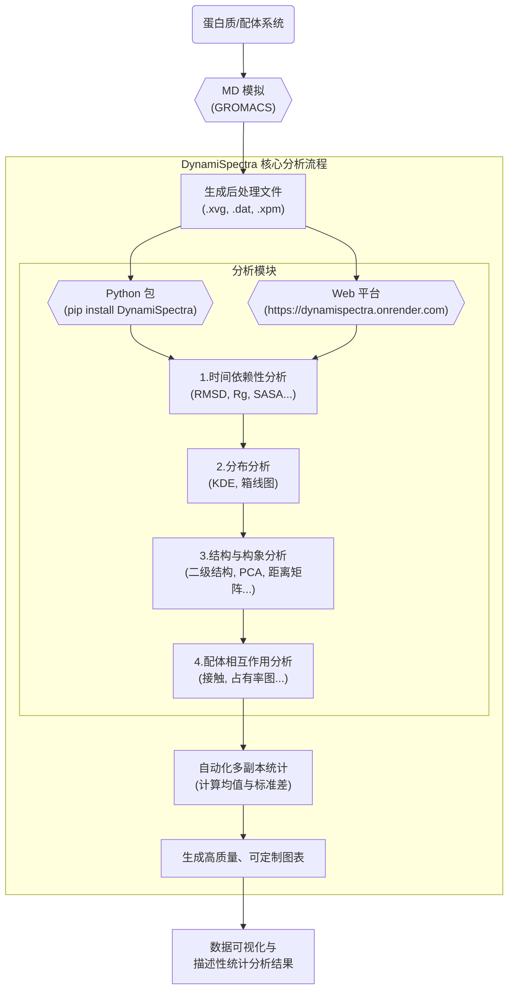

# DynamiSpectra: 自动化多副本分子动力学模拟数据分析的Python包与Web平台

## 本文信息

  - **标题**: DynamiSpectra: 计算生物学中分子动力学模拟数据分析的Python包与Web平台
  - **作者**: Iverson Conrado Bezerra, Jéssika de Oliveira Viana, Karen Cacilda Weber, and Priscila Gubert\*
  - **单位**: Keizo Asami Institute, iLIKA, Federal University of Pernambuco, Brazil
  - **引用格式**: Bezerra, I. C., Viana, J. de O., Weber, K. C., & Gubert, P. (2025). DynamiSpectra: A Python Software Package and Web Platform for Molecular Dynamics Data Analysis in Computational Biology. *Journal of Chemical Information and Modeling*. [https://doi.org/10.1021/acs.jcim.5c01270](https://doi.org/10.1021/acs.jcim.5c01270)

-----

## 摘要

> 分子动力学（MD）模拟会产生海量数据集，这亟需可靠且可复现的分析工具。在本研究中，我们推出了DynamiSpectra，一个基于Python的软件包和网络平台，旨在自动化MD轨迹的描述性统计分析（均值和标准差）与可视化。DynamiSpectra能够流式处理GROMACS生成的文件，支持对多个模拟副本进行比较分析，且无需处理拓扑文件或具备编程专业知识。该软件包执行关键的结构和动态分析，包括RMSD、RMSF、回转半径、SASA、氢键、盐桥、二级结构概率与分数、主成分分析以及配体占据图，并能生成集成了描述性统计分析的高质量图表。此外，它还支持蛋白质-配体接触、最小距离、疏水接触、残基间距离矩阵、phi/psi角度、旋转异构体（x1和x2）、配体二面角以及系统压力、温度和密度等分析。与广泛使用的MD分析软件包的对比测试表明，DynamiSpectra生成的结果与这些工具一致。DynamiSpectra的突出之处在于其能够自动化分析多个副本并计算均值和标准差，这是其他软件包通常缺乏自动化功能的方面。我们通过一个涉及不同温度下β-淀粉样肽模拟的用例展示了该平台的功能。此外，DynamiSpectra的网络界面使用户无需本地安装即可上传数据、生成交互式图表并探索结果，这极大地促进了MD分析的可及性和可复现性，是该工具的另一个重要特色。

-----

## 背景

分子动力学（MD）模拟是现代计算生物学中一种极其强大的技术，它允许科学家在原子层面上观察和预测蛋白质、核酸等生物大分子的动态行为。这项技术在基础科研和工业应用中都扮演着至关重要的角色，例如揭示生物分子结构机制、研究蛋白质折叠、以及加速新药的发现进程。随着计算能力的飞速发展，MD模拟的应用越来越广泛，其模拟的时间尺度和系统规模也日益增大，从而产生了前所未有的海量数据。

然而，数据的“爆炸式”增长也带来了严峻的挑战。从这些复杂的、高维度的数据轨迹中提取有意义的生物学见解，是一项艰巨的任务。尽管像GROMACS、AMBER、CHARMM等主流MD软件本身提供了一些分析工具，但它们往往需要用户具备深入的软件内部知识或复杂的脚本编写能力，这为许多湿实验背景的研究者设置了较高的技术门槛。更重要的是，科学研究的核心在于**可复现性**。在MD模拟中，由于系统的随机性和复杂性，单次模拟的结果可能存在偶然性。因此，学界普遍推荐通过运行多个独立的“副本”（replicas）来增强结果的统计可靠性和可信度。

这一最佳实践引出了当前MD数据分析领域的一个核心“痛点”（gap）：**缺乏能够轻松、自动化地整合并分析多个模拟副本的工具**。研究人员常常需要手动整理来自不同副本的数据，分别计算均值、标准差等统计量，然后再进行可视化，整个过程繁琐、耗时且容易出错。同时，对于不擅长编程的研究者而言，进行复杂的数据分析和定制化绘图更是难上加-难。因此，开发一款既能自动化处理多副本数据，又具备用户友好界面的分析工具，对于提高MD模拟研究的效率、可靠性和可及性至关重要。

## 关键科学问题

本文旨在解决一个核心的技术挑战，而非传统的科学假说：**如何简化和自动化对来自多个分子动力学模拟副本的大规模数据集的统计分析流程，使其不仅可靠、可复现，而且对于没有深厚编程背景的研究人员也易于上手？**

## 创新点

DynamiSpectra通过以下几个关键创新点，有效地解决了上述问题：

  - **全自动化的多副本统计分析**：该工具的核心亮点在于能够自动处理多个模拟副本的数据，并直接计算和可视化均值与标准差，极大地简化了评估模拟结果收敛性和可靠性的过程。
  - **“代码+网页”双平台设计**：DynamiSpectra同时提供了一个功能强大的Python软件包和一个无需安装、交互友好的Web平台。前者为需要高度定制化和流程整合的计算专家提供了灵活性，后者则为非编程背景的研究者提供了“零门槛”的解决方案。
  - **简化的工作流程**：该工具直接使用GROMACS等软件生成的后处理文件（如`.xvg`, `.dat`, `.xpm`），用户无需再处理复杂的原始轨迹或拓扑文件，从而降低了操作的复杂性并减少了潜在的错误。
  - **全面且高质量的可视化**：DynamiSpectra内置了MD分析中最常用的一系列指标，如RMSD、RMSF、SASA、PCA等，并能生成出版级质量的图表，且图表样式可通过简单的配置进行高度定制。

-----

## 软件和数据可用性

  - **Python包 (PyPI)**: `pip install DynamiSpectra`
  - **GitHub 源代码**: [https://github.com/Conradoou/DynamiSpectra](https://github.com/Conradoou/DynamiSpectra)
  - **Web Server 在线平台**: [https://dynamispectra.onrender.com](https://dynamispectra.onrender.com)
  - **官方文档**: [https://conradoou.github.io/DynamiSpectra/](https://www.google.com/search?q=https://conradoou.github.io/DynamiSpectra/)
  - **示例数据**: [https://github.com/Conradoou/DynamiSpectra/tree/main/data](https://www.google.com/search?q=https://github.com/Conradoou/DynamiSpectra/tree/main/data)

-----

## 研究内容

### 案例研究：Aβ肽-配体复合物模拟

为了全面展示软件功能，作者构建了一个与阿尔茨海默病相关的**β-淀粉样肽（Aβ）与一种喹啉衍生物**的复合物体系。

#### 1\. 建模细节

模拟使用了**GROMACS 2023.5**软件包和**GROMOS 54A7**力场。体系被放置在一个$7.28 \times 7.28 \times 5.14$ nm的十二面体盒子中，并使用**SPC模型**的水分子进行溶剂化。通过添加Na⁺离子来中和系统电荷。在恒定压力（1 bar, Parrinello-Rahman barostat）和温度（V-rescale thermostat）下，系统首先进行了100 ps的平衡，随后进行了**50 ns**的生产性模拟。需要指出的是，**原文并未提供该复合物初始结构的PDB ID，也未详细说明喹啉衍生物在Aβ肽上的具体结合口袋或初始对接方式**。该体系主要作为生成测试数据的案例。

#### 2\. Web平台开发

DynamiSpectra的Web平台是使用Python语言的**Flask框架**开发的。Flask是一个轻量级的Web应用框架，允许开发者快速构建Web服务。开发完成后，该Web应用被部署在**Onrender.com**上。Onrender是一个云平台即服务（PaaS），为开发者提供托管和运行Web应用的环境，从而让全球用户都可以通过浏览器直接访问，无需本地安装。

### DynamiSpectra 核心功能与分析实例

该工具的核心工作流程是从GROMACS生成的后处理文件开始，通过Python包或Web平台进行自动化分析，最终输出包含描述性统计信息的高质量图表。

#### 1\. 时间依赖性与分布分析

这是评估体系稳定性和构象采样的基础。作者以溶剂可及表面积（SASA）为例，展示了其统一的作图框架。

**图1：肽SASA值随MD模拟时间的变化**。图A展示了SASA随时间的变化，三条不同颜色的实线代表了三次独立模拟（300K、310K、318K）的均值，周围的半透明色带则是对应的标准差。图B是SASA值的核密度估计（KDE）图，它描绘了SASA值在整个模拟过程中的概率分布，峰值位置对应最常出现的SASA值。
类似地，该工具也能自动生成RMSD（均方根偏差）、Rg（回转半径）、氢键和盐桥数量等关键指标的时间序列图，并计算其均值和标准差，全面评估系统的稳定性和结构紧凑性。交叉验证结果表明，DynamiSpectra计算的RMSD与MDPlot和xmgrace等成熟工具的结果完全一致，证明了其可靠性。

#### 2\. 二级结构分析

蛋白质的二级结构是其功能的基础。DynamiSpectra提供了两种互补的可视化方法来分析二级结构随时间的变化。

**图2：MD模拟过程中肽的二级结构分析**。图A使用箱线图展示了不同二级结构类型（如α-螺旋、β-折叠等）在整个模拟过程中所占比例的概率分布，用于比较不同模拟条件下的整体差异。图B则以线图的形式展示了各种二级结构组分随模拟帧数（时间）的动态演变，用于观察详细的结构转变过程。

#### 3\. 高级结构与构象分析

DynamiSpectra还集成了一系列高级分析模块，以提供更深层次的结构信息。

**图3：MD模拟中肽-配体系统的结构与构象分析**。这张图集成了多种高级分析结果：(A) **主成分分析 (PCA)**，用于识别主要的构象状态及其转变路径；(B) **配体占据图**，展示了配体在模拟盒子中的空间分布密度；(C) **配体二面角分布**，揭示了配体的构象偏好；(D) **残基间距离矩阵**，用于识别紧凑的结构域或稳定的接触；(E) **拉马钱德兰图**，评估蛋白质骨架构象的合理性；以及(F, G, H) **侧链旋转异构体分析**，详细刻画了特定残基侧链的构象分布。

#### 4\. 系统热力学性质监控

确保模拟体系的稳定是MD分析的先决条件。DynamiSpectra可以方便地监控系统的温度、压力和密度等热力学参数随时间的变化，以判断模拟是否充分平衡。

**图4：系统在MD模拟过程中的温度曲线**。图中清晰地显示了三次模拟的温度分别稳定在300K、310K和318K附近，表明温度控制算法工作正常，模拟过程稳定可靠。

-----

## Q\&A

  - **Q1**: DynamiSpectra目前主要针对GROMACS的输出文件，这是否会限制使用其他MD软件（如AMBER, NAMD）的研究人员？

  - **A1**: 是的，这是一个当前的局限性。论文作者明确指出，由于文件解析器是为GROMACS的特定格式设计的，因此不能保证与其他软件的兼容性。不过，他们也提到，像AMBER套件中的CPPTRAJ工具可以生成格式类似的`.dat`文件，初步测试表明DynamiSpectra或许能够处理。更重要的是，作者计划在未来开发一个更灵活的数据处理层，以支持由MDAnalysis和MDTraj等通用库生成的通用时间序列数据，从而极大地扩展其适用性。

  - **Q2**: 为什么论文如此强调对“多个副本”进行均值和标准差的自动化计算？这个功能为什么如此重要？

  - **A2**: 这是因为MD模拟本质上是一种随机过程，单次长时间的模拟可能会陷入某个局部的能量陷阱，无法充分探索分子的所有可能构象，导致结果出现偏差。通过运行多个从不同初始速度开始的独立副本，可以更全面地对构象空间进行抽样，从而得到更可靠、更接近真实情况的统计结果。计算**均值**可以得到系统的平均行为，而**标准差**则量化了结果的变异性和不确定性，这两者对于得出稳健的科学结论至关重要。将这个繁琐的过程自动化，不仅节省了研究者大量的时间和精力，也避免了手动处理数据时可能引入的人为错误。

  - **Q3**: 与本地安装的Python包相比，使用Web界面的优缺点分别是什么？

  - **A3**: Web界面的最大优点是**可及性和易用性**。它无需任何本地安装和编程知识，研究者只需上传数据文件即可获得交互式的分析图表，非常适合快速查看结果、教学演示或是不具备计算背景的用户。缺点可能在于**灵活性和性能**。对于超大规模的数据集，上传和在线处理可能会受到网络速度和服务器性能的限制。而本地的Python包则提供了无与伦比的灵活性，用户可以深入代码进行高度定制化的修改（例如通过配置字典调整图表细节），将其集成到自动化的分析流程中，并且能够处理任意大小的数据。

  - **Q4**: 在分析拉马钱德兰图（phi/psi角）和侧链旋转异构体（χ1/χ2角）时，论文提到了两种不同的多副本数据处理策略：“拼接”（concatenation）和“循环平均”（circular mean）。为什么要这样做？

  - **A4**: 这体现了针对不同数据类型选择恰当统计方法的严谨性。对于**phi/psi角**，作者采用“拼接”策略，即将所有副本的轨迹数据合并在一起，然后绘制一个总的2D KDE图。这样做是为了获得一个更完整、统计上更具代表性的构象空间分布图，因为它汇集了所有模拟探索到的区域。而对于**χ1/χ2等二面角**，作者计算了“循环平均值”。这是因为角度是周期性数据（例如359°和1°其实只差2°），直接进行算术平均会得到错误的结果。循环平均是一种专门处理周期性数据的统计方法，能够正确地计算出角度的中心趋势。

  - **Q5**: DynamiSpectra与MDplot、mdciao等其他现有分析工具有何不同？

  - **A5**: DynamiSpectra的定位非常清晰。与**MDplot**相比，两者都能处理多副本数据并进行统计分析，但MDplot是基于R语言环境，而DynamiSpecta是基于Python，为不同技术栈的用户提供了选择。与**xmgrace**这类传统的绘图工具相比，DynamiSpectra的自动化程度要高得多，它整合了从数据处理、统计计算到可视化的完整流程。与**mdciao**、**MD-TASK**等工具最大的不同在于，后者通常直接处理原始的轨迹和拓扑文件（如.xtc, .pdb），而DynamiSpectra专注于GROMACS的**后处理文本文件**，这为偏好使用这类总结性数据进行快速分析的用户提供了一个更轻量、更便捷的工作流。

-----

## 关键结论与批判性总结

**核心结论**:

1.  **发布了一款新工具**：DynamiSpectra是一个开源的Python软件包和Web平台，专为MD模拟数据的描述性统计分析和可视化而设计。
2.  **核心优势是多副本分析**：其最突出的特点是能够自动化地整合和分析来自多个独立模拟副本的数据，并计算均值和标准差，从而极大地促进了研究的可复现性。
3.  **功能全面且易于使用**：该工具支持对GROMACS输出文件进行广泛的结构和动态分析，其Web版本甚至无需用户具备任何编程经验。
4.  **结果可靠**：通过与MDplot和xmgrace等成熟工具的交叉验证，证明了DynamiSpectra分析结果的准确性和可靠性。

**批判性总结**:

DynamiSpectra的问世，**极大地降低了进行严谨、统计可靠的MD数据分析的技术门槛**。特别是其设计精良的Web平台，真正实现了MD分析的“民主化”，让更多非计算背景的实验科学家和初学者能够轻松地从复杂的模拟数据中挖掘价值。这是一个非常实用的贡献，有望改善当前MD领域研究的规范性和效率。

然而，其**当前的局限性也相当明显**，即高度依赖GROMACS的文件格式。这使得在以AMBER、NAMD等其他软件为主要平台的实验室中，该工具的直接应用受到了限制。此外，Web平台在处理TB级别的大型轨迹数据时可能会面临性能瓶颈。

展望未来，**该工具的价值将极大地取决于其后续的生态拓展**。正如作者计划的那样，如果未来能够成功集成对MDAnalysis和MDTraj等通用数据格式的支持，DynamiSpectra将有望从一个“GROMACS用户的便利工具”转变为一个服务于整个MD社区的通用分析平台，其影响力也将不可同日而语。

-----

> **小编评论**
>
> 工具的图表设计略显粗糙，例如箱线图重叠、部分图的X轴未使用标准的'ns'单位而是'frame'，配色方案也有优化空间。作者并未详细阐述为何选择Aβ肽这个特定案例，以及它如何特别适合展示软件的各项分析功能。尽管用户手册和文档详尽，但工具目前高度绑定GROMACS，对使用其他MD软件的用户来说适配性不强。不过，这也反映了一个趋势：一个真正能解决用户痛点、具备友好界面的实用工具，即便在学术创新性上不那么突出，也同样具有发表价值。这或许是给应用型软件开发者的一个启示。