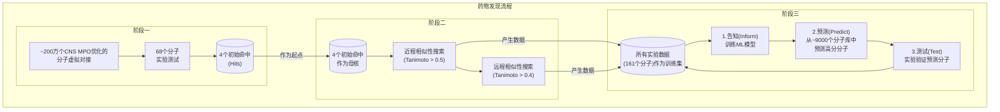

# AI炼丹新范式：用迭代式机器学习发现帕金森病α-突触核蛋白的高效抑制剂

## 本文信息

- **标题**: Discovery of potent inhibitors of a-synuclein aggregation using structure-based iterative learning
- **作者**: Robert I. Horne, Ewa A. Andrzejewska, Parvez Alam, Z. Faidon Brotzakis, Ankit Srivastava, et al.
- **单位**: University of Cambridge, National Institutes of Health (NIH), Indiana University School of Medicine, etc.
- **引用格式**: Horne, R. I., Andrzejewska, E. A., Alam, P., Brotzakis, Z. F., Srivastava, A., Aubert, A., ... & Vendruscolo, M. (2024). Discovery of potent inhibitors of α-synuclein aggregation using structure-based iterative learning. *Nature Chemical Biology*, *20*, 634-645.

## 摘要

> 机器学习方法有望降低传统药物发现流程的成本和失败率。对于神经退行性疾病而言，这个问题尤为紧迫，因为开发能够改变病程的药物一直极具挑战性。为了解决这个问题，我们在此描述了一种机器学习方法，用于识别α-突触核蛋白（α-synuclein）聚集的抑制剂，该过程与帕金森病及其他突触核蛋白病相关。由于α-突触核蛋白聚集体的增殖是通过自催化的二级成核过程发生的，我们的目标是识别能够结合聚集体表面催化位点的化合物。为实现这一目标，我们以迭代的方式使用基于结构的机器学习，首先识别，然后逐步优化二级成核抑制剂。我们的研究结果表明，这种方法能够轻松地识别出比以往报道的化合物效力高出两个数量级的抑制剂。

## 背景

帕金森病（PD）是最常见的神经退行性运动障碍，影响着全球超过65岁人群中2-3%的人口。这场旷日持久的“健康”与“衰老”的战争，其核心病理特征之一是**α-突触核蛋白（αS）的异常聚集**。正常情况下，αS蛋白在神经元中发挥着重要生理功能；然而，一旦它错误折叠并聚集形成纤维状的“团块”，就会产生神经毒性，最终导致神经元的死亡，尤其是在大脑的黑质区域。当运动症状出现时，神经系统的损伤往往已相当严重。因此，开发能够有效抑制αS聚集的化合物，被认为是治疗帕金森病最具前景的策略之一。

然而，神经退行性疾病的药物研发之路异常艰难，至今仍缺乏能够根治或显著延缓病程的药物。传统的药物发现方法，如高通量筛选，不仅成本高昂，而且成功率极低（通常低于1%）。近年来，对αS聚集过程的动力学研究揭示了一个关键环节：**二级成核（secondary nucleation）**。在这个过程中，已形成的αS纤维聚集体会催化游离的单体蛋白在其表面错误折叠和聚集，形成新的聚集体核心，从而实现聚集过程的“指数级”扩增。这就像滚雪球一样，是导致αS病理迅速扩散的主要机制。因此，**靶向并抑制二级成核过程，成为一个极具吸引力的药物设计策略**。

## 关键科学问题

本文旨在解决的核心科学问题是：在药物研发早期阶段普遍存在**实验数据稀疏**的困境下，如何利用机器学习方法，建立一个**高效、可靠且能够自我优化的闭环系统**，用于从庞大的化学空间中快速发现并迭代优化出能够**特异性抑制αS蛋白二级成核过程**的新型、高效小分子抑制剂？

## 创新点

- **提出迭代式主动学习策略**：构建了一个“预测-测试-再学习”的闭环工作流。模型根据少量初始数据进行预测，实验验证后将新数据反馈给模型进行再训练，从而在数据稀疏的场景下逐步提升模型的预测能力和发现效率。
- **精准靶向二级成核**：整个药物发现策略从始至终都聚焦于抑制αS聚集的二级成核步骤，这是一个基于深刻病理机制理解的精准打击策略。
- **高效的机器学习模型组合**：采用**随机森林回归器（RFR）与高斯过程回归器（GPR）的组合模型。RFR提供了强大的预测性能，而GPR则能评估预测的不确定性**，使得在选择化合物时可以平衡“高预测效力”和“高信息量”（即探索未知化学空间），有效避免模型陷入局部最优。
- **惊人的效力提升**：通过该方法发现的苗头化合物，其抑制效力比本领域已知的、甚至已进入临床试验的分子（如Anle-138b）**高出两个数量级**。

## 研究内容

### 核心方法：三阶段迭代学习工作流

作者设计了一个分三步走的策略来探索化学空间，并最终锁定高效抑制剂。


**图1：本文所述化学空间探索三个阶段的示意图。a, 通过对接模拟预测具有良好结合能力的68个分子中，我们最初通过实验测试确定了4个活性分子（“对接组”）。这四个分子增加了αS聚集的t₁/₂。b, 然后，我们在化学空间中围绕这四个母体化合物进行了近程Tanimoto相似性搜索。我们选择了Tanimoto相似性截断值>0.5的分子（“近程相似性对接组”），随后进行了Tanimoto相似性截断值>0.4的远程相似性搜索（“远程相似性对接组”）。然后应用机器学习方法，使用观察到的数据从一个源自ZINC数据库、与母体结构Tanimoto相似性>0.3的化合物库（“评估集”）中预测有效的分子。c, 预测和实验测试的连续迭代产生了更高的优化率（定义为使标准化的聚集半衰期增加到2倍以上的分子百分比），并且平均而言，分子的效力高于先前相似性搜索中识别出的分子。对识别出的有效分子也进行了验证实验。**



**阶段一：对接策略 (Docking Strategy)**

- **目标**：从海量分子库中找到最初的“种子”分子。
- **过程**：研究人员首先在先前研究中使用的αS纤维聚集体结构(PDB: 6CU7)上，使用软件（Fpocket, CamSol）识别出一个位于纤维侧面的潜在结合口袋。该口袋由**His50-Lys58和Thr72-Val77**残基构成，具有较低的溶解性和易于结合的特性。然后，他们从一个包含**约200万个**经过**中枢神经系统多参数优化（CNS MPO）**的分子库中，使用两种不同的对接软件（AutoDock Vina, FRED）进行虚拟筛选。
- **结果**：通过筛选和**Tanimoto相似性聚类**（阈值为0.75），最终得到了79个**代表性分子（centroids）**，即每个簇的代表。其中68个可供购买并进行了体外实验测试。实验发现，**有4个分子（48, 52, 68, 69）能够有效抑制αS聚集**，它们构成了后续研究的“母核”或“父代结构”。

**阶段二：相似性搜索策略 (Search Strategy)**

- **目标**：在初始命中的分子周围快速扩展化学空间，找到更多活性分子。
- **过程**：以4个母核分子为起点，在ZINC15数据库中进行两轮相似性搜索。
  - **近程搜索**：使用较高的Tanimoto相似性阈值（>0.5），寻找与母核结构非常相似的分子。
  - **远程搜索**：使用较低的相似性阈值（>0.4），寻找与母核结构有一定差异的分子。
- **结果**：近程搜索的**命中率（optimization rate）较高，而远程搜索的命中率急剧下降到仅4%**，且测试了三倍多的化合物。命中率的计算方式为：在一个集合中，能够将聚集反应的半衰期（t₁/₂）延长至对照组两倍以上的分子所占的百分比。这表明，**仅靠传统的结构-活性关系和相似性搜索，很难在远离初始母核的化学空间中高效地发现新分子**。

**阶段三：主动学习策略 (Active Learning Strategy)**

- **目标**：利用机器学习，在更广阔但相关的化学空间中智能地寻找高效抑制剂。
- **过程**：这是一个“设计-测试-学习”的闭环。
  1. **告知 (Inform)**：将前两个阶段获得的所有**161个分子**的实验数据（包括活性和非活性分子）作为初始训练集。
  2. **预测 (Predict)**：训练一个机器学习模型，用它来预测一个包含约9000个分子的“评估库”（该库由与4个母核有Tanimoto相似性>0.3的分子构成）中分子的抑制活性。
  3. **测试 (Test)**：购买并实验验证模型预测排名最高的约60个分子。
  4. **迭代**：将新测试的数据加入训练集，重复步骤1-3，共进行了四轮迭代。

### 机器学习模型细节

- **分子表示**：使用**连接树变分自编码器 (Junction Tree Variational Autoencoder)** 将分子的SMILES字符串转换为低维度的连续向量（潜在向量），这是模型能够“理解”分子结构的基础。
- **预测模型**：采用**随机森林回归器（RFR）和高斯过程回归器（GPR）的堆叠模型。RFR负责主要的活性预测，而GPR则对RFR的残差进行拟合，并提供一个关键的预测不确定性**度量。这使得模型在选择下一个要测试的分子时，不仅会选择那些预测活性高的，也会适当选择那些模型“不确定”但可能带来新信息的分子。
- **模型性能**：在训练集上，该组合模型在R²得分、平均绝对误差和均方根误差方面均优于其他模型组合（如多层感知器、线性回归器等）。具体的性能参数展示在补充图1和补充表1中。当用该模型拟合聚集实验数据时，获得的R²值在0.2到0.3之间。

### 实验结果与分析

**本文核心Result部分的思路图**

```mermaid
graph TD
    A("起点：<br/>传统药物发现策略") --> B;

    subgraph "1. 初始策略与瓶颈"
        direction LR
        B["对接策略 (Docking)<br/>- 200万分子库<br/>- 获得4个活性母核"] --> C["相似性搜索 (Similarity Search)<br/>- 近程搜索: 命中率尚可<br/>- 远程搜索: 命中率骤降至**4%**"] --> D{("瓶颈：<br/>传统方法难以<br/>拓展新化学空间")}
    end

    D --> E;

    subgraph "2. 机器学习迭代策略的成功"
        direction LR
        E["主动学习闭环<br/>(Active Learning Loop)<br/>- ‘预测-测试-再学习’<br/>- RFR+GPR模型 (含不确定性)"] --> F["性能提升<br/>- 命中率: 4% -> **21.4%**<br/>- 平均效力持续增强 (图3a)"] --> G{("突破：<br/>成功探索新化学空间<br/>并持续优化")}
    end

    G --> H;

    subgraph "3. 发现超高效分子 (I4.05)"
        direction LR
        H["效力对比 (图2)<br/>- KIC₅₀ = 0.52 μM<br/>- **比Anle-138b强约70倍**"] --> I["作用机制分析<br/>- 不影响纤维延伸 (图2c)<br/>- **显著减少寡聚体** (图2d)"] --> J{("成果：<br/>发现全新、高效且<br/>机制明确的抑制剂")}
    end

    J --> K;

    subgraph "4. 作用机制验证"
        direction LR
        K["靶点结合验证 (SPR, 图4)<br/>- 与αS纤维**高亲和力结合**<br/>- KD值达**纳摩尔级别 (13-68 nM)**"] --> L["特异性验证<br/>- **对Aβ42无活性** (图4d)"] --> M{("确认：<br/>分子通过结合纤维<br/>特异性抑制二级成核")}
    end

    M --> N;
    
    subgraph "5. 生物学相关性验证"
        direction LR
        N["病理种子抑制实验 (RT-QuIC, 图5)<br/>- **有效抑制帕金森病(DLB)<br/>脑源性种子的聚集**"] --> O["寡聚体直接量化 (µFFE, 图6)<br/>- **显著减少寡聚体的<br/>数量和大小**"] --> P{("关键验证：<br/>分子对真实病理<br/>聚集体有效")}
    end

    P --> Q(("最终结论：<br/>迭代式ML成功发现高效、新颖且<br/>具生物学相关性的αS二级成核抑制剂"));
```

**机器学习迭代的成功**

- **命中率和效力持续提升**：随着机器学习的迭代（从第1轮到第3轮），发现的有效分子的**平均效力（以标准化的聚集半衰期t₁/₂表示）和命中率都在稳步提高**。第1、2、3轮的命中率分别为**12.5%、17.2%和21.4%**，这比传统高通量筛选（<1%）的效率高出一个数量级，并且显著优于远程相似性搜索（4%）。
- **探索新化学空间**：**图3：机器学习药物发现方法的迭代结果。a, 不同阶段（远程搜索，迭代1，迭代2和迭代3）在25μM浓度下有效先导化合物的标准化的t₁/₂（n=2次重复；中心度量为平均值；误差为标准差）。水平虚线表示有效先导化合物分类的界限，即标准化的t₁/₂=2。对于远程搜索，测试了69个分子，而对于迭代1、2和3，测试的分子数分别为64、64和56。请注意，最有效的分子在观察的时间尺度内完全抑制了聚集，因此标准化的t₁/₂表示为实验的整个持续时间。b, 项目中从近程搜索（CS）开始，到远程搜索（LS），再到迭代1、2和3（I1, I2和I3），有效分子（+）和无效分子（-）的流向。每个分支都标有分子来源（例如，p48）。在远程搜索阶段，损耗达到最高点，之后随着每次迭代逐渐改善。**

**发现超高效抑制剂**

- **效力碾压**：在低浓度下，通过第四轮迭代发现的明星分子**14.05**展现出惊人的抑制效果。研究人员计算了半数抑制动力学常数（KIC₅₀），即能将聚集半衰期延长50%所需的浓度。**分子14.05的KIC₅₀值为0.52 μM，而母核分子69和Anle-138b的该值分别为18.2 μM和36.4 μM**。这意味着14.05的效力比这些参照物**高出约35-70倍**。
- **特异性作用机制**：实验表明，这些新发现的抑制剂**不影响αS纤维的延伸过程**，这非常重要，因为抑制延伸可能会导致毒性更强的寡聚体累积。计算表明，这些分子能够有效延迟和减少寡聚体峰值的出现。**图2：迭代学习发现的分子(I4.05)与一种目前处于临床试验阶段的αS聚集抑制剂(Anle-138b)的性能比较。a, 在有分子或1% DMSO存在下，10μM的αS溶液与25nM种子的动力学曲线（pH 4.8, 37°C）（n=3次重复；中心度量为平均值；误差为标准差(s.d.)）。在初始筛选中，除第4次迭代外，所有分子均在2.5摩尔当量（25μM）下进行筛选，然后将有效分子在更低浓度下进行进一步验证：0.4μM（蓝色）、0.8μM（蓝绿色）、1.6μM（橙色），并以25μM的Anle-138b作为比较（红色圆圈）。1% DMSO阴性对照以紫色显示。以分子I4.05为例。实验结束时，通过Pierce BCA蛋白检测试剂盒在t=125小时检测到的αS单体浓度对终点进行归一化。b, 三种不同分子Anle-138b（紫色）、母体结构69（淡紫色）和I4.05（蓝色）存在下的近似反应速率（取为1/t₁/₂，在0和100之间归一化；中心度量为平均值）。I4.05的KIC₅₀由拟合曲线（蓝色）与水平虚线的交点指示。c, 还进行了高浓度种子实验（5μM种子，所有其他条件与a相同，n=3次重复；中心度量为平均值；误差为s.d.），以观察对延伸速率的任何影响，并结合从a中得到的二级成核速率来计算寡聚体通量。d, 使用从a和c中得到的速率，计算I4.05与临床试验分子Anle-138b的寡聚体通量。**

**生物学验证：结合亲和力与靶向病理聚集体**

- **直接结合证据**：使用表面等离子共振（SPR）技术，作者证实了分子14.05能够以纳摩尔级别的亲和力（在pH 4.8时K_D=68 nM，pH 8时K_D=13 nM）直接结合到αS纤维上。相比之下，Anle-138b在pH 4.8下未检测到结合，在pH 8下的亲和力也仅为微摩尔级别（K_Dapprox8.1 μM）。这**两个数量级的亲和力差异**与观察到的效力差异完美匹配。
- **靶点特异性**：分子14.05对阿尔茨海默病相关的Aβ42蛋白的聚集和纤维结合均无明显效果，表明其并非泛泛的淀粉样蛋白抑制剂，而是对αS具有高度特异性。**图4：分子与αS纤维的结合。a, 小分子与αS纤维上目标结合口袋结合的示意图。b, 在pH 4.8和pH 8下，不同浓度的I4.05与通过种子法生成的αS纤维结合的SPR响应曲线，并附有相应的分子结构。显示了每个分子浓度的原始数据（点）和相应的拟合曲线（实线）（n=2次重复）。y轴显示响应单位（RU）。αS纤维以2000 pg mm⁻²的浓度固定在CM5 Cytivia芯片上。拟合对应于1:1动力学结合模型，在pH 4.8时得到KD为68 nM，在pH 8时为13 nM。误差为平均值的标准误差（s.e.m.）。c, 不同浓度Anle-138b的SPR响应曲线。显示了每个分子浓度的原始数据（点）（n=2次重复）。在pH 4.8时无法获得准确的拟合。在pH 8时，1:1动力学结合模型得出的近似KD为8.1μM。误差为s.e.m.。d, 在1% DMSO或不同浓度I4.05存在下，2μM Aβ42的种子诱导动力学（40nM种子，n=2次重复；中心度量为平均值；误差为标准差）和SPR响应曲线（n=2次重复）。I4.05不能有效抑制Aβ42的二级成核或与Aβ42纤维结合。Aβ42纤维以2000 pg mm⁻²的浓度固定在CM5 Cytivia芯片上。**
- **抑制病理相关聚集体**：最关键的验证来自使用**路易体痴呆（DLB）**患者脑组织提取物作为“种子”的RT-QuIC实验。DLB中的αS纤维结构与帕金森病中的一致。结果显示，**所有通过机器学习发现的苗头分子，都能有效抑制由真实病人脑源性病理种子诱导的αS聚集**，并且效果优于母核分子。而Anle-138b在此实验条件下反而加速了聚集。**图5：RT-QuIC脑源性种子扩增实验。a, RT-QuIC实验的示意图。使用来自患有DLB的患者脑组织的聚集体诱导αS聚集。来自患有CBD的患者脑部样本作为阴性对照。b, 在CBD种子存在下，7μM αS溶液的动力学曲线（pH 8, 42°C，以1分钟为间隔摇晃400 rpm，n=4次重复；中心度量为平均值；误差为标准差(s.d.)）。CBD样本为1% DMSO（蓝色），7μM Anle-138b（蓝绿色），母体分子（橙色），I1.01（紫色），I3.02（红色），I3.08（青绿色）和I4.05（浅蓝色）。在此条件下，蓝绿色的Anle-138b诱导了聚集。c, 在DLB种子存在下，7μM αS溶液的动力学曲线（n=4次重复；误差为s.d.；所有其他条件与b相同）。DLB样本为1% DMSO（紫色），3.5μM分子（蓝色），7μM分子（蓝绿色）和25μM分子（橙色）。Anle-138b再次表现出加速而非抑制聚集。**
- **对MSA病理种子同样有效**：该分子对另一种突触核蛋白病——多系统萎缩症（MSA）患者的脑源性种子也表现出抑制活性。
- **直接测量寡聚体**：通过微流控自由流电泳（µFFE）技术，研究人员能够直接分离并量化反应体系中的寡聚体。结果显示，在DMSO对照组中存在大量寡聚体，而**加入分子13.02后，寡聚体的数量和大小均显著减少**，而Anle-138b处理组的寡聚体数量甚至比对照组还多。**图6：使用μFFE技术量化αS寡聚体。右上角：用AlexaFluor 488标记的αS（100μM, pH 7.4, 37°C，200rpm摇晃5分钟和静置1分钟的循环，n=4次重复；误差为标准差）补充了0.5μM种子和1% DMSO（紫色）或50μM Anle-138b（蓝绿色）或13.02（蓝色）在1% DMSO中。在这些条件下，Anle-138b轻微加速聚集，其中由于摇晃，断裂机制可能再次起作用，而13.02则减缓了聚集。在聚集时间进程的9小时处提取样品，并离心以从混合物中去除纤维，仅留下αS单体和可溶性寡聚体物种用于μFFE分析。左下角：μFFE方法的示意图，显示了经过AlexaFluor 488标记的αS寡聚体混合物进行μFFE。流体流动方向由箭头显示。电场的差异偏转使得在分析过程中能够将单体群体与寡聚体群体分离开。中下和右下角：对每个样品中检测到的聚集体群体的分析。条形图的y轴绘制了每个样品发出的平均光子数，该数值与颗粒数量和大小成正比。插图中标明了每个颗粒发出的平均光子数。**

## Q&A

- **Q1**: 本文得到的分子是抑制聚集还是结合αS纤维？
- **A1**: 两者都是，而且是因果关系。**分子的作用机制是首先结合到αS纤维上，通过占据纤维表面的催化位点，从而抑制了二级成核过程，最终达到了抑制整个聚集反应的效果**。SPR实验（图4）直接证明了分子与纤维的高亲和力结合，而动力学实验（图2）则证明了其对聚集的抑制效果。因此，可以说“结合αS纤维”是手段，“抑制聚集”是最终目的和结果。
- **Q2**: 为什么这项研究一开始要用虚拟对接，而不是直接从机器学习开始？
- **A2**: 这是一个非常好的策略性问题。机器学习，尤其是在药物发现这样的复杂领域，**需要一个合理的起点**。在没有任何实验数据的情况下，模型无法知道应该学习什么样的分子特征。虚拟对接在这里扮演了“先锋”的角色，它基于蛋白质的3D结构，从数百万个分子中初步筛选出几十个最有可能与目标口袋结合的候选者。尽管对接的准确性有限，但它成功地提供了4个具有初步活性的“火种”（母核分子），为后续的相似性搜索和更关键的机器学习迭代提供了**宝贵的初始训练数据和探索方向**。
- **Q3**: 为什么模型选择随机森林（RFR）和高斯过程（GPR）的组合，而不是更“时髦”的深度学习模型？
- **A2**: 这体现了在**数据稀疏**场景下建模的智慧。深度学习模型通常需要大量的训练数据才能表现良好。而本研究的初始训练集只有161个分子，对于深度学习来说太少了，很容易过拟合。随机森林是一种集成模型，对小数据集有很好的鲁棒性。更重要的是，与GPR的组合引入了**不确定性量化**的能力。GPR不仅能预测一个值，还能告诉我们这个预测有多“自信”。这使得主动学习策略可以更智能地选择下一个要测试的分子：既要“利用”已知的知识（选择预测活性高的），也要“探索”未知的领域（选择模型不确定，但可能带来新信息的分子）。
- **Q4**: 实验中发现的抑制剂对体外重组蛋白纤维和病人脑源性纤维都有效，这是否说明两者结构很相似？
- **A4**: 这是一个非常深刻的观察。作者指出，他们最初用于对接和筛选的重组αS纤维结构（PDB: 6CU7）与后来从病人大脑中解析出的病理纤维结构（PDB: 8A9L）其实是**不一样的**。然而，他们在补充图S16中对比发现，这两种不同的纤维多晶型物在**目标结合口袋区域存在一定的结构相似性**。作者认为，这种口袋的相似性可能是“侥幸的”，但也正是因为这种相似性，使得基于重组蛋白发现的抑制剂，也能够幸运地对病理相关的聚集体起作用。这提示我们，即使体外模型与体内病理结构不完全一致，但如果能靶向一个保守的关键功能位点，仍然可能开发出有效的药物。
- **Q5**: 为什么在RT-QuIC实验中，Anle-138b反而加速了αS的聚集？
- **A5**: 作者也注意到了这个“反常”现象。他们推测这可能与Anle-138b**据报道的低溶解度**有关。RT-QuIC实验条件（pH 8，剧烈振荡）与最初的筛选条件（pH 4.8，静置）有很大不同。在这些条件下，低溶解度的Anle-138b可能自身形成微小的聚集体或胶束，这些颗粒反而可能作为新的成核表面，异构地诱导了αS的聚集，从而表现出加速效应。这凸显了在不同实验条件下评估化合物活性的重要性。
- **Q6**: 聚类时使用的“代表性分子”是如何定义的？
- **A6**: 在这项研究中，“代表性分子”（centroids）是通过**Tanimoto相似性聚类**产生的。具体来说，他们将对接分数最高的10,000个化合物，使用基于Morgan指纹的Tanimoto相似性度量进行聚类，相似性截断值为0.75。每个形成的簇（cluster）中，会选出一个分子作为该簇的代表，这个分子就是“代表性分子”或“质心”。这么做的目的是为了在保证化学多样性的前提下，减少需要进行实验测试的化合物数量。
- **Q7**: 机器学习模型的训练效果具体如何？R²值是多少？
- **A7**: 论文中提到，研究团队测试了多种机器学习模型的组合，最终发现**RFR-GPR堆叠模型**在预测对接分数时表现最好。虽然在预测实际的、数据量较小的聚集实验数据时，QSAR模型的R²值表现“一般”（modest），但这主要是由于训练数据稀疏造成的。当模型用于预测数据量稍大的对接分数时，其**R²值是前者的三倍**，达到了约0.6-0.7。具体的R²值和其他性能指标在补充图S1和补充图S6中有详细展示。

### 补充信息（SI）中的亮点

- **模型选择的严谨性（图S1）**：SI详细展示了多种机器学习模型（线性回归、多层感知器、随机森林、高斯过程及其组合）的学习曲线。这表明作者经过了严谨的模型比较和选择，最终确定RFR-GPR组合是针对该问题的最优解，而不是随意选择了一个模型。
- **化学空间的演化（图S2, S14）**：SI中的图表直观地展示了从最初的母核分子到经过多轮迭代后发现的高效抑制剂，其化学结构是如何一步步演变的。可以看出，模型保留了母核69中的一些关键药效团（如吡唑烷二酮环），同时对其他部分进行了大胆的修饰，实现了“探索式优化”。
- **模型可解释性的尝试（图S15）**：作者利用SHAP（Shapley Additive Explanations）技术，尝试打开机器学习的“黑箱”。他们通过分析SHAP值，将潜在空间中的维度与分子中的特定化学亚结构（如吡唑烷二酮、色原酮等）关联起来。这表明，**模型不仅仅是在进行无意义的拟合，而是在学习和识别与活性相关的、具有化学意义的结构特征**。
- **病理结构口袋的相似性（图S116）**：这是解释为什么药物有效的一个关键证据。SI中直接对比了体外重组纤维和病人脑源性纤维的冷冻电镜结构，并指出了两者在目标结合口袋区域的相似性，为药物的广谱有效性提供了结构基础。

## 关键结论与批判性总结

### 核心结论

- **成功建立并验证了一个迭代式、基于结构的机器学习药物发现流程**，能够高效地识别和优化靶向α-突触核蛋白二级成核过程的抑制剂。
- **该方法在数据稀疏的早期药物发现阶段表现出色**，其命中率（最终达到21.4%）比传统高通量筛选高出一个数量级，并且显著优于传统的相似性搜索策略。
- **发现了多个新型、高效的αS聚集抑制剂**，其中最优秀的分子（14.05）在体外实验中的抑制效力（KIC₅₀ = 0.52 μM）和与αS纤维的结合亲和力（Kᴅ = 13-68 nM）方面，均比已进入临床试验的参照分子Anle-138b**高出约两个数量级**。
- **验证了抑制剂的生物学相关性**，证明其不仅对体外重组αS纤维有效，还能抑制从帕金森病（DLB）和多系统萎缩症（MSA）患者脑组织中提取的病理相关聚集体的扩增，并且对Aβ42蛋白无交叉反应，显示出高度特异性。

### 批判性总结与展望

这项研究是**机器学习赋能神经退行性疾病药物发现的一次精彩示范**。它巧妙地将基于病理机制的深刻理解（靶向二级成核）与前沿的主动学习策略相结合，为在数据稀疏这一普遍困境下如何高效“炼丹”提供了一个极具操作性的范例。其发现的化合物效力之高，令人印象深刻，不仅为帕金森病的治疗提供了新的候选分子，也强有力地证明了该方法的巨大潜力。

**该方法最值得称道的智慧在于其“迭代”和“不确定性导向”的核心思想**。它不是试图一步到位地找到“神药”，而是通过快速的“预测-验证”循环，让模型在与实验的“对话”中不断学习和进化，最终逼近最优解。

尽管如此，该方法仍存在局限性，最主要的是其**依赖于一个预设的化合物筛选库**，这限制了其探索全新化学结构的能力。正如作者所言，结合生成式人工智能（Generative AI）和强化学习，实现从头分子设计，将是该领域的下一个突破口。此外，将药代动力学、毒性等多重参数纳入优化目标，将使其更贴近真实的药物研发需求。总而言之，这项工作为蛋白质错误折叠疾病的药物发现开辟了一条充满希望的新路径，也预示着AI驱动的闭环式药物研发将成为未来的主流。


