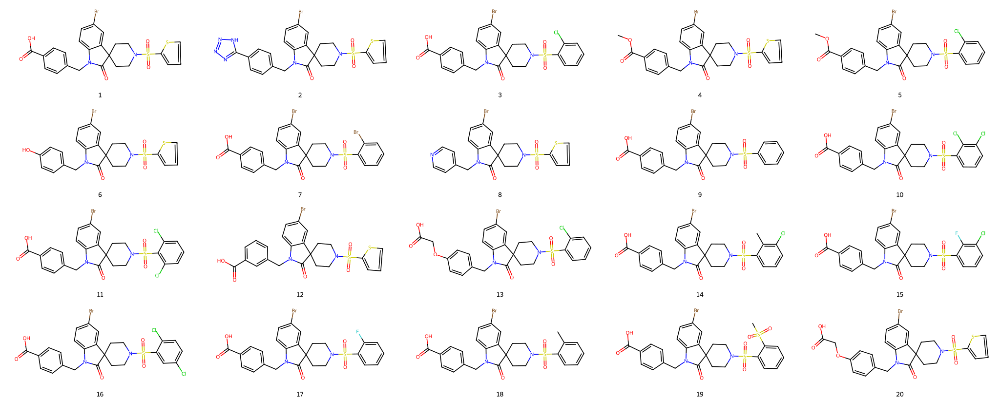

# Plotting congeneric ligands in rdkit

## Introduction

When working with series of similar molecules, quickly identifying differences is crucial. However, default visualization in rdkit gives us a messed molecular orientations. A few lines of code can significantly aid in this by visually aligning molecular scaffolds. 

## Molecules

Here's how you can utilize the RDkit to visualize and compare small molecule structures in 2D from a SMILES file named `ligands.smi` file:

```text
OC(=O)c1ccc(CN2C(=O)C3(CCN(CC3)S(=O)(=O)c4cccs4)c5cc(Br)ccc25)cc1
Brc1ccc2N(Cc3ccc(cc3)c4nnn[nH]4)C(=O)C5(CCN(CC5)S(=O)(=O)c6cccs6)c2c1
OC(=O)c1ccc(CN2C(=O)C3(CCN(CC3)S(=O)(=O)c4ccccc4Cl)c5cc(Br)ccc25)cc1
COC(=O)c1ccc(CN2C(=O)C3(CCN(CC3)S(=O)(=O)c4cccs4)c5cc(Br)ccc25)cc1
COC(=O)c1ccc(CN2C(=O)C3(CCN(CC3)S(=O)(=O)c4ccccc4Cl)c5cc(Br)ccc25)cc1
Oc1ccc(CN2C(=O)C3(CCN(CC3)S(=O)(=O)c4cccs4)c5cc(Br)ccc25)cc1
OC(=O)c1ccc(CN2C(=O)C3(CCN(CC3)S(=O)(=O)c4ccccc4Br)c5cc(Br)ccc25)cc1
Brc1ccc2N(Cc3ccncc3)C(=O)C4(CCN(CC4)S(=O)(=O)c5cccs5)c2c1
OC(=O)c1ccc(CN2C(=O)C3(CCN(CC3)S(=O)(=O)c4ccccc4)c5cc(Br)ccc25)cc1
OC(=O)c1ccc(CN2C(=O)C3(CCN(CC3)S(=O)(=O)c4cccc(Cl)c4Cl)c5cc(Br)ccc25)cc1
OC(=O)c1ccc(CN2C(=O)C3(CCN(CC3)S(=O)(=O)c4c(Cl)cccc4Cl)c5cc(Br)ccc25)cc1
OC(=O)c1cccc(CN2C(=O)C3(CCN(CC3)S(=O)(=O)c4cccs4)c5cc(Br)ccc25)c1
OC(=O)COc1ccc(CN2C(=O)C3(CCN(CC3)S(=O)(=O)c4ccccc4Cl)c5cc(Br)ccc25)cc1
Cc1c(Cl)cccc1S(=O)(=O)N2CCC3(CC2)C(=O)N(Cc4ccc(cc4)C(=O)O)c5ccc(Br)cc35
OC(=O)c1ccc(CN2C(=O)C3(CCN(CC3)S(=O)(=O)c4cccc(Cl)c4F)c5cc(Br)ccc25)cc1
OC(=O)c1ccc(CN2C(=O)C3(CCN(CC3)S(=O)(=O)c4cc(Cl)ccc4Cl)c5cc(Br)ccc25)cc1
OC(=O)c1ccc(CN2C(=O)C3(CCN(CC3)S(=O)(=O)c4ccccc4F)c5cc(Br)ccc25)cc1
Cc1ccccc1S(=O)(=O)N2CCC3(CC2)C(=O)N(Cc4ccc(cc4)C(=O)O)c5ccc(Br)cc35
CS(=O)(=O)c1ccccc1S(=O)(=O)N2CCC3(CC2)C(=O)N(Cc4ccc(cc4)C(=O)O)c5ccc(Br)cc35
OC(=O)COc1ccc(CN2C(=O)C3(CCN(CC3)S(=O)(=O)c4cccs4)c5cc(Br)ccc25)cc1
```

## Visualization Script

To visualize these molecules in 2D aligned to their most common substructure, follow the Python script below:

```python
# Import necessary modules from RDKit for molecular operations and visualization
from rdkit import Chem
from rdkit.Chem import Draw, AllChem, rdFMCS

# Define a function to align molecules in 2D based on their maximum common substructure
def align_mols_2d(mols):
    # Find the maximum common substructure (MCS) among the molecules
    mcs = Chem.rdFMCS.FindMCS(mols, atomCompare=rdFMCS.AtomCompare.CompareAny,
                              bondCompare=rdFMCS.BondCompare.CompareAny, ringMatchesRingOnly=True)
    core = Chem.MolFromSmarts(mcs.smartsString)  # Convert MCS to a SMARTS pattern for common core structure
    _ = AllChem.Compute2DCoords(core)  # Compute 2D coordinates for the core structure

    # Iterate over each molecule in the list
    for i in range(len(mols)):
        _ = AllChem.Compute2DCoords(mols[i])  # Compute initial 2D coordinates for molecule
        # Align each molecule to the common core structure to emphasize structural similarities
        _ = AllChem.GenerateDepictionMatching2DStructure(mols[i], core)
        # Normalize the depiction of molecules for uniform appearance
        _ = AllChem.NormalizeDepiction(mols[i])

# Specify the filename containing SMILES strings
file = 'ligands.smi'
mols = []  # Initialize an empty list to store molecule objects
lines = open(file, 'r').readlines()  # Read all lines from the SMILES file

# Convert each SMILES string into an RDKit molecule object and append to the list
for smi in lines:
    mols.append(Chem.MolFromSmiles(smi.strip()))

# Generate a list of labels for the molecules, simply numbered in the order they appear
legends = [str(i + 1) for i in range(len(mols))]

# Call the function to align molecules based on their MCS
align_mols_2d(mols)

# Create a grid image of the aligned molecules using RDKit's drawing module
img = Draw.MolsToGridImage(mols, molsPerRow=5, subImgSize=(500, 250), useSVG=True, legends=legends)

# Save the image to a file in SVG format for high-quality vector graphics output
with open(file + '.svg', 'w') as f:
    f.write(img)

```

Result:




>[!TIP] 
>
>In RDKit, adjusting the figure size of individual images can help control the relative size of the annotations. If the molecules are large, consider increasing the figure size to ensure details are visible.

If some molecules do not align well, consider relaxing the MCS criteria. Adjustments like 

```python
atomCompare=rdFMCS.AtomCompare.CompareAny, bondCompare=rdFMCS.BondCompare.CompareAny, ringMatchesRingOnly=True
```

might help. In extreme cases where alignment is still problematic, removing outliers from the dataset could be necessary.

>[!WARNING] 
>
>The resulting figure might not be aesthetically pleasing. Use this script primarily for structural comparison rather than official presentations.

## Advanced Considerations

For users looking to customize this script further or tackle more complex scenarios, understanding the parameters and their effects is crucial. Experiment with different settings to find what best suits your specific set of molecules.

This revised article now includes a structured approach to visualizing molecular structures using RDKit, complete with code comments and Markdown styling that enhance the clarity and usability of the information provided.

```python
#!/usr/bin/python
# python aligned_depiction.py ligands.sdf

import warnings
warnings.simplefilter(action='ignore', category=Warning)
import argparse
from rdkit import Chem
from rdkit.Chem import Draw, AllChem, rdFMCS
from rdkit.Chem import rdGeometry, rdMolAlign, rdmolops
from sklearn.cluster import DBSCAN
import numpy as np
# from FEbuilder.setup.utils import see_mol


class CustomMetavarFormatter(argparse.RawTextHelpFormatter):
    """
    Reference: https://devpress.csdn.net/python/62fe2a1dc67703293080479b.html

    If the optional takes a value, format is: ``-s ARGS, --long ARGS``; Now changed to ``-s, --long ARGS``
    """

    def _format_action_invocation(self, action):
        if not action.option_strings:
            metavar, = self._metavar_formatter(action, action.dest)(1)
            return metavar
        else:
            parts = []
            if action.nargs == 0:
                parts.extend(action.option_strings)
            else:
                default = action.dest.upper()
                args_string = self._format_args(action, default)
                for option_string in action.option_strings:
                    # parts.append('%s %s' % (option_string, args_string))
                    parts.append('%s'%option_string)
                parts[-1] += ' %s'%args_string
            return ', '.join(parts)


def parse_arguments():
    des = 'Align molecules and create 2D depictions, for you to view cognate ligands easily.'
    epilog = 'Welcome to aligned_depiction.py!'
    parser = argparse.ArgumentParser(description=des, epilog=epilog, formatter_class=CustomMetavarFormatter)
    parser.add_argument('-f', '--file', type=str, required=True, help='Path to molecule files (sdf).')
    parser.add_argument('-m', '--molperrows', type=int, default=6, help='Number of molecules per row. Default is 6.')
    parser.add_argument('-r', '--resolution', type=int, default=300, help='Resolution for each ligand. Default is 300.')
    parser.add_argument('-pf', '--prefix', type=str, default='', help='Prefix for ligand in the figure. Default is empty.')
    parser.add_argument('-fa', '--fine-align', default=False, action="store_true", help='Do fine alignment? Default is False.')
    hyp = parser.add_argument_group('Hyperparameters')
    hyp.add_argument('-eps', type=float, default=0.2, help='DBSCAN eps, as small as possible. Default is 0.2.')
    hyp.add_argument('-ms', '--min-samples', type=int, default=3, help='DBSCAN min_samples. Tune eps in prior. Default is 3.')
    return parser.parse_args()


def align_mols_2d(mols):
    mcs = Chem.rdFMCS.FindMCS(mols, atomCompare=rdFMCS.AtomCompare.CompareAny,
                              bondCompare=rdFMCS.BondCompare.CompareAny, ringMatchesRingOnly=True)
    core = Chem.MolFromSmarts(mcs.smartsString)  # common structure
    _ = AllChem.Compute2DCoords(core)
    for i in range(len(mols)):
        _ = AllChem.Compute2DCoords(mols[i])  # resolve clashes. AllChem.EmbedMolecule is deprecated here
        _ = AllChem.GenerateDepictionMatching2DStructure(mols[i], core)  # all align to core
        _ = AllChem.NormalizeDepiction(mols[i])
    print('If ligands are not well aligned, try fine alignment (-fa).')


def align_mols_2d_fine(mols, args):
    """
    Any outlier causes the core to be very small. We try to do clustering to find a group of "truely congnate ligands",
    find the real core to align to. The false core is aligned to the real one before outliers are aligned to it. So all ligands are well positioned.
    (Actually we can do multi-level clustering, but usually two levels are enough.)

    Advice on the hyperparameters:

    1. To make the smaller core as aligned as possible? no, some rings are deformed, bacause maybe 5-membrane aligned to 6.
    A slightly larger eps may help to avoid matching that ring. So do use ringMatchesRingOnly=True.

    2. If too many are aligned, everything gets messy. So try to get eps smaller and min_samples moderately large.
    i.e. only take one central ligand's backbone.
    Not 100% right. In case an outlier also has three close neighbors...TODO: shp2, two clusters?

    p.s. It seems GenerateDepictionMatching2DStructure dominates the fine tune even if cores are aligned, resulting in no change.
    Also, it might be better to add restraints before Compute2DCoords than after.
    Also, we have to remove: _ = AllChem.NormalizeDepiction(mol)

    :param mols: Molecules to be aligned
    """
    def cluster_molecules(mols, radius=2, eps=args.eps, min_samples=args.min_samples):
        # use strict criteria, to find the real common core
        fingerprints = [AllChem.GetMorganFingerprintAsBitVect(mol, radius) for mol in mols]
        fp_array = np.array([np.array(fp) for fp in fingerprints])
        clustering = DBSCAN(eps=eps, min_samples=min_samples, metric='jaccard').fit(fp_array)
        core_ligands = [mols[i] for i, label in enumerate(clustering.labels_) if label != -1]
        outliers = [mols[i] for i, label in enumerate(clustering.labels_) if label == -1]
        return core_ligands, outliers

    def get_core(mols):
        """
        Atom/bond types might differ, but size must not.
        :param mols:
        :return:
        """
        try:
            mcs_all = Chem.rdFMCS.FindMCS(mols, atomCompare=rdFMCS.AtomCompare.CompareAny, bondCompare=rdFMCS.BondCompare.CompareAny, ringMatchesRingOnly=True)
        except RuntimeError as e:
            exit('Not found enough core ligands. Please try larger eps.')
        core = Chem.MolFromSmarts(mcs_all.smartsString)  # MCS for all molecules including outliers
        rdmolops.SanitizeMol(core)  # otherwise RingInfo not initialized
        _ = AllChem.Compute2DCoords(core)
        return core

    def align_core(cores):
        cmn_core = get_core(cores)
        _ = AllChem.Compute2DCoords(cmn_core)
        for mol in cores:
            align_with_map(mol, cmn_core)

    def align_with_map(mol, core):
        match = mol.GetSubstructMatches(core)
        coordMap = {}
        conf = core.GetConformer()
        for i, atomIdx in enumerate(match[0]):
            pos = conf.GetAtomPosition(i)
            pos2D = rdGeometry.Point2D(pos.x, pos.y)
            coordMap[atomIdx] = pos2D
        _ = AllChem.Compute2DCoords(mol, coordMap=coordMap)  # Resolve clashes

    core_mols, outliers = cluster_molecules(mols)
    ccore = get_core(core_mols)
    core  = get_core(mols)
    align_core([ccore, core])

    for mol in mols:
        if mol in core_mols:
            align_with_map(mol, ccore)  # Align to ccore
        else:
            align_with_map(mol, core)  # Align to core
    print('If there are strange bonds crossing the molecule, try smaller eps or larger min_samples.\nIf there are strange rings, do the opposite.\n')


def main(args):
    print('Welcome to aligned_depiction.py!\n')
    # preparation
    mols = [Chem.MolFromSmiles(Chem.MolToSmiles(mol)) for mol in Chem.SDMolSupplier(args.file)]
    if args.prefix != '':   args.prefix += '-'
    legends = [args.prefix+str(i + 1) for i in range(len(mols))]
    if args.fine_align:
        align_mols_2d_fine(mols, args)
    else:
        align_mols_2d(mols)
    # draw
    img = Draw.MolsToGridImage(mols, molsPerRow=args.molperrows, subImgSize=(args.resolution, args.resolution),
                               useSVG=True, legends=legends)
    ofile = args.file.split('.')[0]+'.svg'
    with open(ofile, 'w') as f:
        f.write(img)
    print('Wrote image to '+ofile)


if __name__ == '__main__':
    args = parse_arguments()
    main(args)


# test
# if __name__ == '__main__':
#     d = {
#         'file': 'ligands.sdf',
#         'molperrows': 6,
#         'resolution': 300,
#         'fine_align': True,
#         'eps': 0.2,
#         'min_samples': 3,
#         'prefix': ''
#     }
#     args = argparse.Namespace(**d)
#     main(args)
```
